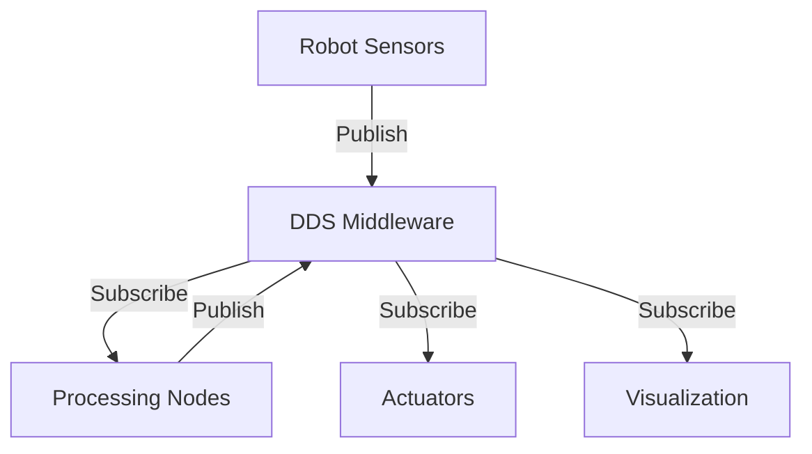

# Chapter 1: ROS 2 Middleware

## Introduction

The **Robot Operating System 2 (ROS 2)** is not an operating system in the traditional sense. Instead, it's a sophisticated middleware framework that provides the communication backbone for robotic systems. Think of it as the nervous system that connects all parts of a robot, allowing them to communicate and coordinate.

<Callout type="info" title="What You'll Learn">
- What ROS 2 is and why it exists
- The architecture of ROS 2 middleware
- How DDS (Data Distribution Service) powers ROS 2
- Key differences between ROS 1 and ROS 2
- When to use ROS 2 in your projects
</Callout>

## What is ROS 2?

ROS 2 is a flexible framework for writing robot software. It provides:

- **Communication Infrastructure**: Libraries and tools for inter-process communication
- **Hardware Abstraction**: Standard interfaces for sensors and actuators
- **Development Tools**: Debugging, visualization, and simulation tools
- **Package Management**: A ecosystem of reusable robotics packages

### The Evolution from ROS 1

ROS 2 was created to address limitations in the original ROS:

| Feature | ROS 1 | ROS 2 |
|---------|-------|-------|
| Real-time Support | Limited | Full support |
| Multi-robot Systems | Difficult | Native support |
| Security | Basic | Enterprise-grade |
| Platform Support | Primarily Linux | Cross-platform |
| Communication | Custom protocol | DDS standard |

## The Middleware Architecture

At the heart of ROS 2 lies the **Data Distribution Service (DDS)** – a proven industry standard for real-time, distributed systems.

### DDS: The Communication Backbone

DDS provides:

- **Publish-Subscribe Pattern**: Decoupled communication between nodes
- **Quality of Service (QoS)**: Fine-grained control over message delivery
- **Discovery**: Automatic detection of publishers and subscribers
- **Reliability**: Guaranteed message delivery when needed



### Key Components

#### 1. ROS Client Library (RCL)

The RCL provides the core ROS 2 functionality in C. It handles:
- Node lifecycle management
- Publisher and subscriber creation
- Service and action interfaces
- Parameter management

#### 2. Language Bindings

ROS 2 supports multiple programming languages through client libraries:

- **rclcpp**: C++ client library
- **rclpy**: Python client library
- **rclj**: Java client library
- **rclnodejs**: Node.js client library

<Callout type="success" title="Python Developers">
We'll be using **rclpy** extensively in Chapter 3 to build practical robotics applications in Python!
</Callout>

## Quality of Service (QoS)

One of ROS 2's most powerful features is its QoS system, inherited from DDS. QoS policies allow you to configure how messages are delivered:

### Common QoS Profiles

```python
# Sensor data - fast, lossy
sensor_qos = QoSProfile(
    reliability=ReliabilityPolicy.BEST_EFFORT,
    durability=DurabilityPolicy.VOLATILE,
    history=HistoryPolicy.KEEP_LAST,
    depth=10
)

# Command data - reliable, important
command_qos = QoSProfile(
    reliability=ReliabilityPolicy.RELIABLE,
    durability=DurabilityPolicy.TRANSIENT_LOCAL,
    history=HistoryPolicy.KEEP_ALL
)
```

### QoS Parameters Explained

- **Reliability**: BEST_EFFORT (fast) vs RELIABLE (guaranteed)
- **Durability**: VOLATILE (temporary) vs TRANSIENT_LOCAL (persistent)
- **History**: KEEP_LAST (n messages) vs KEEP_ALL (everything)
- **Depth**: Number of messages to keep in history

<Callout type="warning" title="QoS Compatibility">
Publishers and subscribers must have compatible QoS settings to communicate. Mismatched QoS profiles are a common source of communication issues!
</Callout>

## ROS 2 Distributions

ROS 2 releases follow a predictable schedule with codenames based on turtles:

- **Humble Hawksbill** (2022) - Long Term Support (LTS)
- **Iron Irwini** (2023)
- **Jazzy Jalisco** (2024)
- **Rolling** - Continuous development branch

<Callout type="info" title="Which Version?">
For production systems, use an LTS release like **Humble**. For learning and development, the latest stable release is recommended.
</Callout>

## Real-World Applications

ROS 2 powers robots across diverse industries:

### Autonomous Vehicles
- Self-driving cars (Tier IV Autoware)
- Delivery robots (Amazon Scout, Starship Technologies)
- Agricultural robots (John Deere, Blue River Technology)

### Industrial Robotics
- Manufacturing automation (ABB, KUKA)
- Warehouse logistics (Fetch Robotics, Otto Motors)
- Quality inspection systems

### Service Robots
- Humanoid robots (Boston Dynamics, Agility Robotics)
- Healthcare assistants
- Hospitality and customer service robots

## Installation Quick Start

```bash
# Ubuntu 22.04 - Install ROS 2 Humble
sudo apt update
sudo apt install ros-humble-desktop

# Source the setup script
source /opt/ros/humble/setup.bash

# Verify installation
ros2 --help
```

<Callout type="success" title="Installation Complete">
If you see the ROS 2 help output, you're ready to start building!
</Callout>

## Key Takeaways

- ROS 2 is a middleware framework, not an operating system
- DDS provides the robust communication infrastructure
- QoS policies give fine-grained control over message delivery
- ROS 2 is production-ready and used across industries
- Multiple language bindings make ROS 2 accessible to all developers

## What's Next?

Now that you understand the middleware architecture, in **Chapter 2** we'll dive into the fundamental communication patterns: **Nodes, Topics, and Services**. You'll learn how to create your first ROS 2 nodes and make them communicate!

---

## Additional Resources

- [ROS 2 Official Documentation](https://docs.ros.org/en/humble/)
- [DDS Specification](https://www.omg.org/spec/DDS/)
- [ROS 2 Design Documents](https://design.ros2.org/)

## Exercises

1. Install ROS 2 on your system following the official guide
2. Explore the available ROS 2 commands: `ros2 --help`
3. Run the talker-listener demo: `ros2 run demo_nodes_cpp talker`
4. Research which DDS vendor implementations are available (e.g., Fast DDS, CycloneDDS)
