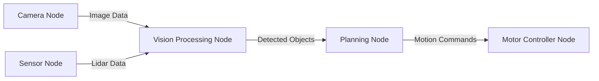
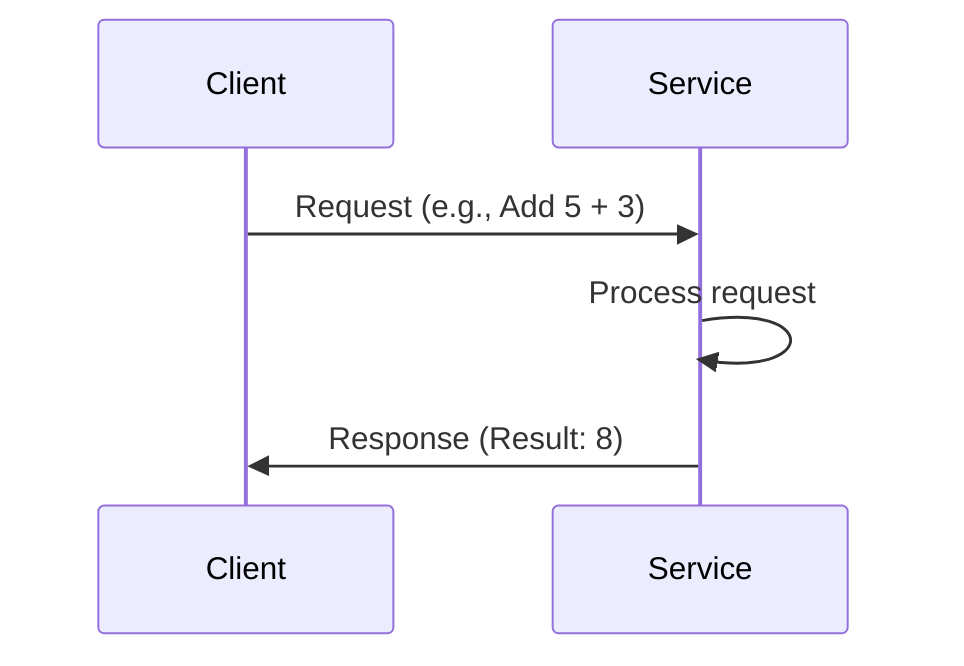

# Chapter 2: Nodes, Topics, and Services

## Introduction

In Chapter 1, we learned about ROS 2's middleware architecture. Now it's time to understand the fundamental building blocks of any ROS 2 system: **nodes**, **topics**, and **services**. These concepts form the basis of robot communication and coordination.

<Callout type="info" title="What You'll Learn">
- What nodes are and how they organize robot functionality
- How topics enable publish-subscribe communication
- When to use services for request-response patterns
- Practical examples of each communication method
- Best practices for designing ROS 2 systems
</Callout>

## Nodes: The Building Blocks

A **node** is a process that performs computation. Nodes are the fundamental unit of organization in ROS 2. Think of them as independent workers, each responsible for a specific task.

### Node Characteristics

- **Single Purpose**: Each node should do one thing well
- **Loosely Coupled**: Nodes communicate through well-defined interfaces
- **Independently Deployable**: Can be started, stopped, and updated separately
- **Language Agnostic**: Can be written in C++, Python, or other supported languages

### Example Node Structure



### Creating a Simple Node (Python)

```python
import rclpy
from rclpy.node import Node

class MinimalNode(Node):
    def __init__(self):
        super().__init__('minimal_node')
        self.get_logger().info('Node has been started!')

def main(args=None):
    rclpy.init(args=args)
    node = MinimalNode()
    rclpy.spin(node)
    node.destroy_node()
    rclpy.shutdown()

if __name__ == '__main__':
    main()
```

<Callout type="success" title="Your First Node">
This simple node does nothing but log a message, but it demonstrates the basic structure all ROS 2 nodes follow!
</Callout>

## Topics: Publish-Subscribe Communication

**Topics** are named buses over which nodes exchange messages. They implement the **publish-subscribe pattern**, one of the most important communication patterns in robotics.

### How Topics Work

1. **Publishers** send messages to a topic
2. **Subscribers** receive messages from a topic
3. Multiple publishers and subscribers can connect to the same topic
4. Communication is asynchronous and decoupled

```mermaid
graph TB
    P1[Publisher 1] -->|publish| T[/camera/image Topic]
    P2[Publisher 2] -->|publish| T
    T -->|subscribe| S1[Subscriber 1]
    T -->|subscribe| S2[Subscriber 2]
    T -->|subscribe| S3[Subscriber 3]
```

### When to Use Topics

Topics are ideal for:
- Continuous data streams (sensor readings, camera images)
- Broadcasting information to multiple subscribers
- Fire-and-forget communication (no response needed)
- High-frequency data (e.g., 30 Hz camera feeds)

### Publisher Example

```python
from rclpy.node import Node
from std_msgs.msg import String

class PublisherNode(Node):
    def __init__(self):
        super().__init__('publisher_node')
        self.publisher = self.create_publisher(String, 'chatter', 10)
        self.timer = self.create_timer(1.0, self.publish_message)
        self.counter = 0

    def publish_message(self):
        msg = String()
        msg.data = f'Hello World: {self.counter}'
        self.publisher.publish(msg)
        self.get_logger().info(f'Publishing: "{msg.data}"')
        self.counter += 1
```

### Subscriber Example

```python
from rclpy.node import Node
from std_msgs.msg import String

class SubscriberNode(Node):
    def __init__(self):
        super().__init__('subscriber_node')
        self.subscription = self.create_subscription(
            String,
            'chatter',
            self.listener_callback,
            10
        )

    def listener_callback(self, msg):
        self.get_logger().info(f'I heard: "{msg.data}"')
```

### Message Types

ROS 2 provides many standard message types:

- **std_msgs**: Basic data types (String, Int32, Float64, Bool)
- **sensor_msgs**: Sensor data (Image, LaserScan, Imu, PointCloud2)
- **geometry_msgs**: Geometric primitives (Point, Pose, Twist, Transform)
- **nav_msgs**: Navigation data (Odometry, Path, OccupancyGrid)

<Callout type="info" title="Custom Messages">
You can also define custom message types for your specific needs. We'll cover this in later chapters!
</Callout>

## Services: Request-Response Communication

While topics are great for streaming data, sometimes you need a **request-response** interaction. That's where **services** come in.

### Service Characteristics

- **Synchronous**: Client waits for a response
- **One-to-One**: One client, one server at a time
- **Blocking**: Client blocks until response is received (or timeout)
- **Bidirectional**: Request goes to server, response comes back



### When to Use Services

Services are ideal for:
- Triggering actions (start/stop a process)
- Querying state (get current position)
- Computations that return results (inverse kinematics)
- Configuration changes (set parameters)

### Service Example (AddTwoInts)

**Service Definition** (AddTwoInts.srv):
```
int64 a
int64 b
---
int64 sum
```

**Service Server**:
```python
from rclpy.node import Node
from example_interfaces.srv import AddTwoInts

class AddTwoIntsServer(Node):
    def __init__(self):
        super().__init__('add_two_ints_server')
        self.srv = self.create_service(
            AddTwoInts,
            'add_two_ints',
            self.add_two_ints_callback
        )

    def add_two_ints_callback(self, request, response):
        response.sum = request.a + request.b
        self.get_logger().info(f'Request: {request.a} + {request.b} = {response.sum}')
        return response
```

**Service Client**:
```python
from rclpy.node import Node
from example_interfaces.srv import AddTwoInts

class AddTwoIntsClient(Node):
    def __init__(self):
        super().__init__('add_two_ints_client')
        self.client = self.create_client(AddTwoInts, 'add_two_ints')
        while not self.client.wait_for_service(timeout_sec=1.0):
            self.get_logger().info('Service not available, waiting...')

    def send_request(self, a, b):
        request = AddTwoInts.Request()
        request.a = a
        request.b = b
        future = self.client.call_async(request)
        return future
```

<Callout type="warning" title="Blocking vs Async">
Services can block your node! Use async calls (`call_async`) when possible to avoid freezing your node while waiting for a response.
</Callout>

## Topics vs Services: Decision Matrix

| Use Case | Topics | Services |
|----------|--------|----------|
| Sensor data streaming | ✅ Yes | ❌ No |
| Multiple consumers | ✅ Yes | ❌ No |
| Guaranteed response needed | ❌ No | ✅ Yes |
| High-frequency updates (>10 Hz) | ✅ Yes | ❌ No |
| Triggering actions | ⚠️ Possible | ✅ Preferred |
| Getting current state | ⚠️ Possible | ✅ Preferred |

## Advanced Patterns

### 1. Topic Remapping

Redirect topics without changing code:

```bash
ros2 run package_name node_name --ros-args --remap chatter:=new_topic_name
```

### 2. Namespaces

Organize nodes and topics hierarchically:

```python
node = Node('camera_node', namespace='robot1')
# Topics will be under /robot1/...
```

### 3. Latching (Transient Local QoS)

Late subscribers receive the last published message:

```python
from rclpy.qos import QoSProfile, DurabilityPolicy

qos = QoSProfile(depth=1, durability=DurabilityPolicy.TRANSIENT_LOCAL)
self.publisher = self.create_publisher(String, 'config', qos)
```

## Debugging Tools

### List Active Nodes
```bash
ros2 node list
```

### Inspect Node Details
```bash
ros2 node info /node_name
```

### List Topics
```bash
ros2 topic list
```

### Monitor Topic Data
```bash
ros2 topic echo /topic_name
```

### Publish to Topic (Command Line)
```bash
ros2 topic pub /topic_name std_msgs/msg/String "data: 'Hello'"
```

### List Services
```bash
ros2 service list
```

### Call a Service
```bash
ros2 service call /add_two_ints example_interfaces/srv/AddTwoInts "{a: 5, b: 3}"
```

<Callout type="success" title="Debugging Tip">
These CLI tools are invaluable for debugging! Keep them handy when developing ROS 2 applications.
</Callout>

## Design Best Practices

### 1. Single Responsibility
Each node should have one clear purpose. Don't create "god nodes" that do everything!

### 2. Meaningful Names
Use descriptive topic and service names:
- ✅ `/camera/front/image_raw`
- ❌ `/data1`

### 3. Standard Interfaces
Use standard message types when possible to ensure compatibility.

### 4. QoS Awareness
Choose appropriate QoS settings for your use case:
- Sensor data: BEST_EFFORT
- Commands: RELIABLE

### 5. Error Handling
Always handle service timeouts and connection failures gracefully.

## Key Takeaways

- **Nodes** are independent processes that perform specific computations
- **Topics** enable asynchronous, many-to-many publish-subscribe communication
- **Services** provide synchronous, request-response interactions
- Choose topics for streaming data, services for actions and queries
- ROS 2 CLI tools are essential for debugging and introspection

## What's Next?

Now that you understand nodes, topics, and services, in **Chapter 3** we'll explore how to use **rclpy** (ROS 2 Python Client Library) to build practical robotic applications. You'll create your own nodes and implement real communication patterns!

---

## Additional Resources

- [ROS 2 Topics Tutorial](https://docs.ros.org/en/humble/Tutorials/Topics/Understanding-ROS2-Topics.html)
- [ROS 2 Services Tutorial](https://docs.ros.org/en/humble/Tutorials/Services/Understanding-ROS2-Services.html)
- [Common ROS 2 Message Types](https://github.com/ros2/common_interfaces)

## Exercises

1. Create a temperature sensor publisher node that publishes random temperatures
2. Create a subscriber node that listens to temperatures and logs warnings above 30°C
3. Implement a service that calculates the average of an array of numbers
4. Use `ros2 topic echo` to monitor your temperature topic
5. Test your average service with `ros2 service call`
