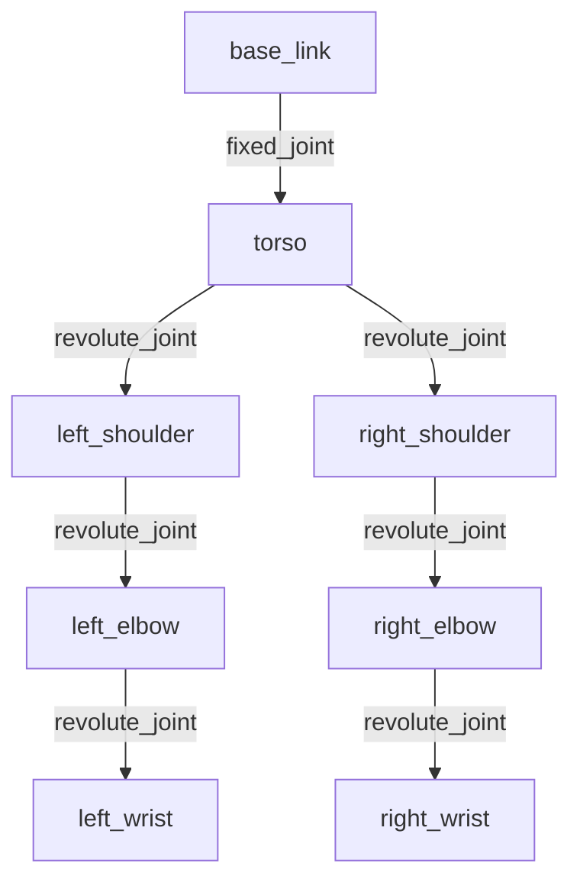

# Chapter 4: URDF for Humanoids

## Introduction

The **Unified Robot Description Format (URDF)** is an XML-based language for describing robot structures. It defines everything from the physical properties of robot parts to their connections and movements. For humanoid robots – with their complex joint structures mimicking human anatomy – URDF is essential for simulation, visualization, and motion planning.

<Callout type="info" title="What You'll Learn">
- What URDF is and why it's crucial for robotics
- How to define links, joints, and kinematic chains
- Special considerations for humanoid robot models
- How to visualize robots in RViz2
- Best practices for URDF modeling
- Integration with physics simulators
</Callout>

## What is URDF?

URDF is an XML format that describes:

- **Links**: Rigid bodies (bones, chassis, limbs)
- **Joints**: Connections between links (revolute, prismatic, fixed)
- **Kinematics**: How parts move relative to each other
- **Dynamics**: Mass, inertia, friction
- **Visualization**: 3D models and colors
- **Collision**: Simplified geometries for physics



## URDF Structure for Humanoids

### Basic Link Definition

A link represents a rigid body:

```xml
<link name="torso">
  <!-- Visual appearance -->
  <visual>
    <origin xyz="0 0 0" rpy="0 0 0"/>
    <geometry>
      <box size="0.3 0.2 0.5"/>
    </geometry>
    <material name="white">
      <color rgba="1 1 1 1"/>
    </material>
  </visual>

  <!-- Collision geometry -->
  <collision>
    <origin xyz="0 0 0" rpy="0 0 0"/>
    <geometry>
      <box size="0.3 0.2 0.5"/>
    </geometry>
  </collision>

  <!-- Physical properties -->
  <inertial>
    <mass value="10.0"/>
    <origin xyz="0 0 0" rpy="0 0 0"/>
    <inertia ixx="0.1" ixy="0.0" ixz="0.0"
             iyy="0.1" iyz="0.0"
             izz="0.1"/>
  </inertial>
</link>
```

### Joint Types for Humanoids

Humanoid robots use various joint types:

#### 1. Revolute Joint (Most Common)

Mimics human joints with limited rotation:

```xml
<joint name="left_shoulder_pitch" type="revolute">
  <parent link="torso"/>
  <child link="left_upper_arm"/>
  <origin xyz="0.0 0.15 0.2" rpy="0 0 0"/>
  <axis xyz="0 1 0"/>
  <limit lower="-3.14" upper="3.14" effort="100" velocity="2.0"/>
  <dynamics damping="0.7" friction="0.1"/>
</joint>
```

#### 2. Continuous Joint

For joints with unlimited rotation (rare in humanoids):

```xml
<joint name="waist_yaw" type="continuous">
  <parent link="base_link"/>
  <child link="torso"/>
  <origin xyz="0 0 0.1" rpy="0 0 0"/>
  <axis xyz="0 0 1"/>
</joint>
```

#### 3. Fixed Joint

For rigidly connected parts:

```xml
<joint name="head_mount" type="fixed">
  <parent link="neck"/>
  <child link="head"/>
  <origin xyz="0 0 0.1" rpy="0 0 0"/>
</joint>
```

## Complete Humanoid Arm Example

Let's build a complete humanoid arm with shoulder, elbow, and wrist:

```xml
<?xml version="1.0"?>
<robot name="humanoid_arm">

  <!-- Base Link -->
  <link name="base_link">
    <visual>
      <geometry>
        <box size="0.1 0.1 0.1"/>
      </geometry>
      <material name="gray">
        <color rgba="0.5 0.5 0.5 1"/>
      </material>
    </visual>
  </link>

  <!-- Upper Arm -->
  <link name="upper_arm">
    <visual>
      <geometry>
        <cylinder length="0.3" radius="0.04"/>
      </geometry>
      <origin xyz="0 0 0.15" rpy="0 0 0"/>
      <material name="blue">
        <color rgba="0 0 1 1"/>
      </material>
    </visual>
    <collision>
      <geometry>
        <cylinder length="0.3" radius="0.04"/>
      </geometry>
      <origin xyz="0 0 0.15" rpy="0 0 0"/>
    </collision>
    <inertial>
      <mass value="2.0"/>
      <inertia ixx="0.015" ixy="0" ixz="0"
               iyy="0.015" iyz="0"
               izz="0.0016"/>
    </inertial>
  </link>

  <!-- Shoulder Joint (Pitch) -->
  <joint name="shoulder_pitch" type="revolute">
    <parent link="base_link"/>
    <child link="upper_arm"/>
    <origin xyz="0 0 0.05" rpy="0 0 0"/>
    <axis xyz="0 1 0"/>
    <limit lower="-2.0" upper="2.0" effort="50" velocity="1.5"/>
    <dynamics damping="0.5"/>
  </joint>

  <!-- Forearm -->
  <link name="forearm">
    <visual>
      <geometry>
        <cylinder length="0.25" radius="0.03"/>
      </geometry>
      <origin xyz="0 0 0.125" rpy="0 0 0"/>
      <material name="green">
        <color rgba="0 1 0 1"/>
      </material>
    </visual>
    <collision>
      <geometry>
        <cylinder length="0.25" radius="0.03"/>
      </geometry>
      <origin xyz="0 0 0.125" rpy="0 0 0"/>
    </collision>
    <inertial>
      <mass value="1.5"/>
      <inertia ixx="0.008" ixy="0" ixz="0"
               iyy="0.008" iyz="0"
               izz="0.0011"/>
    </inertial>
  </link>

  <!-- Elbow Joint -->
  <joint name="elbow_pitch" type="revolute">
    <parent link="upper_arm"/>
    <child link="forearm"/>
    <origin xyz="0 0 0.3" rpy="0 0 0"/>
    <axis xyz="0 1 0"/>
    <limit lower="0" upper="2.5" effort="30" velocity="1.5"/>
    <dynamics damping="0.3"/>
  </joint>

  <!-- Hand -->
  <link name="hand">
    <visual>
      <geometry>
        <box size="0.08 0.12 0.03"/>
      </geometry>
      <material name="red">
        <color rgba="1 0 0 1"/>
      </material>
    </visual>
    <collision>
      <geometry>
        <box size="0.08 0.12 0.03"/>
      </geometry>
    </collision>
    <inertial>
      <mass value="0.5"/>
      <inertia ixx="0.001" ixy="0" ixz="0"
               iyy="0.0008" iyz="0"
               izz="0.0005"/>
    </inertial>
  </link>

  <!-- Wrist Joint -->
  <joint name="wrist_pitch" type="revolute">
    <parent link="forearm"/>
    <child link="hand"/>
    <origin xyz="0 0 0.25" rpy="0 0 0"/>
    <axis xyz="0 1 0"/>
    <limit lower="-1.5" upper="1.5" effort="10" velocity="2.0"/>
    <dynamics damping="0.1"/>
  </joint>

</robot>
```

<Callout type="success" title="Save and Test">
Save this as `humanoid_arm.urdf` and visualize it in RViz2!
</Callout>

## Humanoid-Specific Considerations

### 1. Degrees of Freedom (DOF)

Human body has ~244 DOF, but humanoid robots typically have:

| Body Part | DOF | Joints |
|-----------|-----|--------|
| Head/Neck | 2-3 | Yaw, Pitch, Roll |
| Arm | 6-7 | Shoulder (3), Elbow (1-2), Wrist (2) |
| Torso | 2-3 | Waist pitch/yaw, spine |
| Leg | 6 | Hip (3), Knee (1), Ankle (2) |
| Hand | 3-20 | Finger joints |

**Total**: 25-50 DOF for full humanoid

### 2. Joint Limits (Mimicking Human Range)

```xml
<!-- Shoulder Flexion/Extension -->
<limit lower="-3.14" upper="3.14"/>

<!-- Elbow Flexion (cannot bend backward) -->
<limit lower="0" upper="2.5"/>

<!-- Knee Flexion -->
<limit lower="0" upper="2.4"/>

<!-- Ankle -->
<limit lower="-0.7" upper="0.7"/>
```

### 3. Center of Mass (CoM)

Critical for balance:

```xml
<inertial>
  <!-- CoM should be low and centered for stability -->
  <origin xyz="0 0 -0.05" rpy="0 0 0"/>
  <mass value="50.0"/>
</inertial>
```

### 4. Kinematic Chains

Define forward and inverse kinematics paths:

```
base_link
  └─ torso
      ├─ left_arm_chain
      │   └─ shoulder → elbow → wrist → hand
      ├─ right_arm_chain
      │   └─ shoulder → elbow → wrist → hand
      ├─ left_leg_chain
      │   └─ hip → knee → ankle → foot
      └─ right_leg_chain
          └─ hip → knee → ankle → foot
```

## Visualizing in RViz2

### 1. Launch RViz2

```bash
ros2 run rviz2 rviz2
```

### 2. Load URDF

```bash
ros2 run robot_state_publisher robot_state_publisher --ros-args -p robot_description:="$(cat humanoid_arm.urdf)"
```

### 3. Joint State Publisher (for testing)

```bash
ros2 run joint_state_publisher_gui joint_state_publisher_gui
```

This opens a GUI with sliders to control each joint!

<Callout type="info" title="RViz Configuration">
In RViz2, add:
1. **RobotModel** display
2. Set **Fixed Frame** to `base_link`
3. Adjust joint angles with Joint State Publisher GUI
</Callout>

## Advanced Features

### 1. Using Mesh Files

For realistic appearance:

```xml
<visual>
  <geometry>
    <mesh filename="package://my_robot/meshes/arm.stl" scale="0.001 0.001 0.001"/>
  </geometry>
</visual>
```

### 2. Xacro for Modular URDF

Xacro (XML Macros) makes URDF more maintainable:

```xml
<?xml version="1.0"?>
<robot xmlns:xacro="http://www.ros.org/wiki/xacro" name="humanoid">

  <!-- Define reusable macros -->
  <xacro:macro name="arm" params="side reflect">
    <link name="${side}_upper_arm">
      <visual>
        <geometry>
          <cylinder length="0.3" radius="0.04"/>
        </geometry>
        <origin xyz="0 ${reflect*0.15} 0.15" rpy="0 0 0"/>
      </visual>
    </link>

    <joint name="${side}_shoulder" type="revolute">
      <parent link="torso"/>
      <child link="${side}_upper_arm"/>
      <origin xyz="0 ${reflect*0.2} 0.2" rpy="0 0 0"/>
      <axis xyz="0 1 0"/>
      <limit lower="-2.0" upper="2.0" effort="50" velocity="1.5"/>
    </joint>
  </xacro:macro>

  <!-- Base link -->
  <link name="base_link"/>

  <!-- Instantiate left and right arms -->
  <xacro:arm side="left" reflect="1"/>
  <xacro:arm side="right" reflect="-1"/>

</robot>
```

Convert Xacro to URDF:

```bash
xacro humanoid.urdf.xacro > humanoid.urdf
```

### 3. Gazebo Integration

Add Gazebo-specific tags for simulation:

```xml
<gazebo reference="upper_arm">
  <material>Gazebo/Blue</material>
  <mu1>0.8</mu1>  <!-- Friction -->
  <mu2>0.8</mu2>
</gazebo>

<gazebo>
  <plugin name="gazebo_ros_joint_state_publisher" filename="libgazebo_ros_joint_state_publisher.so">
    <update_rate>100</update_rate>
  </plugin>
</gazebo>
```

## Physics and Dynamics

### Calculating Inertia

For a cylinder (like limbs):

```
I_xx = I_yy = (1/12) * m * (3r² + h²)
I_zz = (1/2) * m * r²
```

For a box:

```
I_xx = (1/12) * m * (y² + z²)
I_yy = (1/12) * m * (x² + z²)
I_zz = (1/12) * m * (x² + y²)
```

<Callout type="warning" title="Accurate Inertia Matters">
Incorrect inertia values can cause unstable simulations and unrealistic physics!
</Callout>

### Joint Dynamics

```xml
<dynamics damping="0.7" friction="0.5"/>
```

- **Damping**: Resistance proportional to velocity
- **Friction**: Static resistance to motion

## Best Practices for Humanoid URDF

### 1. Hierarchical Structure
Start from base, build outward: base → torso → limbs

### 2. Realistic Joint Limits
Use human anatomical ranges as reference

### 3. Proper Coordinate Frames
- **X**: Forward
- **Y**: Left
- **Z**: Up

### 4. Scale Appropriately
Use meters for consistency with ROS conventions

### 5. Separate Visual and Collision Geometries
Use simplified shapes for collision detection:

```xml
<!-- Detailed visual -->
<visual>
  <geometry>
    <mesh filename="arm_detailed.stl"/>
  </geometry>
</visual>

<!-- Simplified collision -->
<collision>
  <geometry>
    <cylinder length="0.3" radius="0.05"/>
  </geometry>
</collision>
```

### 6. Document Your Model

```xml
<!-- Add comments -->
<!-- Shoulder joint: Allows arm flexion/extension (-180° to 180°) -->
<joint name="shoulder_pitch" type="revolute">
  ...
</joint>
```

## Real-World Humanoid Examples

### Atlas (Boston Dynamics)
- 28 DOF
- Height: 1.5m, Weight: 89kg
- Hydraulic actuators
- Focus: Dynamic locomotion and manipulation

### ASIMO (Honda)
- 34 DOF
- Height: 1.3m, Weight: 50kg
- Electric actuators
- Focus: Human interaction, stair climbing

### Digit (Agility Robotics)
- 20 DOF
- Height: 1.5m, Weight: 45kg
- Focus: Logistics and delivery

## Integration with Motion Planning

URDF serves as input for:

- **MoveIt2**: Motion planning framework
- **IKFast**: Inverse kinematics solver
- **Trajectory Planning**: Smooth joint movements
- **Collision Checking**: Avoiding self-collision and obstacles

```python
# Using MoveIt2 with URDF
from moveit_msgs.msg import MoveItErrorCodes
from moveit.planning import MoveGroupInterface

move_group = MoveGroupInterface("left_arm", "robot_description", None)
move_group.set_pose_target(target_pose)
plan = move_group.plan()
```

## Key Takeaways

- **URDF** defines robot structure, kinematics, and dynamics
- **Links** are rigid bodies, **joints** connect them
- Humanoid robots require 25-50 DOF for realistic motion
- **RViz2** visualizes URDF models
- **Xacro** makes URDF modular and reusable
- Accurate inertia and joint limits are crucial for simulation
- URDF integrates with motion planning and physics simulation

## Congratulations!

You've completed **Module 1: The Robotic Nervous System**! You now understand:
- ROS 2 middleware architecture
- Nodes, topics, and services
- Python development with rclpy
- Robot modeling with URDF

You're ready to build sophisticated robotic systems!

---

## Additional Resources

- [URDF Specification](http://wiki.ros.org/urdf/XML)
- [Xacro Tutorial](http://wiki.ros.org/xacro)
- [MoveIt2 Documentation](https://moveit.ros.org/)
- [Gazebo Simulation](https://gazebosim.org/)

## Exercises

1. Create a complete humanoid leg URDF (hip, knee, ankle, foot)
2. Add realistic joint limits based on human anatomy
3. Calculate accurate inertia values for each link
4. Visualize your model in RViz2 with Joint State Publisher
5. Convert your URDF to Xacro for modularity
6. Add Gazebo tags and spawn your robot in simulation
7. Create a full upper body humanoid (torso, arms, head)
