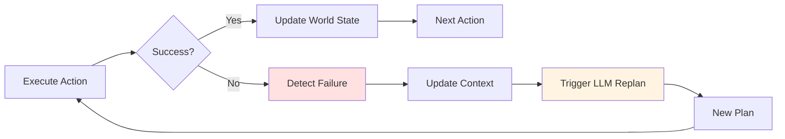

# Chapter 2: Cognitive Planning with LLMs

## Introduction: The Robot That Thinks

A humanoid service robot stands in a hotel lobby. A guest approaches and says: *"I need fresh towels delivered to room 312."*

In traditional robotics, this would require a human programmer to anticipate this exact scenario and write code:
```python
if request == "towels to room 312":
    navigate_to_linen_closet()
    pick_up_towels(count=2)
    navigate_to_room(312)
    knock_on_door()
    hand_over_towels()
```

But what about *"I need soap in room 405"* or *"Can you bring ice to the conference room?"* Each scenario needs custom code. The robot is brittle—locked into pre-programmed behaviors.

Now imagine a different approach. The robot **understands** the guest's intent, **reasons** about the steps needed, and **generates** an action plan:

```
Human: "I need fresh towels delivered to room 312"
  ↓ [LLM Planning]
Robot plans:
1. Navigate to linen storage
2. Identify and grasp 2 fresh towels
3. Navigate to room 312
4. Knock on door (audio signal)
5. Wait for guest to open door
6. Hand over towels to guest
7. Return to lobby
```

This is **cognitive planning with Large Language Models**—the "brain" that makes VLA systems adaptive, general-purpose, and intelligent.

## What Is Cognitive Planning?

### Traditional Planning vs. Cognitive Planning

**Traditional Planning (Scripted Robotics)**:
- Human writes explicit if-then-else rules
- Every scenario must be anticipated and coded
- Robot has no understanding of task semantics
- Brittle: breaks when environment or request changes
- Example: Fast food robot flips burgers in exact sequence, fails if burger position shifts

**Cognitive Planning (LLM-Based)**:
- LLM decomposes high-level natural language into action sequences
- Robot adapts to novel scenarios without new code
- Semantic understanding: LLM "knows" what "clean the room" entails
- Flexible: handles variations, unexpected obstacles, replans on failure
- Example: Service robot adapts "clean the conference room" differently based on room state (empty vs. occupied)

### How LLMs Enable Semantic Understanding

Large Language Models (GPT-4, Llama-3, Claude, etc.) are trained on massive text corpora including:
- Wikipedia articles on robotics, physics, common sense reasoning
- Task instructions ("how to set a table", "how to organize a warehouse")
- Code repositories with robot control logic
- Human conversations about tasks and procedures

This training gives LLMs **implicit world knowledge**:
- "Picking up a cup" requires grasping from the side or top (not bottom)
- "Cleaning a room" involves identifying trash, organizing items, vacuuming
- "Delivering an object" requires navigating to target location, then handing over
- "Placing object on shelf" requires checking if shelf has space

LLMs can **decompose complex tasks** into subtasks with **preconditions** and **success criteria**—the building blocks of robot planning.

## Task Decomposition with LLMs

### Example 1: "Clean the Room"

Let's see how an LLM decomposes this high-level command:

**Human Task**: *"Clean the room"*

**LLM Decomposition**:
```json
{
  "task": "Clean the room",
  "plan": [
    {
      "step": 1,
      "action": "navigate",
      "target": "room_center",
      "preconditions": ["robot_localized", "map_available"],
      "success_criteria": ["position_reached"]
    },
    {
      "step": 2,
      "action": "detect_objects",
      "query": "all objects in room",
      "preconditions": ["camera_online", "vision_model_loaded"],
      "success_criteria": ["object_list_generated"]
    },
    {
      "step": 3,
      "action": "categorize_objects",
      "categories": ["trash", "misplaced_items", "organized_items"],
      "preconditions": ["objects_detected"],
      "success_criteria": ["all_objects_categorized"]
    },
    {
      "step": 4,
      "action": "pick_up_trash",
      "targets": "objects_in_trash_category",
      "preconditions": ["gripper_available", "trash_items_identified"],
      "success_criteria": ["all_trash_grasped"]
    },
    {
      "step": 5,
      "action": "navigate",
      "target": "trash_bin",
      "preconditions": ["trash_held"],
      "success_criteria": ["at_trash_bin"]
    },
    {
      "step": 6,
      "action": "place_in_bin",
      "target": "trash_bin",
      "preconditions": ["at_trash_bin", "trash_held"],
      "success_criteria": ["trash_released", "gripper_empty"]
    },
    {
      "step": 7,
      "action": "organize_misplaced_items",
      "targets": "objects_in_misplaced_category",
      "preconditions": ["trash_discarded"],
      "success_criteria": ["items_returned_to_proper_locations"]
    },
    {
      "step": 8,
      "action": "navigate",
      "target": "room_exit",
      "preconditions": ["task_complete"],
      "success_criteria": ["exited_room"]
    }
  ],
  "estimated_duration": "8-12 minutes",
  "risk_assessment": "low",
  "safety_notes": ["avoid fragile items", "do not discard items unless clearly trash"]
}
```

**Key Features**:
- **Structured decomposition**: High-level task → 8 executable steps
- **Preconditions**: Each step requires certain conditions (robot localized, objects detected, etc.)
- **Success criteria**: Clear measures for step completion
- **Safety considerations**: LLM includes cautions (avoid fragile items)

### Example 2: "Pick up the blue bottle and place it in the recycling bin"

**Human Task**: *"Pick up the blue bottle and place it in the recycling bin"*

**LLM Decomposition**:
```json
{
  "task": "Pick up the blue bottle and place it in the recycling bin",
  "plan": [
    {
      "step": 1,
      "action": "navigate",
      "target": "object_search_position",
      "description": "Move to vantage point for object detection"
    },
    {
      "step": 2,
      "action": "detect_object",
      "query": "blue bottle",
      "confidence_threshold": 0.8,
      "description": "Use computer vision to locate blue bottle"
    },
    {
      "step": 3,
      "action": "navigate",
      "target": "object_position",
      "description": "Navigate to detected blue bottle location"
    },
    {
      "step": 4,
      "action": "grasp",
      "object": "blue_bottle",
      "grasp_type": "top_down",
      "description": "Grasp blue bottle with top-down approach"
    },
    {
      "step": 5,
      "action": "navigate",
      "target": "recycling_bin_position",
      "description": "Navigate to recycling bin while holding bottle"
    },
    {
      "step": 6,
      "action": "place",
      "target": "recycling_bin",
      "release_height": 0.2,
      "description": "Place bottle in recycling bin from 20cm above"
    }
  ]
}
```

**Notice**:
- LLM **infers implicit steps** (navigate to search position before detecting)
- LLM **specifies parameters** (confidence_threshold: 0.8, release_height: 0.2m)
- LLM **chooses grasp strategy** (top_down for bottle)
- Plan is **concise** (6 steps vs. 8 for "clean room"—appropriate to task complexity)

## Prompt Engineering for Robotics

The quality of LLM planning depends entirely on **prompt engineering**—how we structure the input to the LLM.

### Anatomy of a Robotics Prompt

A good robotics prompt includes:

1. **System Prompt**: Defines robot capabilities, workspace, safety constraints
2. **Few-Shot Examples**: Shows LLM what good task decomposition looks like
3. **Task Description**: The actual command to plan
4. **Output Format**: JSON schema for structured action sequences

### System Prompt Example

```python
SYSTEM_PROMPT = """
You are a task planning AI for a humanoid service robot with the following capabilities:

**Sensors**:
- Stereo cameras (640x480 @ 30 FPS)
- LiDAR (360° horizontal, 15m range)
- Force/torque sensors in gripper

**Actuators**:
- Differential drive base (max speed: 1.0 m/s)
- 6-DOF robotic arm (reach: 0.8m)
- Parallel jaw gripper (max grasp width: 0.15m, max force: 50N)

**Software**:
- ROS 2 Humble
- Nav2 navigation stack (obstacle avoidance, path planning)
- MoveIt motion planning
- Computer vision (object detection, 6D pose estimation)

**Workspace**:
- Indoor office environment
- Known map (5m x 8m floor plan)
- Obstacles: desks, chairs, shelves, trash bins
- Named locations: "office", "conference_room", "storage_closet", "charging_station"

**Safety Constraints**:
- Maximum speed: 0.5 m/s near humans, 1.0 m/s in open areas
- Do NOT grasp: knives, hot objects, fragile glassware, heavy objects (>2kg)
- Do NOT navigate: stairs, narrow gaps (<0.6m width)
- Always confirm before discarding any item

**Task Decomposition Rules**:
1. Break tasks into atomic actions: navigate, detect_object, grasp, place, wait
2. Include preconditions for each action
3. Include success criteria for each action
4. Estimate duration realistically
5. Assess safety risks
6. Output JSON format with "task", "plan" (array of steps), "estimated_duration", "safety_notes"

Now decompose the following task into an executable plan.
"""
```

**Why this works**:
- **Explicit capabilities**: LLM knows what robot can/cannot do
- **Safety constraints**: LLM avoids generating unsafe plans
- **Workspace context**: LLM plans within known environment
- **Output format**: Ensures structured, parseable responses

### Few-Shot Examples

Provide 2-3 examples of good task decomposition:

```python
FEW_SHOT_EXAMPLES = """
**Example 1**:
Task: "Go to the conference room"
Plan:
{
  "task": "Go to the conference room",
  "plan": [
    {"step": 1, "action": "navigate", "target": "conference_room", "preconditions": ["map_loaded"], "success_criteria": ["position_reached"]}
  ],
  "estimated_duration": "30 seconds"
}

**Example 2**:
Task: "Bring me a water bottle from the storage closet"
Plan:
{
  "task": "Bring me a water bottle from the storage closet",
  "plan": [
    {"step": 1, "action": "navigate", "target": "storage_closet"},
    {"step": 2, "action": "detect_object", "query": "water bottle", "confidence_threshold": 0.8},
    {"step": 3, "action": "grasp", "object": "water_bottle", "grasp_type": "side_grasp"},
    {"step": 4, "action": "navigate", "target": "user_position"},
    {"step": 5, "action": "handover", "recipient": "user"}
  ],
  "estimated_duration": "90-120 seconds",
  "safety_notes": ["ensure stable grasp to avoid dropping bottle"]
}

**Example 3**:
Task: "Sort the items on the table into trash and keep piles"
Plan:
{
  "task": "Sort items on table",
  "plan": [
    {"step": 1, "action": "navigate", "target": "table_position"},
    {"step": 2, "action": "detect_objects", "query": "all items on table"},
    {"step": 3, "action": "categorize_objects", "categories": ["trash", "keep"], "use_llm": true},
    {"step": 4, "action": "pick_and_sort", "targets": "categorized_objects", "trash_location": "trash_bin", "keep_location": "shelf"}
  ],
  "estimated_duration": "3-5 minutes",
  "safety_notes": ["ask user for confirmation before discarding items"]
}

Now decompose the user's task:
"""
```

### Complete Prompt Template

```python
def create_planning_prompt(user_task):
    """
    Create complete prompt for LLM task planning.
    """
    prompt = f"""{SYSTEM_PROMPT}

{FEW_SHOT_EXAMPLES}

**User Task**: "{user_task}"

Provide the task decomposition in JSON format.
"""
    return prompt
```

## LLM-to-ROS Conversion

Once the LLM generates a plan, we need to convert it into ROS 2 actions.

### JSON Action Schema

LLMs output plans in JSON. Here's our action schema:

```python
ACTION_SCHEMA = {
    "navigate": {
        "ros_action": "nav2_msgs/NavigateToPose",
        "parameters": ["target"],  # target can be named location or (x, y, theta)
        "timeout": 60.0
    },
    "detect_object": {
        "ros_action": "custom_msgs/DetectObject",
        "parameters": ["query", "confidence_threshold"],
        "timeout": 10.0
    },
    "grasp": {
        "ros_action": "moveit_msgs/Pickup",
        "parameters": ["object", "grasp_type"],
        "timeout": 30.0
    },
    "place": {
        "ros_action": "moveit_msgs/Place",
        "parameters": ["target", "release_height"],
        "timeout": 30.0
    },
    "wait": {
        "ros_action": "std_srvs/Trigger",  # No-op, just wait
        "parameters": ["duration"],
        "timeout": None
    }
}
```

### Converting LLM Plan to ROS Actions

Here's a complete LLM planner node that converts plans to ROS actions:

```python
#!/usr/bin/env python3
"""
LLM Planner Node: Converts natural language tasks into ROS 2 action sequences
"""
import rclpy
from rclpy.node import Node
from rclpy.action import ActionClient
from std_msgs.msg import String
from nav2_msgs.action import NavigateToPose
import openai
import json
import os

# System prompt defining robot capabilities and constraints
SYSTEM_PROMPT = """
You are a task planning AI for a humanoid service robot.

Capabilities: navigation, object detection, grasping, placing
Workspace: indoor office with known map
Safety: avoid knives, hot objects, heavy items (>2kg)

Output JSON format:
{
  "task": "task description",
  "plan": [
    {"step": 1, "action": "navigate", "target": "location", "preconditions": [...], "success_criteria": [...]},
    ...
  ],
  "estimated_duration": "X seconds/minutes"
}

Decompose the user's task into executable actions.
"""

class LLMPlannerNode(Node):
    def __init__(self):
        super().__init__('llm_planner_node')

        # OpenAI API setup (or use Llama-3 alternative)
        openai.api_key = os.getenv('OPENAI_API_KEY')

        # Subscriber: Voice commands from Chapter 1
        self.command_sub = self.create_subscription(
            String,
            '/voice/command',
            self.command_callback,
            10
        )

        # Publisher: Generated plans
        self.plan_pub = self.create_publisher(
            String,
            '/task/plan',
            10
        )

        # Action clients (example: navigation)
        self.nav_client = ActionClient(self, NavigateToPose, 'navigate_to_pose')

        self.get_logger().info("LLM Planner Node initialized")

    def command_callback(self, msg):
        """
        Receive voice command, generate plan with LLM, publish plan.
        """
        user_task = msg.data
        self.get_logger().info(f"Received task: '{user_task}'")

        # Step 1: Generate plan with LLM
        plan = self.generate_plan(user_task)

        if plan:
            self.get_logger().info(f"Generated plan: {json.dumps(plan, indent=2)}")

            # Step 2: Validate plan
            validation = self.validate_plan(plan)
            if validation["status"] != "valid":
                self.get_logger().warn(f"Plan rejected: {validation['reason']}")
                return

            # Step 3: Publish plan
            plan_msg = String()
            plan_msg.data = json.dumps(plan)
            self.plan_pub.publish(plan_msg)

            # Step 4: Execute plan (call ROS actions)
            self.execute_plan(plan)

    def generate_plan(self, user_task):
        """
        Call LLM (GPT-4) to generate task plan.
        """
        try:
            response = openai.ChatCompletion.create(
                model="gpt-4",
                messages=[
                    {"role": "system", "content": SYSTEM_PROMPT},
                    {"role": "user", "content": f"Task: {user_task}"}
                ],
                temperature=0.3,  # Lower temperature for consistent, deterministic plans
                max_tokens=500
            )

            # Parse JSON response
            plan_text = response.choices[0].message.content
            plan = json.loads(plan_text)
            return plan

        except json.JSONDecodeError:
            self.get_logger().error("LLM response was not valid JSON")
            return None
        except Exception as e:
            self.get_logger().error(f"LLM API error: {e}")
            return None

    def validate_plan(self, plan):
        """
        Validate LLM-generated plan for safety and feasibility.
        """
        # Check 1: Plan has required fields
        if "task" not in plan or "plan" not in plan:
            return {"status": "rejected", "reason": "missing_required_fields"}

        # Check 2: Plan steps are non-empty
        if len(plan["plan"]) == 0:
            return {"status": "rejected", "reason": "empty_plan"}

        # Check 3: All actions are supported
        supported_actions = ["navigate", "detect_object", "grasp", "place", "wait"]
        for step in plan["plan"]:
            action = step.get("action")
            if action not in supported_actions:
                return {"status": "rejected", "reason": f"unsupported_action: {action}"}

        # Check 4: No forbidden actions (safety)
        for step in plan["plan"]:
            if step.get("action") == "grasp":
                obj = step.get("object", "").lower()
                forbidden = ["knife", "hot", "glass", "fragile"]
                if any(f in obj for f in forbidden):
                    return {"status": "rejected", "reason": f"unsafe_grasp: {obj}"}

        return {"status": "valid"}

    def execute_plan(self, plan):
        """
        Execute plan by calling ROS 2 actions for each step.
        """
        for step in plan["plan"]:
            action = step.get("action")
            self.get_logger().info(f"Executing step {step.get('step')}: {action}")

            if action == "navigate":
                self.execute_navigate(step)
            elif action == "grasp":
                self.execute_grasp(step)
            # Add more action handlers as needed

    def execute_navigate(self, step):
        """
        Execute navigation action via Nav2.
        """
        target = step.get("target")
        self.get_logger().info(f"Navigating to: {target}")

        # Here you would create NavigateToPose goal and send to action server
        # goal = NavigateToPose.Goal()
        # goal.pose.header.frame_id = "map"
        # goal.pose.pose.position.x = ...  # Look up target coordinates
        # self.nav_client.send_goal_async(goal)

    def execute_grasp(self, step):
        """
        Execute grasp action via MoveIt.
        """
        obj = step.get("object")
        self.get_logger().info(f"Grasping: {obj}")
        # Here you would call MoveIt Pickup action

def main(args=None):
    rclpy.init(args=args)
    node = LLMPlannerNode()

    try:
        rclpy.spin(node)
    except KeyboardInterrupt:
        pass
    finally:
        node.destroy_node()
        rclpy.shutdown()

if __name__ == '__main__':
    main()
```

**Key Features**:
- ✅ Subscribes to voice commands from Chapter 1
- ✅ Calls GPT-4 API with robotics system prompt
- ✅ Parses JSON response
- ✅ Validates plan (required fields, supported actions, safety constraints)
- ✅ Executes plan by calling ROS 2 action servers
- ✅ Logs each step for debugging

## Open-Source Alternative: Using Llama-3

For learners without OpenAI API access, here's how to use **Llama-3-70B** (open-source):

```python
from transformers import AutoTokenizer, AutoModelForCausalLM
import torch

class LlamaPlanner:
    def __init__(self, model_name="meta-llama/Meta-Llama-3-70B-Instruct"):
        """
        Initialize Llama-3 model for task planning.
        Requires GPU with 40GB+ VRAM or quantized version.
        """
        self.tokenizer = AutoTokenizer.from_pretrained(model_name)
        self.model = AutoModelForCausalLM.from_pretrained(
            model_name,
            torch_dtype=torch.float16,
            device_map="auto"  # Automatic multi-GPU distribution
        )

    def generate_plan(self, user_task):
        """
        Generate task plan using Llama-3.
        """
        prompt = f"""{SYSTEM_PROMPT}

Task: {user_task}

Provide the task decomposition in JSON format:
"""

        # Tokenize and generate
        inputs = self.tokenizer(prompt, return_tensors="pt").to("cuda")
        outputs = self.model.generate(
            **inputs,
            max_new_tokens=500,
            temperature=0.3,
            do_sample=True,
            top_p=0.9
        )

        # Decode response
        response = self.tokenizer.decode(outputs[0], skip_special_tokens=True)

        # Extract JSON (Llama-3 often includes extra text)
        try:
            # Find JSON block in response
            json_start = response.find('{')
            json_end = response.rfind('}') + 1
            json_text = response[json_start:json_end]
            plan = json.loads(json_text)
            return plan
        except:
            return None

# Usage in ROS node:
# self.llama_planner = LlamaPlanner()
# plan = self.llama_planner.generate_plan(user_task)
```

**Comparison: GPT-4 vs Llama-3**

| Feature | GPT-4 (OpenAI API) | Llama-3-70B (Open-Source) |
|---------|-------------------|---------------------------|
| **Cost** | ~$0.03 per 1K tokens | Free (inference only) |
| **Accuracy** | Very high (state-of-the-art) | High (close to GPT-4) |
| **Latency** | 1-3 seconds | 2-5 seconds (on RTX 4090) |
| **Hardware** | None (cloud API) | GPU with 40GB+ VRAM |
| **Privacy** | Data sent to OpenAI | Fully local inference |
| **Deployment** | Requires internet | Works offline |

**Recommendation**: Use **GPT-4 for prototyping** (fast, no setup), migrate to **Llama-3 for production** (privacy, no API costs).

## State Tracking and Replanning

Robots operate in dynamic environments. Plans fail. **State tracking** and **replanning** make VLA systems robust.

### Why Plans Fail

Common failure modes:
1. **Object not found**: "Pick up the blue cup" → no blue cup detected
2. **Navigation blocked**: Path to target is obstructed
3. **Grasp failure**: Object slips from gripper
4. **Precondition not met**: Action requires condition that doesn't hold

### State Tracking Architecture



### Implementing State Tracking

```python
class StatefulPlanExecutor(Node):
    def __init__(self):
        super().__init__('stateful_executor')

        # World state (tracks robot knowledge)
        self.world_state = {
            "robot_position": None,
            "detected_objects": [],
            "gripper_status": "empty",  # "empty" or "holding_X"
            "last_action_result": None,
            "task_history": []
        }

        # Current plan
        self.current_plan = None
        self.current_step = 0

    def execute_step(self, step):
        """
        Execute a plan step and update world state.
        """
        action = step.get("action")
        self.get_logger().info(f"Executing: {action}")

        # Execute action (returns success/failure)
        result = self.call_action(action, step)

        # Update world state based on result
        if result["status"] == "success":
            self.update_world_state(action, result)
            self.current_step += 1
            return "continue"
        else:
            # Failure detected
            self.get_logger().warn(f"Action failed: {result['error']}")
            return "replan"

    def update_world_state(self, action, result):
        """
        Update world state after successful action.
        """
        if action == "navigate":
            self.world_state["robot_position"] = result["final_pose"]

        elif action == "detect_object":
            self.world_state["detected_objects"] = result["objects"]

        elif action == "grasp":
            self.world_state["gripper_status"] = f"holding_{result['object_id']}"

        elif action == "place":
            self.world_state["gripper_status"] = "empty"

        # Record in task history
        self.world_state["task_history"].append({
            "action": action,
            "timestamp": self.get_clock().now().to_msg(),
            "result": "success"
        })

    def trigger_replan(self, failure_info):
        """
        Call LLM to generate new plan given current world state and failure.
        """
        replan_prompt = f"""
The robot was executing this plan:
{json.dumps(self.current_plan, indent=2)}

Current step: {self.current_step}
Failure: {failure_info['error']}

Current world state:
{json.dumps(self.world_state, indent=2)}

Generate a new plan to complete the original task, accounting for this failure.
"""

        # Call LLM (GPT-4 or Llama-3)
        new_plan = self.llm_generate_plan(replan_prompt)

        if new_plan:
            self.get_logger().info("Replanning successful")
            self.current_plan = new_plan
            self.current_step = 0
            return new_plan
        else:
            self.get_logger().error("Replanning failed")
            return None
```

### Example: Replanning After Failure

**Original Plan**: "Pick up the blue cup"
```json
{
  "plan": [
    {"step": 1, "action": "navigate", "target": "table"},
    {"step": 2, "action": "detect_object", "query": "blue cup"},
    {"step": 3, "action": "grasp", "object": "blue_cup"}
  ]
}
```

**Execution**:
- Step 1: Navigate to table ✅ SUCCESS
- Step 2: Detect blue cup ❌ FAILURE (no blue cup found)

**Replan Prompt to LLM**:
```
Task: Pick up the blue cup
Failure at step 2: Object "blue cup" not detected
World state: robot at table, detected objects: [red cup, green bottle, book]

Suggest next steps.
```

**LLM Replanned Actions**:
```json
{
  "plan": [
    {"step": 1, "action": "navigate", "target": "kitchen", "reasoning": "Blue cup might be in kitchen"},
    {"step": 2, "action": "detect_object", "query": "blue cup"},
    {"step": 3, "action": "conditional_grasp", "if_detected": true, "else": "ask_human_for_help"}
  ]
}
```

LLM **adapts** the plan: searches another location, adds fallback (ask human) if still not found.

## Safety Constraints and Validation

LLMs can hallucinate unsafe actions. **Validation layers** prevent disasters.

### Safety Validation Checklist

```python
def validate_action_safety(action, parameters, world_state):
    """
    Multi-layer safety validation for robot actions.
    Returns {"safe": bool, "warnings": []}
    """
    warnings = []

    # Layer 1: Workspace bounds
    if action == "navigate":
        target = parameters.get("target")
        if not is_within_workspace(target):
            return {"safe": False, "reason": "target outside workspace bounds"}

    # Layer 2: Collision prediction
    if action == "navigate":
        path = plan_path(world_state["robot_position"], parameters["target"])
        if has_collision(path):
            return {"safe": False, "reason": "collision predicted on path"}

    # Layer 3: Gripper force limits
    if action == "grasp":
        obj = parameters.get("object")
        estimated_weight = estimate_object_weight(obj)
        if estimated_weight > 2.0:  # kg
            return {"safe": False, "reason": "object too heavy (>2kg limit)"}

    # Layer 4: Forbidden actions
    forbidden_objects = ["knife", "hot_pan", "glass", "fragile"]
    if action == "grasp":
        obj = parameters.get("object", "").lower()
        for forbidden in forbidden_objects:
            if forbidden in obj:
                return {"safe": False, "reason": f"forbidden object: {forbidden}"}

    # Layer 5: Human proximity
    if action == "navigate":
        if humans_nearby(parameters["target"]):
            warnings.append("humans nearby, reduce speed to 0.3 m/s")

    return {"safe": True, "warnings": warnings}
```

### Confidence Thresholding

Reject low-confidence LLM outputs:

```python
def assess_plan_confidence(plan):
    """
    Estimate confidence in LLM-generated plan.
    """
    confidence_score = 1.0

    # Check 1: All actions have required parameters
    for step in plan["plan"]:
        required_params = ACTION_SCHEMA[step["action"]]["parameters"]
        for param in required_params:
            if param not in step:
                confidence_score -= 0.2  # Missing parameter lowers confidence

    # Check 2: Reasonable step count (2-15 steps typical)
    step_count = len(plan["plan"])
    if step_count < 2 or step_count > 20:
        confidence_score -= 0.3

    # Check 3: Has estimated duration
    if "estimated_duration" not in plan:
        confidence_score -= 0.1

    return max(0.0, confidence_score)

# Usage
plan = llm_generate_plan(task)
confidence = assess_plan_confidence(plan)

if confidence < 0.7:
    reject_plan(reason="low_confidence")
```

## Real-World Example: Hotel Service Robot

**Scenario**: Humanoid robot assists hotel guests.

**System Setup**:
- **Robot**: Mobile manipulator (PR2-style)
- **LLM**: GPT-4 via API (Llama-3 on-device as fallback)
- **Capabilities**: Navigate hallways, grasp objects (towels, toiletries), interact with guests

**Example Task Sequence**:

```
Guest (voice): "I need extra towels in room 312"
  ↓ [Whisper STT - Chapter 1]
Transcription: "I need extra towels in room 312"
  ↓ [LLM Planning - Chapter 2]
Generated Plan:
{
  "plan": [
    {"step": 1, "action": "confirm_request", "message": "I'll bring fresh towels to room 312"},
    {"step": 2, "action": "navigate", "target": "linen_storage"},
    {"step": 3, "action": "detect_object", "query": "folded towels"},
    {"step": 4, "action": "grasp", "object": "towel_stack", "count": 2},
    {"step": 5, "action": "navigate", "target": "room_312"},
    {"step": 6, "action": "signal_arrival", "method": "door_knock"},
    {"step": 7, "action": "wait_for_door", "timeout": 30},
    {"step": 8, "action": "handover", "recipient": "guest", "message": "Here are your towels"},
    {"step": 9, "action": "navigate", "target": "lobby"}
  ]
}
  ↓ [Validation]
Safety check: PASS (all actions safe, no forbidden items, paths clear)
  ↓ [Execution]
Robot executes plan...
  ↓ [Completion]
Robot: "Task complete. Towels delivered to room 312."
```

**What if linen storage is empty?**

```
Step 3: Detect towels → FAILURE (no towels found)
  ↓ [Replan]
LLM generates alternative:
{
  "plan": [
    {"step": 1, "action": "navigate", "target": "housekeeping_office"},
    {"step": 2, "action": "request_assistance", "message": "Linen storage is empty. Please restock."},
    {"step": 3, "action": "wait_for_restock", "timeout": 300},
    {"step": 4, "action": "retry_original_plan"}
  ]
}
```

LLM **adapts**: requests human help, waits for restock, retries.

## What You Learned

In this chapter, you've mastered **cognitive planning**—the decision-making brain of VLA systems:

1. **Cognitive Planning Paradigm**: LLMs enable semantic task understanding and adaptive planning, moving beyond brittle scripted robotics to general-purpose, language-driven systems that reason about tasks and handle novel scenarios

2. **Task Decomposition**: LLMs decompose high-level natural language tasks ("Clean the room") into structured action sequences with preconditions, success criteria, and safety considerations—transforming human intent into executable robot behaviors

3. **Prompt Engineering for Robotics**: Effective LLM planning requires carefully engineered prompts including system prompts (robot capabilities, workspace, safety constraints), few-shot examples (demonstrating good decomposition), and structured output formats (JSON schemas for ROS action mapping)

4. **LLM-to-ROS Conversion**: Converting LLM-generated JSON plans into ROS 2 actions requires action schemas (mapping abstract actions to ROS action types), parameter extraction, and ROS action client invocation for each plan step

5. **State Tracking and Replanning**: Robust VLA systems maintain world state (robot position, detected objects, gripper status), detect action failures, and trigger LLM replanning with updated context—enabling adaptive recovery from unexpected situations

6. **Safety Validation**: Multi-layer validation prevents unsafe LLM hallucinations through workspace bounds checking, collision prediction, gripper force limits, forbidden object filtering, and human proximity awareness—ensuring plans are safe before execution

7. **Open-Source Alternatives**: Multiple deployment options exist—GPT-4 (cloud API, fast prototyping), Llama-3-70B (local inference, privacy, free), and other open models—ensuring accessibility regardless of API access or compute constraints

**You're now ready to build robots that think**—planning complex tasks adaptively, replanning on failures, and executing safely with LLM-driven intelligence.

## Next Steps

Voice input (Chapter 1) and cognitive planning (Chapter 2) are powerful, but plans need **visual grounding**. How does the robot know where "the blue bottle" is? How does it estimate grasp poses?

In **Chapter 3: Computer Vision for Object Recognition**, you'll learn vision foundation models (CLIP, SAM, Grounding DINO) that enable robots to **see**, **identify**, and **locate** objects—connecting language-based plans to the physical world through visual perception.

Let's make robots see what they need to do.

---

**Resources**:
- OpenAI GPT-4 API: https://platform.openai.com/docs/
- Meta Llama-3: https://huggingface.co/meta-llama/Meta-Llama-3-70B-Instruct
- Hugging Face Transformers: https://huggingface.co/docs/transformers/
- LangChain (LLM orchestration): https://python.langchain.com/
- Prompt Engineering Guide: https://www.promptingguide.ai/
