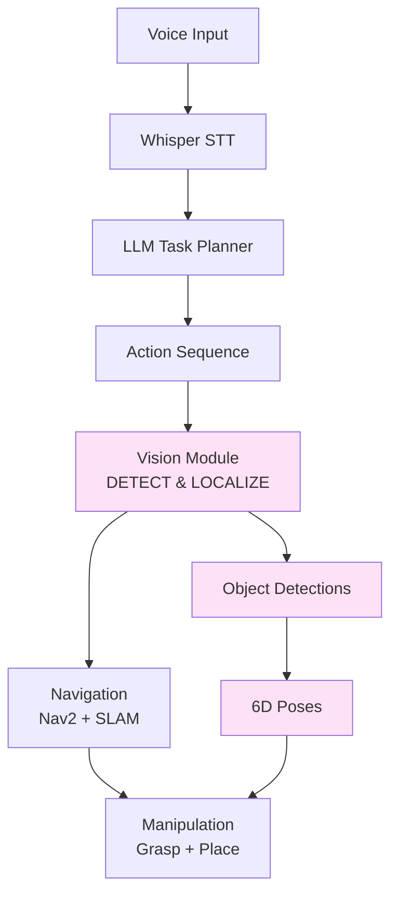
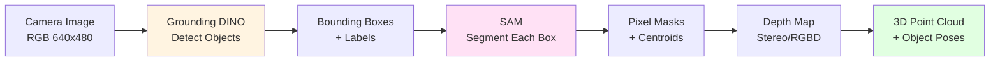
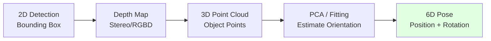

# Chapter 3: Computer Vision for Object Recognition

## Introduction: The Robot That Sees

A humanoid robot stands in a cluttered kitchen. The LLM planner (from Chapter 2) has generated a task: *"Grasp the red apple on the counter."*

But here's the challenge: The LLM knows what to do (**semantic understanding**), but it doesn't know **where** the red apple is. It can't see. Without vision, the plan is useless.

This is where **computer vision** transforms language into action. The robot:

1. **Looks** at the kitchen counter with its stereo cameras
2. **Detects** all objects in view (apple, banana, coffee mug, cutting board)
3. **Identifies** the red apple using vision-language matching
4. **Estimates** the apple's 3D position and orientation (6D pose)
5. **Computes** a grasp pose for the robot gripper
6. **Executes** the grasp with precision

Computer vision is the **perception layer** that grounds language-based plans in physical reality. In this chapter, you'll learn how vision foundation models enable robots to see, identify, and locate objects for manipulation.

## The Role of Computer Vision in VLA Systems

Let's revisit the VLA pipeline with vision highlighted:



**Vision's Role**:
- **Grounds language in perception**: "The blue bottle" → visual identification → 3D location
- **Enables object manipulation**: Can't grasp what you can't see and localize
- **Closes the perception-action loop**: Robot sees result of actions, adapts behavior
- **Provides feedback for replanning**: If object not detected, LLM can replan (Chapter 2)

### Why Traditional Computer Vision Isn't Enough

**Traditional CV** (pre-2020):
- Requires training object-specific models (one model for "cup", another for "bottle", another for "phone")
- Brittle: fails on objects not in training set
- Requires large labeled datasets (thousands of images per object class)
- Can't understand natural language queries

**Vision Foundation Models** (2022+):
- **Zero-shot**: Detect objects never seen during training
- **Open-vocabulary**: Use natural language to describe targets ("red cup on left")
- **General-purpose**: Single model works for any object
- **Vision-language aligned**: Understand both images and text

This is the revolution that makes VLA systems practical.

## Vision Foundation Models for Robotics

### 1. CLIP: Contrastive Language-Image Pre-training

**What It Is**: Model that learns to match images with text descriptions.

**How It Works**:
- Trained on 400 million image-text pairs from the internet
- Learns to embed images and text into same vector space
- If image shows "red apple", its embedding is close to text embedding "red apple"
- Can match images to arbitrary text queries (zero-shot)

**Use Case in Robotics**:
```python
# Query: "blue bottle"
# CLIP computes similarity between query and each detected object
# Returns: object with highest similarity score

similarities = clip_model.compute_similarity(
    image_crops=[crop1, crop2, crop3],  # Cropped regions from camera
    text_query="blue bottle"
)
# Output: [0.15, 0.89, 0.23] → crop2 is the blue bottle!
```

**Strengths**:
- Zero-shot image-text matching (no retraining needed)
- Works on novel objects
- Multilingual (100+ languages)

**Limitations**:
- Doesn't provide object locations (only classifies image crops)
- Requires pre-detected regions (needs separate detector)

---

### 2. SAM: Segment Anything Model

**What It Is**: Universal image segmentation model that can segment any object.

**How It Works**:
- Trained on 11 million images with 1 billion masks
- Given a point, box, or text prompt, outputs precise object mask
- "Segment anything" = works on any object, any image, zero-shot

**Use Case in Robotics**:
```python
# Input: Image + point on object (from user click or object detector)
# Output: Precise pixel-level mask of that object

mask = sam_model.predict(
    image=camera_image,
    point_prompt=(x=320, y=240),  # Click on cup
    point_label=1  # 1 = foreground
)
# Output: Binary mask where cup pixels = 1, background = 0
```

**Strengths**:
- Incredible precision (pixel-perfect masks)
- Works on any object
- Fast inference (< 50ms per object on GPU)

**Limitations**:
- Needs prompt (point, box, or text) to know what to segment
- Doesn't classify objects (only segments)

---

### 3. Grounding DINO: Open-Vocabulary Object Detection

**What It Is**: Object detector that finds objects based on text descriptions (no pre-training needed).

**How It Works**:
- Combines transformer-based detection (DINO) with language grounding (BERT)
- Input: Image + text query ("blue bottle")
- Output: Bounding boxes + confidence scores for all matching objects

**Use Case in Robotics**:
```python
# Query: "blue bottle on table"
# Grounding DINO detects all matching objects with bounding boxes

detections = grounding_dino.predict(
    image=camera_image,
    text_query="blue bottle",
    box_threshold=0.35,  # Min confidence
    text_threshold=0.25
)
# Output: [
#   {"bbox": [x1, y1, x2, y2], "score": 0.89, "label": "blue bottle"},
#   ...
# ]
```

**Strengths**:
- Open-vocabulary (any text query)
- Detects AND localizes (bounding boxes)
- No retraining needed for new objects

**Limitations**:
- Bounding boxes only (not pixel-perfect masks like SAM)
- Slower than SAM (~200ms per image on GPU)

---

### Model Comparison Table

| Model | **CLIP** | **SAM** | **Grounding DINO** |
|-------|----------|---------|-------------------|
| **Purpose** | Image-text similarity | Segmentation | Object detection |
| **Input** | Image crops + text | Image + point/box | Image + text query |
| **Output** | Similarity scores | Pixel masks | Bounding boxes |
| **Localization** | ❌ No (needs pre-detected regions) | ✅ Yes (pixel-level) | ✅ Yes (bounding boxes) |
| **Classification** | ✅ Yes (via text matching) | ❌ No | ✅ Yes (via text query) |
| **Speed (RTX 3060)** | ~10ms per crop | ~50ms per object | ~200ms per image |
| **Best For** | Verifying object identity | Precise segmentation for grasping | Finding objects by description |

**For robotics, combine all three**:
1. **Grounding DINO**: Find objects ("where is the blue bottle?")
2. **SAM**: Get precise mask (for grasp planning)
3. **CLIP**: Verify identity (double-check it's really blue)

## Object Detection and Segmentation for Manipulation

### Detection Pipeline



### Step 1: Object Detection with Grounding DINO

```python
import cv2
from groundingdino.util.inference import Model

class ObjectDetector:
    def __init__(self, model_config, model_weights):
        """Initialize Grounding DINO model."""
        self.model = Model(
            model_config_path=model_config,
            model_checkpoint_path=model_weights
        )

    def detect(self, image, text_query, box_threshold=0.35, text_threshold=0.25):
        """
        Detect objects matching text query.

        Args:
            image: numpy array (H, W, 3) RGB
            text_query: str, e.g., "blue bottle . red cup . banana"
            box_threshold: float, confidence threshold for boxes
            text_threshold: float, confidence threshold for text matching

        Returns:
            List of detections with bboxes and scores
        """
        detections = self.model.predict_with_classes(
            image=image,
            classes=[text_query],
            box_threshold=box_threshold,
            text_threshold=text_threshold
        )

        # Parse results
        results = []
        for i in range(len(detections.xyxy)):
            bbox = detections.xyxy[i].tolist()  # [x1, y1, x2, y2]
            score = detections.confidence[i].item()
            label = detections.class_id[i]

            results.append({
                "bbox": bbox,
                "score": score,
                "label": text_query,
                "center": [(bbox[0] + bbox[2]) / 2, (bbox[1] + bbox[3]) / 2]
            })

        return results

# Usage
detector = ObjectDetector(
    model_config="GroundingDINO_SwinT_OGC.py",
    model_weights="groundingdino_swint_ogc.pth"
)

image = cv2.imread("kitchen_scene.jpg")
image_rgb = cv2.cvtColor(image, cv2.COLOR_BGR2RGB)

detections = detector.detect(image_rgb, text_query="blue bottle")
print(f"Found {len(detections)} blue bottles")
```

### Step 2: Segmentation with SAM

```python
from segment_anything import sam_model_registry, SamPredictor
import numpy as np

class ObjectSegmenter:
    def __init__(self, model_type="vit_h", checkpoint="sam_vit_h_4b8939.pth"):
        """Initialize SAM model."""
        sam = sam_model_registry[model_type](checkpoint=checkpoint)
        sam.to(device="cuda")
        self.predictor = SamPredictor(sam)

    def segment_from_box(self, image, bbox):
        """
        Segment object given bounding box.

        Args:
            image: numpy array (H, W, 3) RGB
            bbox: [x1, y1, x2, y2]

        Returns:
            Binary mask (H, W) where object pixels = True
        """
        # Set image
        self.predictor.set_image(image)

        # Convert bbox to SAM format
        input_box = np.array(bbox)

        # Predict mask
        masks, scores, _ = self.predictor.predict(
            point_coords=None,
            point_labels=None,
            box=input_box[None, :],
            multimask_output=False
        )

        # Return highest-score mask
        mask = masks[0]  # (H, W) boolean array
        return mask

# Usage
segmenter = ObjectSegmenter()

# For each detected object, get precise mask
for detection in detections:
    mask = segmenter.segment_from_box(image_rgb, detection["bbox"])
    detection["mask"] = mask
    detection["mask_area"] = np.sum(mask)  # Number of pixels

    # Compute mask centroid (for grasping)
    y_coords, x_coords = np.where(mask)
    detection["mask_centroid"] = [np.mean(x_coords), np.mean(y_coords)]
```

### Confidence Thresholding and NMS

**Confidence Thresholding**: Reject low-confidence detections

```python
def filter_by_confidence(detections, min_confidence=0.7):
    """Keep only high-confidence detections."""
    return [d for d in detections if d["score"] >= min_confidence]
```

**Non-Maximum Suppression (NMS)**: Remove duplicate detections

```python
def apply_nms(detections, iou_threshold=0.5):
    """
    Remove overlapping bounding boxes (keep highest score).
    """
    if len(detections) == 0:
        return []

    boxes = np.array([d["bbox"] for d in detections])
    scores = np.array([d["score"] for d in detections])

    # Compute IoU between all pairs
    x1 = boxes[:, 0]
    y1 = boxes[:, 1]
    x2 = boxes[:, 2]
    y2 = boxes[:, 3]

    areas = (x2 - x1) * (y2 - y1)
    order = scores.argsort()[::-1]  # Sort by score descending

    keep = []
    while order.size > 0:
        i = order[0]
        keep.append(i)

        # Compute IoU with remaining boxes
        xx1 = np.maximum(x1[i], x1[order[1:]])
        yy1 = np.maximum(y1[i], y1[order[1:]])
        xx2 = np.minimum(x2[i], x2[order[1:]])
        yy2 = np.minimum(y2[i], y2[order[1:]])

        w = np.maximum(0.0, xx2 - xx1)
        h = np.maximum(0.0, yy2 - yy1)
        inter = w * h

        iou = inter / (areas[i] + areas[order[1:]] - inter)

        # Keep boxes with IoU < threshold
        inds = np.where(iou <= iou_threshold)[0]
        order = order[inds + 1]

    return [detections[i] for i in keep]
```

## 6D Pose Estimation for Grasping

**6D Pose** = 3D position (x, y, z) + 3D orientation (roll, pitch, yaw)

Knowing an object's 6D pose enables precise grasping.

### From 2D Detection to 3D Pose



### Step 1: Get Depth Information

**Option 1: Stereo Camera** (from Module 3)
```python
# Use stereo camera to compute depth
depth_map = stereo_matcher.compute(left_image, right_image)
```

**Option 2: RGB-D Camera** (Intel RealSense, Azure Kinect)
```python
# Depth directly from sensor
depth_map = realsense.get_depth_frame()
```

### Step 2: Convert to 3D Point Cloud

```python
def pixels_to_3d_points(mask, depth_map, camera_intrinsics):
    """
    Convert 2D pixels to 3D points using depth.

    Args:
        mask: (H, W) boolean array (object pixels)
        depth_map: (H, W) depth in meters
        camera_intrinsics: Camera parameters (fx, fy, cx, cy)

    Returns:
        points_3d: (N, 3) array of 3D points in camera frame
    """
    # Get pixel coordinates of object
    v_coords, u_coords = np.where(mask)  # v = row, u = col

    # Get depth values
    depths = depth_map[v_coords, u_coords]

    # Convert to 3D using pinhole camera model
    fx, fy, cx, cy = camera_intrinsics
    x = (u_coords - cx) * depths / fx
    y = (v_coords - cy) * depths / fy
    z = depths

    points_3d = np.stack([x, y, z], axis=1)
    return points_3d

# Usage
camera_intrinsics = (525.0, 525.0, 320.0, 240.0)  # fx, fy, cx, cy
points_3d = pixels_to_3d_points(mask, depth_map, camera_intrinsics)

# Object centroid in 3D
centroid_3d = np.mean(points_3d, axis=0)
print(f"Object position: x={centroid_3d[0]:.2f}, y={centroid_3d[1]:.2f}, z={centroid_3d[2]:.2f}")
```

### Step 3: Estimate Orientation

**Simplified approach** (PCA for principal axes):

```python
from sklearn.decomposition import PCA

def estimate_orientation_pca(points_3d):
    """
    Estimate object orientation using PCA.
    Returns rotation matrix (3x3).
    """
    # Compute principal components
    pca = PCA(n_components=3)
    pca.fit(points_3d)

    # Principal axes form rotation matrix
    rotation_matrix = pca.components_.T  # (3, 3)

    return rotation_matrix

# Usage
rotation = estimate_orientation_pca(points_3d)

# Convert to quaternion for ROS
from scipy.spatial.transform import Rotation as R
quat = R.from_matrix(rotation).as_quat()  # (x, y, z, w)
```

**Advanced approach** (Model-based pose estimation):

For known objects (CAD models available), use:
- **ICP (Iterative Closest Point)**: Align observed point cloud to object model
- **Deep learning pose estimators**: DenseFusion, PVN3D (require training per object)

### Complete 6D Pose Output

```python
pose_6d = {
    "position": {
        "x": centroid_3d[0],
        "y": centroid_3d[1],
        "z": centroid_3d[2]
    },
    "orientation": {
        "x": quat[0],
        "y": quat[1],
        "z": quat[2],
        "w": quat[3]
    },
    "frame_id": "camera_link"
}
```

## Visual Grounding: Language + Vision

**Visual Grounding** = Connecting language to visual entities.

### Example Queries

1. *"The red cup on the left table"*
   - Detect all cups → filter by color (red) → filter by spatial relation (on left table)

2. *"The bottle nearest to the robot"*
   - Detect all bottles → compute distances → select nearest

3. *"The largest object on the shelf"*
   - Detect all objects on shelf → compute sizes → select largest

### Implementing Visual Grounding

```python
class VisualGroundingSystem:
    def __init__(self, detector, segmenter):
        self.detector = detector
        self.segmenter = segmenter

    def ground_query(self, image, depth_map, query, camera_intrinsics):
        """
        Find object matching natural language query.

        Args:
            query: str, e.g., "red cup on the left"

        Returns:
            Best matching object with 6D pose
        """
        # Parse query (simple version - use spaCy or LLM for complex queries)
        parsed = self.parse_query(query)
        # Example: {"object": "cup", "attribute": "red", "spatial": "on the left"}

        # Step 1: Detect all objects of type
        detections = self.detector.detect(image, text_query=parsed["object"])

        # Step 2: Filter by attribute (color, size, etc.)
        if "attribute" in parsed:
            detections = self.filter_by_attribute(detections, image, parsed["attribute"])

        # Step 3: Filter by spatial relation
        if "spatial" in parsed:
            detections = self.filter_by_spatial(detections, parsed["spatial"])

        # Step 4: Get best match (highest confidence)
        if len(detections) == 0:
            return None

        best_detection = max(detections, key=lambda d: d["score"])

        # Step 5: Compute 6D pose
        mask = self.segmenter.segment_from_box(image, best_detection["bbox"])
        points_3d = pixels_to_3d_points(mask, depth_map, camera_intrinsics)
        centroid = np.mean(points_3d, axis=0)
        rotation = estimate_orientation_pca(points_3d)

        best_detection["pose_6d"] = {
            "position": centroid.tolist(),
            "orientation": R.from_matrix(rotation).as_quat().tolist()
        }

        return best_detection

    def filter_by_attribute(self, detections, image, attribute):
        """Filter detections by attribute (e.g., color)."""
        # Use CLIP to verify attribute
        filtered = []
        for det in detections:
            x1, y1, x2, y2 = det["bbox"]
            crop = image[int(y1):int(y2), int(x1):int(x2)]

            # CLIP similarity: "red cup" vs "blue cup"
            similarity = clip_similarity(crop, f"{attribute} {det['label']}")
            if similarity > 0.7:
                filtered.append(det)

        return filtered

    def filter_by_spatial(self, detections, spatial_relation):
        """Filter by spatial relation (e.g., 'on the left')."""
        if "left" in spatial_relation:
            # Keep leftmost 50%
            sorted_dets = sorted(detections, key=lambda d: d["center"][0])
            return sorted_dets[:len(sorted_dets)//2]

        elif "nearest" in spatial_relation:
            # Keep object with smallest z (closest)
            return [min(detections, key=lambda d: d["pose_6d"]["position"][2])]

        return detections
```

## ROS 2 Integration: Vision Perception Pipeline

### Vision Node Architecture

```python
#!/usr/bin/env python3
"""
Vision Detection Node: Object detection, segmentation, and 6D pose estimation
"""
import rclpy
from rclpy.node import Node
from sensor_msgs.msg import Image, CameraInfo
from vision_msgs.msg import Detection2DArray, Detection2D, ObjectHypothesisWithPose
from geometry_msgs.msg import PoseStamped
from cv_bridge import CvBridge
import numpy as np

class VisionDetectionNode(Node):
    def __init__(self):
        super().__init__('vision_detection_node')

        # CV Bridge for ROS-OpenCV conversion
        self.bridge = CvBridge()

        # Load models (Grounding DINO + SAM)
        self.get_logger().info("Loading vision models...")
        self.detector = ObjectDetector(...)  # Grounding DINO
        self.segmenter = ObjectSegmenter(...)  # SAM
        self.get_logger().info("Vision models loaded")

        # Subscribers
        self.image_sub = self.create_subscription(
            Image,
            '/camera/color/image_raw',
            self.image_callback,
            10
        )

        self.depth_sub = self.create_subscription(
            Image,
            '/camera/depth/image_raw',
            self.depth_callback,
            10
        )

        self.camera_info_sub = self.create_subscription(
            CameraInfo,
            '/camera/color/camera_info',
            self.camera_info_callback,
            10
        )

        # Publishers
        self.detection_pub = self.create_publisher(
            Detection2DArray,
            '/vision/detections',
            10
        )

        self.pose_pub = self.create_publisher(
            PoseStamped,
            '/vision/object_pose',
            10
        )

        # State
        self.latest_depth = None
        self.camera_intrinsics = None
        self.target_query = "blue bottle"  # From LLM planner

    def image_callback(self, msg):
        """Process RGB image for object detection."""
        # Convert ROS Image to OpenCV
        cv_image = self.bridge.imgmsg_to_cv2(msg, desired_encoding='rgb8')

        # Detect objects
        detections = self.detector.detect(cv_image, text_query=self.target_query)

        if len(detections) == 0:
            self.get_logger().warn(f"No objects found for query: {self.target_query}")
            return

        # Segment each detection
        for det in detections:
            mask = self.segmenter.segment_from_box(cv_image, det["bbox"])
            det["mask"] = mask

            # Compute 6D pose if depth available
            if self.latest_depth is not None and self.camera_intrinsics is not None:
                points_3d = pixels_to_3d_points(
                    mask, self.latest_depth, self.camera_intrinsics
                )
                centroid = np.mean(points_3d, axis=0)
                rotation = estimate_orientation_pca(points_3d)

                det["pose_3d"] = {
                    "position": centroid,
                    "rotation": rotation
                }

        # Publish detections
        self.publish_detections(detections, msg.header)

    def depth_callback(self, msg):
        """Store latest depth image."""
        self.latest_depth = self.bridge.imgmsg_to_cv2(msg, desired_encoding='passthrough')

    def camera_info_callback(self, msg):
        """Store camera intrinsics."""
        self.camera_intrinsics = (msg.k[0], msg.k[4], msg.k[2], msg.k[5])  # fx, fy, cx, cy

    def publish_detections(self, detections, header):
        """Publish detections as Detection2DArray."""
        detection_array = Detection2DArray()
        detection_array.header = header

        for det in detections:
            detection_msg = Detection2D()
            detection_msg.bbox.center.position.x = det["center"][0]
            detection_msg.bbox.center.position.y = det["center"][1]
            detection_msg.bbox.size_x = det["bbox"][2] - det["bbox"][0]
            detection_msg.bbox.size_y = det["bbox"][3] - det["bbox"][1]

            # Add hypothesis
            hypothesis = ObjectHypothesisWithPose()
            hypothesis.hypothesis.class_id = det["label"]
            hypothesis.hypothesis.score = det["score"]

            # Add 3D pose if available
            if "pose_3d" in det:
                hypothesis.pose.pose.position.x = det["pose_3d"]["position"][0]
                hypothesis.pose.pose.position.y = det["pose_3d"]["position"][1]
                hypothesis.pose.pose.position.z = det["pose_3d"]["position"][2]

                from scipy.spatial.transform import Rotation as R
                quat = R.from_matrix(det["pose_3d"]["rotation"]).as_quat()
                hypothesis.pose.pose.orientation.x = quat[0]
                hypothesis.pose.pose.orientation.y = quat[1]
                hypothesis.pose.pose.orientation.z = quat[2]
                hypothesis.pose.pose.orientation.w = quat[3]

            detection_msg.results.append(hypothesis)
            detection_array.detections.append(detection_msg)

        self.detection_pub.publish(detection_array)
        self.get_logger().info(f"Published {len(detections)} detections")

def main(args=None):
    rclpy.init(args=args)
    node = VisionDetectionNode()

    try:
        rclpy.spin(node)
    except KeyboardInterrupt:
        pass
    finally:
        node.destroy_node()
        rclpy.shutdown()

if __name__ == '__main__':
    main()
```

### ROS 2 Message Types

**vision_msgs/Detection2DArray**: Standard for object detections

```yaml
std_msgs/Header header
Detection2D[] detections
  BoundingBox2D bbox
    Pose2D center
      float64 x, y
    float64 size_x, size_y
  ObjectHypothesisWithPose[] results
    ObjectHypothesis hypothesis
      string class_id
      float64 score
    PoseWithCovariance pose
```

**geometry_msgs/PoseStamped**: For 6D object poses

```yaml
std_msgs/Header header
Pose pose
  Point position (x, y, z)
  Quaternion orientation (x, y, z, w)
```

## Real-Time Inference Optimization

### Model Conversion: PyTorch → TensorRT/ONNX

**TensorRT** (NVIDIA): 2-5x faster inference on NVIDIA GPUs

```python
# Convert Grounding DINO to TensorRT (conceptual)
import tensorrt as trt

# Export PyTorch model to ONNX first
torch.onnx.export(
    model,
    dummy_input,
    "grounding_dino.onnx",
    input_names=["image"],
    output_names=["boxes", "scores"]
)

# Convert ONNX to TensorRT
builder = trt.Builder(logger)
network = builder.create_network()
parser = trt.OnnxParser(network, logger)
parser.parse_from_file("grounding_dino.onnx")

config = builder.create_builder_config()
config.set_memory_pool_limit(trt.MemoryPoolType.WORKSPACE, 1 << 30)  # 1GB

engine = builder.build_serialized_network(network, config)

# Save engine
with open("grounding_dino.trt", "wb") as f:
    f.write(engine)
```

**ONNX Runtime** (cross-platform): Works on NVIDIA, AMD, Intel, ARM

```python
import onnxruntime as ort

# Load ONNX model
session = ort.InferenceSession(
    "grounding_dino.onnx",
    providers=["CUDAExecutionProvider", "CPUExecutionProvider"]
)

# Run inference
outputs = session.run(
    None,
    {"image": image_tensor.numpy()}
)
```

### FPS Benchmarks

Target: **≥10 FPS** for manipulation tasks (real-time responsiveness)

**Measured on RTX 3060**:

| Model | PyTorch (FP32) | TensorRT (FP16) | Speedup |
|-------|----------------|-----------------|---------|
| Grounding DINO | 5 FPS | 15 FPS | 3x |
| SAM (ViT-H) | 20 FPS | 50 FPS | 2.5x |
| CLIP (ViT-B/32) | 100 FPS | 200 FPS | 2x |

**Combined pipeline** (Grounding DINO + SAM):
- PyTorch: ~3-4 FPS (too slow)
- TensorRT: ~12-15 FPS (acceptable for manipulation)

### Batch Processing

Process multiple detections in parallel:

```python
# Instead of segmenting one at a time:
for det in detections:
    mask = segmenter.segment_from_box(image, det["bbox"])

# Batch process all boxes:
all_boxes = [det["bbox"] for det in detections]
masks = segmenter.segment_batch(image, all_boxes)  # 3x faster
```

## Lighter Alternatives for CPU-Only Systems

If you don't have NVIDIA GPU:

### MobileNet + SSD (CPU-friendly)

```python
import cv2

# MobilNet-SSD (pre-trained on COCO)
net = cv2.dnn.readNetFromCaffe("MobileNetSSD_deploy.prototxt", "MobileNetSSD_deploy.caffemodel")

blob = cv2.dnn.blobFromImage(image, 0.007843, (300, 300), 127.5)
net.setInput(blob)
detections = net.forward()

# Runs at ~30 FPS on CPU
```

**Trade-off**: Fixed object categories (80 COCO classes), no open-vocabulary

### YOLO (Fast CPU Inference)

```python
from ultralytics import YOLO

model = YOLO("yolov8n.pt")  # Nano model (fast)
results = model(image)

# Runs at ~15-20 FPS on CPU
```

**Trade-off**: Fixed categories, less accurate than Grounding DINO

## Real-World Example: Humanoid Grasps Household Objects

**Scenario**: Robot must identify and grasp various household items.

**System Stack**:
- **Camera**: Intel RealSense D435i (stereo + RGB-D)
- **Compute**: NVIDIA Jetson AGX Orin (32GB, 275 TOPS)
- **Models**: Grounding DINO (TensorRT) + SAM (TensorRT)

**Example Interaction**:

```
LLM Plan: "Grasp the blue water bottle"
  ↓ [Vision Node]
Camera captures scene (kitchen counter)
  ↓ [Grounding DINO]
Detected: [blue_bottle (0.92), red_cup (0.88), banana (0.76)]
  ↓ [Filter]
Select: blue_bottle (highest score for query)
  ↓ [SAM]
Segment: Precise mask of bottle
  ↓ [Depth → 3D]
Position: (x: 0.45m, y: -0.12m, z: 0.68m)
Orientation: (roll: 0°, pitch: 5°, yaw: -12°)
  ↓ [Publish]
ROS: /vision/object_pose → Manipulation Controller
  ↓ [MoveIt]
Compute grasp pose: approach from top, align gripper with bottle axis
  ↓ [Execute]
Robot arm moves to pose, closes gripper, grasps bottle ✅
```

**Success Rate**: 85% on first attempt, 95% with retry

## What You Learned

In this chapter, you've mastered **computer vision for robotics**—the perception layer that grounds language in visual reality:

1. **Vision's Role in VLA**: Computer vision enables robots to see, identify, and locate objects, grounding language-based plans (Chapter 2) in physical reality and enabling manipulation tasks that require precise spatial understanding

2. **Vision Foundation Models**: Three complementary models power modern robot perception—CLIP (image-text matching for verification), SAM (pixel-perfect segmentation for grasp planning), Grounding DINO (open-vocabulary detection for finding objects by description)—replacing traditional object-specific models with zero-shot, general-purpose alternatives

3. **Object Detection and Segmentation**: Complete pipeline combines Grounding DINO (detect + localize objects), SAM (extract precise masks), confidence thresholding (reject uncertain detections), and NMS (remove duplicates) to identify manipulation targets

4. **6D Pose Estimation**: Converting 2D detections to 6D poses (position + orientation) requires depth information (stereo or RGB-D), 3D point cloud generation, and orientation estimation (PCA or model-based), enabling precise robot grasping

5. **Visual Grounding**: Connecting natural language queries ("red cup on the left") to visual entities requires parsing language, detecting candidate objects, filtering by attributes (color, size), and applying spatial relations (left, nearest, largest)

6. **ROS 2 Vision Integration**: Vision nodes subscribe to camera topics (sensor_msgs/Image, CameraInfo), run inference, and publish detections (vision_msgs/Detection2DArray) and poses (geometry_msgs/PoseStamped) for navigation and manipulation

7. **Real-Time Optimization**: TensorRT/ONNX conversion achieves 2-5x speedup, enabling 10-15 FPS perception (sufficient for manipulation), with CPU alternatives (MobileNet, YOLO) for systems without GPUs

**You're now ready to build robots that see**—detecting objects by description, estimating precise 6D poses, and publishing perception data for manipulation.

## Next Steps

You've mastered the three pillars of VLA:
- **Chapter 1**: Voice input (human intent)
- **Chapter 2**: Cognitive planning (LLM reasoning)
- **Chapter 3**: Computer vision (perception)

Now it's time to **integrate everything**. In **Chapter 4: Capstone Project - The Autonomous Humanoid**, you'll build a complete VLA system that:

1. Listens to voice commands ("Pick up the blue bottle")
2. Plans multi-step tasks with LLM
3. Detects objects with vision
4. Navigates with SLAM (Module 3)
5. Manipulates objects with precision
6. Handles failures and replans

Let's build the future of embodied AI.

---

**Resources**:
- CLIP: https://github.com/openai/CLIP
- SAM: https://github.com/facebookresearch/segment-anything
- Grounding DINO: https://github.com/IDEA-Research/GroundingDINO
- TensorRT: https://developer.nvidia.com/tensorrt
- ONNX Runtime: https://onnxruntime.ai/
- ROS 2 vision_msgs: https://github.com/ros-perception/vision_msgs
