# Chapter 4: Capstone Project - The Autonomous Humanoid

## Introduction: The Culmination

You've journeyed through Modules 1-4, mastering ROS 2, digital twins, NVIDIA Isaac perception, voice interfaces, LLM planning, and computer vision. Now, it's time to integrate everything into **one complete system**.

This capstone challenges you to build an autonomous humanoid that:
- Hears and understands voice commands (Whisper)
- Plans multi-step tasks intelligently (GPT-4/Llama-3)
- Sees and localizes objects (CLIP, SAM, Grounding DINO)
- Navigates environments (Isaac ROS SLAM + Nav2)
- Manipulates objects (6D pose grasping)
- Handles failures and replans adaptively

**Your Task**: *"Pick up the blue bottle and place it in the recycling bin"*

Let's build it.

## System Architecture

```mermaid
graph TB
    A[🎤 Microphone] --> B[Whisper STT<br/>Chapter 1]
    B --> C[🧠 LLM Planner<br/>Chapter 2]
    C --> D[📋 Action Sequence]

    D --> E{Action Type?}

    E -->|navigate| F[🗺️ Nav2 + SLAM<br/>Module 3]
    E -->|detect| G[👁️ Vision Module<br/>Chapter 3]
    E -->|grasp/place| H[🤖 Manipulation<br/>MoveIt]

    F --> I[World State]
    G --> I
    H --> I

    I --> J{Success?}
    J -->|No| K[Replan]
    K --> C
    J -->|Yes| L[Next Action]
    L --> E

    J -->|Task Complete| M[✅ Done]

    style C fill:#fff4e1
    style G fill:#ffe1f5
    style F fill:#e1ffe1
    style H fill:#f5e1ff
```



**Data Flow**:
1. Voice → Text command
2. LLM → JSON action plan
3. Execute actions:
   - Navigate → Nav2 action server
   - Detect → Vision node → 6D pose
   - Grasp → MoveIt motion planning
4. Update world state after each action
5. Replan on failure, continue on success

## Implementation Guide

### Step 1: Environment Setup

**Requirements**:
```bash
# ROS 2 Humble
sudo apt install ros-humble-desktop

# Isaac Sim (or Gazebo fallback)
# Download from: https://developer.nvidia.com/isaac-sim

# Python dependencies
pip install openai whisper transformers torch opencv-python
pip install groundingdino-py segment-anything

# ROS 2 packages
sudo apt install ros-humble-nav2-bringup ros-humble-moveit
```

**Workspace Setup**:
```bash
mkdir -p ~/vla_ws/src && cd ~/vla_ws/src
git clone <your-vla-package>
cd ~/vla_ws && colcon build
source install/setup.bash
```

### Step 2: Voice Command Node

**File**: `voice_command_node.py`

```python
import rclpy
from rclpy.node import Node
from std_msgs.msg import String
import whisper
import sounddevice as sd
import numpy as np

class VoiceNode(Node):
    def __init__(self):
        super().__init__('voice_node')
        self.model = whisper.load_model("small")
        self.pub = self.create_publisher(String, '/voice/command', 10)

        # Record 3s audio on trigger
        self.get_logger().info("Voice node ready. Press Enter to record...")

    def record_and_transcribe(self):
        audio = sd.rec(int(3 * 16000), samplerate=16000, channels=1, dtype='float32')
        sd.wait()
        result = self.model.transcribe(audio.flatten())

        msg = String()
        msg.data = result["text"]
        self.pub.publish(msg)
        self.get_logger().info(f"Command: {msg.data}")
```

### Step 3: LLM Planner Node

**File**: `llm_planner_node.py`

```python
import rclpy
from rclpy.node import Node
from std_msgs.msg import String
import openai
import json
import os

SYSTEM_PROMPT = """You are a humanoid robot planner. Output JSON with:
{"plan": [{"step": 1, "action": "navigate/detect/grasp/place", "params": {...}}]}

Available actions:
- navigate: {"target": "search_area"}
- detect: {"query": "blue bottle"}
- grasp: {"object_id": "bottle_1"}
- place: {"target": "recycling_bin"}
"""

class LLMPlannerNode(Node):
    def __init__(self):
        super().__init__('llm_planner')
        openai.api_key = os.getenv('OPENAI_API_KEY')

        self.sub = self.create_subscription(String, '/voice/command', self.plan_callback, 10)
        self.pub = self.create_publisher(String, '/task/plan', 10)

    def plan_callback(self, msg):
        response = openai.ChatCompletion.create(
            model="gpt-4",
            messages=[
                {"role": "system", "content": SYSTEM_PROMPT},
                {"role": "user", "content": msg.data}
            ],
            temperature=0.3
        )

        plan = json.loads(response.choices[0].message.content)

        plan_msg = String()
        plan_msg.data = json.dumps(plan)
        self.pub.publish(plan_msg)
        self.get_logger().info(f"Generated plan: {len(plan['plan'])} steps")
```

### Step 4: Vision Detection Node

**File**: `vision_node.py` (from Chapter 3, simplified)

```python
import rclpy
from rclpy.node import Node
from sensor_msgs.msg import Image
from vision_msgs.msg import Detection2DArray
from cv_bridge import CvBridge

class VisionNode(Node):
    def __init__(self):
        super().__init__('vision_node')
        self.bridge = CvBridge()

        # Load Grounding DINO + SAM
        self.detector = load_grounding_dino()
        self.segmenter = load_sam()

        self.sub = self.create_subscription(Image, '/camera/image', self.detect_callback, 10)
        self.pub = self.create_publisher(Detection2DArray, '/vision/detections', 10)

    def detect_callback(self, msg):
        image = self.bridge.imgmsg_to_cv2(msg, 'rgb8')

        # Detect + segment
        dets = self.detector.detect(image, "blue bottle")
        for det in dets:
            det['mask'] = self.segmenter.segment(image, det['bbox'])
            det['pose_3d'] = compute_6d_pose(det['mask'], depth_map)

        # Publish Detection2DArray
        self.pub.publish(convert_to_ros(dets))
```

### Step 5: Master Executor Node

**File**: `executor_node.py`

```python
import rclpy
from rclpy.node import Node
from rclpy.action import ActionClient
from std_msgs.msg import String
from nav2_msgs.action import NavigateToPose
import json

class ExecutorNode(Node):
    def __init__(self):
        super().__init__('executor')

        self.nav_client = ActionClient(self, NavigateToPose, 'navigate_to_pose')

        self.plan_sub = self.create_subscription(String, '/task/plan', self.execute_plan, 10)

        self.world_state = {"position": None, "holding": None, "detections": []}

    def execute_plan(self, msg):
        plan = json.loads(msg.data)

        for step in plan['plan']:
            action = step['action']
            params = step.get('params', {})

            if action == "navigate":
                self.execute_navigate(params['target'])
            elif action == "detect":
                self.execute_detect(params['query'])
            elif action == "grasp":
                self.execute_grasp(params['object_id'])
            elif action == "place":
                self.execute_place(params['target'])

    def execute_navigate(self, target):
        goal = NavigateToPose.Goal()
        # Set goal pose from target name
        self.nav_client.send_goal_async(goal)

    def execute_detect(self, query):
        # Trigger vision node, wait for detections
        pass

    def execute_grasp(self, object_id):
        # Call MoveIt action
        pass
```

### Step 6: Launch File

**File**: `vla_capstone.launch.py`

```python
from launch import LaunchDescription
from launch_ros.actions import Node

def generate_launch_description():
    return LaunchDescription([
        Node(package='vla_capstone', executable='voice_node'),
        Node(package='vla_capstone', executable='llm_planner'),
        Node(package='vla_capstone', executable='vision_node'),
        Node(package='vla_capstone', executable='executor'),

        # Isaac Sim or Gazebo
        # Nav2 bringup
        # MoveIt
    ])
```

## Scenario Walkthrough

**Task**: *"Pick up the blue bottle and place it in the recycling bin"*

| Step | Component | Input | Processing | Output |
|------|-----------|-------|------------|--------|
| 1 | Voice | Audio | Whisper transcribes | "Pick up the blue bottle and place it in the recycling bin" |
| 2 | LLM | Voice text | GPT-4 plans | JSON: [navigate, detect, grasp, navigate, place] |
| 3 | Executor | Plan step 1 | Send Nav2 goal | Navigate to search area |
| 4 | Vision | Camera image | Grounding DINO + SAM | Detected: blue_bottle at (0.5, -0.2, 0.8) |
| 5 | Executor | Plan step 3 | MoveIt grasp planning | Grasp blue bottle |
| 6 | Executor | Plan step 4 | Nav2 to recycling bin | Navigate to bin |
| 7 | Executor | Plan step 5 | MoveIt place | Release bottle in bin |
| 8 | Executor | All steps done | Confirm completion | "Task complete" |

**Execution Trace**:
```
[00:00] Voice: "Pick up the blue bottle..."
[00:02] LLM: Generated 5-step plan
[00:03] Nav2: Navigating to search area
[00:08] Nav2: Arrived at search area
[00:08] Vision: Detecting "blue bottle"
[00:09] Vision: Found bottle at (x:0.5, y:-0.2, z:0.8)
[00:10] MoveIt: Planning grasp trajectory
[00:12] MoveIt: Executing grasp
[00:14] Gripper: Object secured
[00:15] Nav2: Navigating to recycling bin
[00:20] Nav2: Arrived at bin
[00:20] MoveIt: Planning place trajectory
[00:22] Gripper: Released object
[00:23] Complete: Task successful ✅
```

## Testing Strategies

### Unit Tests

**Test Voice Node**:
```python
def test_voice_transcription():
    # Record known audio "go to kitchen"
    # Verify transcription matches
    assert transcription == "go to kitchen"
```

**Test LLM Planner**:
```python
def test_plan_generation():
    plan = llm.generate_plan("pick up cup")
    assert "grasp" in [s['action'] for s in plan['plan']]
    assert len(plan['plan']) > 2
```

**Test Vision**:
```python
def test_object_detection():
    # Load test image with blue bottle
    dets = vision.detect(image, "blue bottle")
    assert len(dets) > 0
    assert dets[0]['score'] > 0.7
```

### Integration Tests

**Full Pipeline Mock**:
```python
def test_full_pipeline():
    # Mock voice input
    voice_pub.publish("pick up bottle")

    # Wait for plan
    plan = wait_for_message('/task/plan', timeout=5)
    assert plan is not None

    # Verify execution
    assert executor.steps_completed == len(plan['plan'])
```

### Scenario-Based Testing in Isaac Sim

1. Place blue bottle at known position
2. Trigger voice command
3. Monitor execution
4. Verify bottle in recycling bin

**Success Metrics**:
- Task completion rate: ≥70%
- Average time: less than 45 seconds
- Collision-free execution: 100%

## Troubleshooting Common Issues

| Issue | Symptom | Diagnosis | Solution |
|-------|---------|-----------|----------|
| **Low Whisper Confidence** | Empty/garbled transcription | Background noise, unclear speech | Use noise cancellation, speak clearly, adjust mic gain |
| **LLM Hallucination** | Invalid action in plan | LLM generates unsupported action | Strengthen system prompt, add validation layer |
| **Vision False Positive** | Wrong object detected | Similar-looking objects | Increase confidence threshold (0.8+), use CLIP verification |
| **Navigation Timeout** | Robot stuck/not reaching goal | Path blocked, map outdated | Check costmap, update map, reduce goal tolerance |
| **Grasp Failure** | Object slips from gripper | Pose estimate error, object shape | Refine 6D pose, adjust grasp approach angle |
| **Replan Loop** | Robot keeps replanning | Persistent failure | Check failure cause, add fallback (ask human) |

### Debug Commands

```bash
# Check topic data
ros2 topic echo /voice/command
ros2 topic echo /vision/detections

# View TF tree
ros2 run tf2_tools view_frames

# Monitor Nav2
ros2 topic echo /plan

# Check action servers
ros2 action list
```

## Extensions and Next Steps

### Advanced Projects

1. **Multi-Object Manipulation**
   - Task: "Sort all objects by color"
   - Requires: Iterating over multiple detections, categorization

2. **Human-Robot Collaboration**
   - Task: "Hand me the tool I point at"
   - Requires: Gesture recognition, human tracking

3. **Adaptive Learning**
   - Learn from failures: If grasp fails 3x, adjust approach
   - Requires: Logging, pattern detection, parameter tuning

4. **Sim-to-Real Transfer**
   - Deploy capstone on real robot
   - Requires: Domain randomization, real sensor calibration

5. **Voice Dialogue**
   - Robot asks clarifying questions
   - Requires: Speech synthesis (TTS), multi-turn dialogue

### Research Directions

- **End-to-End VLA Models**: RT-1, RT-2, OpenVLA (single model for vision-language-action)
- **Imitation Learning**: Learn from human demonstrations
- **Reinforcement Learning**: Optimize grasp success via RL
- **Multi-Modal Reasoning**: Combine vision, language, touch, force

## Module 4 Completion: You Did It!

Congratulations! You've completed **Module 4: Vision-Language-Action** and the entire Physical AI course.

### Skills Mastered Across All Modules

**Module 1**: ROS 2 fundamentals, nodes, topics, actions, URDF
**Module 2**: Digital twins, Gazebo/Unity simulation, sensor integration
**Module 3**: NVIDIA Isaac Sim, Isaac ROS perception, Visual SLAM, Nav2 navigation
**Module 4**: Voice-to-action (Whisper), LLM planning (GPT-4), computer vision (CLIP, SAM, Grounding DINO), VLA integration

### What You've Built

A portfolio-worthy **autonomous humanoid robot** that:
- ✅ Understands natural language voice commands
- ✅ Plans complex tasks intelligently with LLMs
- ✅ Sees and localizes objects with vision foundation models
- ✅ Navigates environments autonomously with SLAM
- ✅ Manipulates objects with 6D pose estimation
- ✅ Handles failures and replans adaptively

This is **cutting-edge embodied AI**—the convergence of language models, computer vision, and robotics.

### Career Pathways

With these skills, you're ready for:

- **Robotics Engineer**: Autonomous mobile manipulators, warehouse robots, service robots
- **Embodied AI Researcher**: VLA systems, foundation models for robotics, sim-to-real
- **Perception Engineer**: Robot vision, 3D reconstruction, object pose estimation
- **AI Integration Specialist**: Deploying LLMs in robotics, prompt engineering for actions
- **Humanoid Robotics**: Next-generation humanoid platforms (Figure, 1X, Tesla Optimus)

### Community and Resources

- **Research Papers**: RT-2, OpenVLA, PaLM-E (vision-language models for robotics)
- **Open-Source Projects**: ROS 2 Navigation, MoveIt, Isaac ROS, Hugging Face Robotics
- **Communities**: ROS Discourse, r/robotics, Embodied AI Discord
- **Competitions**: RoboCup, Amazon Robotics Challenge

### Final Words

You've journeyed from ROS 2 basics to building a complete autonomous humanoid—one of the most advanced robotics systems today. The skills you've mastered position you at the forefront of embodied AI.

The future of robotics is language-driven, vision-grounded, and adaptively intelligent. **You're ready to build it.**

Keep learning, keep building, and keep pushing the boundaries of what robots can do.

---

## What You Learned

1. **System Integration**: Combined voice (Whisper), planning (LLM), vision (CLIP/SAM/Grounding DINO), navigation (Nav2), and manipulation (MoveIt) into cohesive VLA system
2. **Implementation Architecture**: Master executor coordinates action execution, maintains world state, triggers replanning on failures
3. **Scenario Execution**: End-to-end task traces from voice input → LLM plan → vision detection → navigation → manipulation → completion
4. **Testing Strategies**: Unit tests (individual components), integration tests (multi-node pipelines), scenario tests (Isaac Sim validation)
5. **Troubleshooting**: Systematic debugging of common failures across voice, LLM, vision, navigation, and manipulation subsystems
6. **Portfolio Project**: Capstone demonstrates integrated embodied AI skills valued by robotics industry and research labs

**Next**: Apply these skills to real-world robotics challenges. The future is yours to build.

---

**Resources**:
- Isaac Sim: https://developer.nvidia.com/isaac-sim
- ROS 2 Nav2: https://navigation.ros.org/
- MoveIt: https://moveit.ros.org/
- RT-2 Paper: https://robotics-transformer2.github.io/
- OpenVLA: https://openvla.github.io/
