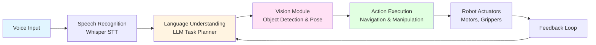

# Module 4: Vision-Language-Action (VLA)

**The Convergence of LLMs and Robotics**

Welcome to the final and most advanced module of this course. In Module 4, you'll explore **Vision-Language-Action (VLA)** systems—the cutting edge of embodied AI where natural language understanding, computer vision, and robot action execution converge to create truly adaptive, intelligent robots.

## What is Vision-Language-Action?

Traditional robots follow scripted behaviors: "If sensor A detects X, execute action Y." They're brittle, requiring extensive programming for every scenario. **VLA systems are different.** They understand human intent through natural language, perceive the world through vision, and translate that understanding into adaptive robot actions.

Imagine saying to a humanoid robot: *"Pick up the blue bottle and place it in the recycling bin."* A VLA system:

1. **Hears** your voice command (speech recognition)
2. **Understands** the task semantics using a Large Language Model (task decomposition, planning)
3. **Sees** the blue bottle using computer vision (object detection, localization)
4. **Navigates** to the bottle using SLAM and path planning (from Module 3)
5. **Grasps** the bottle using vision-guided manipulation (6D pose estimation)
6. **Places** it in the bin, completing the task

This is the paradigm shift from **scripted robotics** to **language-driven robotics**. Instead of programming every behavior, we enable robots to understand and execute tasks described in natural language.

## Why VLA Matters

VLA represents the future of human-robot interaction:

- **Natural Interfaces**: Speak to robots like you speak to people—no special commands or syntax
- **Adaptive Behavior**: Robots plan actions based on understanding, not pre-programmed scripts
- **Semantic Understanding**: LLMs enable robots to reason about tasks, handle failures, and replan dynamically
- **Grounded Perception**: Vision models connect language to the physical world (what is "the blue bottle"?)
- **General-Purpose Robotics**: One robot can handle diverse tasks through language instruction, not task-specific code

By the end of this module, you'll understand how to build VLA systems and complete a capstone project: **The Autonomous Humanoid**—a simulated robot that receives voice commands, plans multi-step tasks, navigates obstacles, identifies objects using vision, and manipulates them to achieve goals.

## VLA Architecture Overview

Here's the high-level architecture of a VLA system:

**Key Components**:

- **Voice Input → Speech Recognition**: Convert human speech to text (OpenAI Whisper)
- **Language Understanding → Task Planning**: Decompose natural language tasks into executable action sequences (GPT-4, Llama-3)
- **Vision Module**: Detect objects, estimate poses, ground language in visual perception (CLIP, SAM, Grounding DINO)
- **Action Execution**: Navigate, manipulate, and interact with the environment (Isaac ROS, Nav2, MoveIt)
- **Feedback Loop**: Monitor execution, detect failures, trigger replanning

## Module 4 Chapters

This module consists of 4 chapters that build progressively toward the capstone project:

### Chapter 1: Voice-to-Action with OpenAI Whisper

Learn how to enable robots to understand human voice commands. You'll explore:

- What VLA models are and how they differ from traditional robotics
- OpenAI Whisper architecture for speech-to-text transcription
- Integrating Whisper with ROS 2 for robot voice interfaces
- Voice command patterns for robotics (navigation, manipulation, queries)
- Error handling for ambiguous or unsafe commands
- Complete voice-to-ROS pipeline implementation

**By the end of Chapter 1**, you'll understand how to convert human speech into structured robot commands—the input layer of the VLA pipeline.

### Chapter 2: Cognitive Planning with LLMs

Discover how Large Language Models enable robots to plan complex, multi-step tasks. You'll explore:

- Task decomposition: "Clean the room" → sequence of executable actions
- Prompt engineering for robotics (safety constraints, action schemas, few-shot examples)
- Converting LLM outputs into ROS 2 action sequences
- State tracking and replanning when environments change
- Safety validation layers to prevent unsafe robot behaviors
- LLM-to-action pipeline using GPT-4 or open-source alternatives (Llama-3, Mistral)

**By the end of Chapter 2**, you'll understand how LLMs serve as the "cognitive brain" that bridges human intent and robot execution.

### Chapter 3: Computer Vision for Object Recognition

Master vision foundation models that enable robots to see and understand their environment. You'll explore:

- Vision foundation models: CLIP, SAM (Segment Anything), Grounding DINO
- Object detection and segmentation for manipulation tasks
- 6D pose estimation for grasping (position + orientation)
- Visual grounding: connecting language queries to visual perception
- Integrating vision models with ROS 2 perception pipelines
- Real-time inference optimization for robot vision (TensorRT, ONNX)

**By the end of Chapter 3**, you'll understand how computer vision grounds language-based plans in the physical world—the perception layer that makes VLA systems work.

### Chapter 4: Capstone Project - The Autonomous Humanoid

Synthesize everything from Modules 1-4 into a complete autonomous humanoid robot. You'll build:

- **End-to-end VLA system** integrating voice, LLM planning, vision, navigation (Module 3), and manipulation
- **Step-by-step implementation** covering environment setup, node creation, system integration
- **Scenario walkthrough**: "Pick up the blue bottle and place it in the recycling bin"
- **Testing strategies**: Unit tests, integration tests, scenario-based validation
- **Troubleshooting guide**: Handling common failures (voice errors, LLM hallucinations, vision false positives, navigation timeouts)
- **Extensions**: Multi-object manipulation, human-robot collaboration, sim-to-real transfer

**By the end of Chapter 4**, you'll have a portfolio-worthy capstone project demonstrating integrated knowledge of ROS 2, simulation, perception, navigation, voice interfaces, LLM planning, and computer vision.

## Prerequisites

Module 4 builds on concepts from all previous modules. **It is strongly recommended** that you complete:

- **Module 1: The Robotic Nervous System (ROS 2)** - ROS 2 fundamentals, nodes, topics, actions, URDF
- **Module 2: The Digital Twin** - Gazebo/Unity simulation, sensor integration, digital twins
- **Module 3: The AI-Robot Brain (NVIDIA Isaac)** - Isaac Sim, Isaac ROS perception, Visual SLAM, Nav2 navigation

If you haven't completed Modules 1-3, you may find concepts in Module 4 challenging. We recommend reviewing at least Module 1 (ROS 2 basics) and Module 3 (perception and navigation) before starting.

## Hardware and Software Requirements

To complete Module 4 effectively, you'll need:

### Required Software

- **ROS 2 Humble** (or later) - Robot Operating System
- **Python 3.8+** - Programming language for examples
- **NVIDIA Isaac Sim** (recommended) or **Gazebo** (fallback) - Simulation environment
- **Git** - Version control for code examples

### Recommended Hardware

- **NVIDIA GPU** (RTX 3060 or better) - For vision model inference and Isaac Sim
  - Alternatives: Cloud GPU (Google Colab, AWS EC2, Paperspace)
  - CPU-only options provided with lighter models (MobileNet, YOLO)

### API Access (Optional but Recommended)

- **OpenAI API** - For Whisper (speech-to-text) and GPT-4 (LLM planning)
  - **Cost**: Approximately $0.10-$0.50 per learner for testing examples
  - **Alternatives**: Open-source options provided throughout
    - Whisper: `whisper.cpp` (local CPU inference), `faster-whisper` (local GPU)
    - LLM Planning: Llama-3-70B, Mistral-8x7B, Qwen-2 (open-source models)

**Don't have access to paid APIs or high-end GPUs?** No problem! We provide open-source alternatives and cloud options for every component, ensuring Module 4 is accessible to all learners.

## What You'll Build: The Autonomous Humanoid Capstone

The capstone project is a simulated humanoid robot in Isaac Sim (or Gazebo) that:

1. **Listens** to your voice command: *"Pick up the blue bottle and place it in the recycling bin"*
2. **Plans** the task using an LLM:
   - Navigate to search position
   - Detect blue bottle using vision
   - Navigate to bottle location
   - Grasp bottle (6D pose estimation)
   - Navigate to recycling bin
   - Place bottle in bin
3. **Executes** each step with vision-guided navigation and manipulation
4. **Handles failures** gracefully: object not found, navigation blocked, grasp failed → replan and retry
5. **Confirms completion** when task succeeds

This capstone demonstrates:

- **Voice interface** (Whisper + ROS 2)
- **LLM-based planning** (GPT-4 or Llama-3)
- **Computer vision** (CLIP, SAM, Grounding DINO)
- **Navigation** (Isaac ROS Visual SLAM + Nav2 from Module 3)
- **Manipulation** (grasp planning, arm control)
- **System integration** (all components working together)

**You'll have a complete, end-to-end VLA system**—a portfolio project showcasing cutting-edge embodied AI skills.

## Learning Outcomes

By completing Module 4, you will be able to:

- Explain what Vision-Language-Action (VLA) systems are and why they represent a paradigm shift in robotics
- Integrate OpenAI Whisper (or alternatives) with ROS 2 for voice-enabled robot interfaces
- Design and implement LLM-based task planning systems for robotics with safety validation
- Apply vision foundation models (CLIP, SAM, Grounding DINO) for object detection, segmentation, and pose estimation
- Combine voice, language, vision, navigation, and manipulation into a cohesive autonomous robot system
- Debug and troubleshoot common VLA system failures (speech errors, LLM hallucinations, vision false positives, execution failures)
- Build a portfolio-worthy capstone project demonstrating integrated embodied AI skills

## Next Steps

Ready to begin your VLA journey? Start with **Chapter 1: Voice-to-Action with OpenAI Whisper** to learn how robots understand human speech and translate it into actionable commands.

Let's build the future of human-robot interaction together.

---

**Note**: This module covers cutting-edge research and engineering. VLA systems are an active area of development, and best practices are evolving rapidly. The concepts and techniques you learn here represent the state-of-the-art as of 2024-2025 and will prepare you for advanced robotics and embodied AI work.
