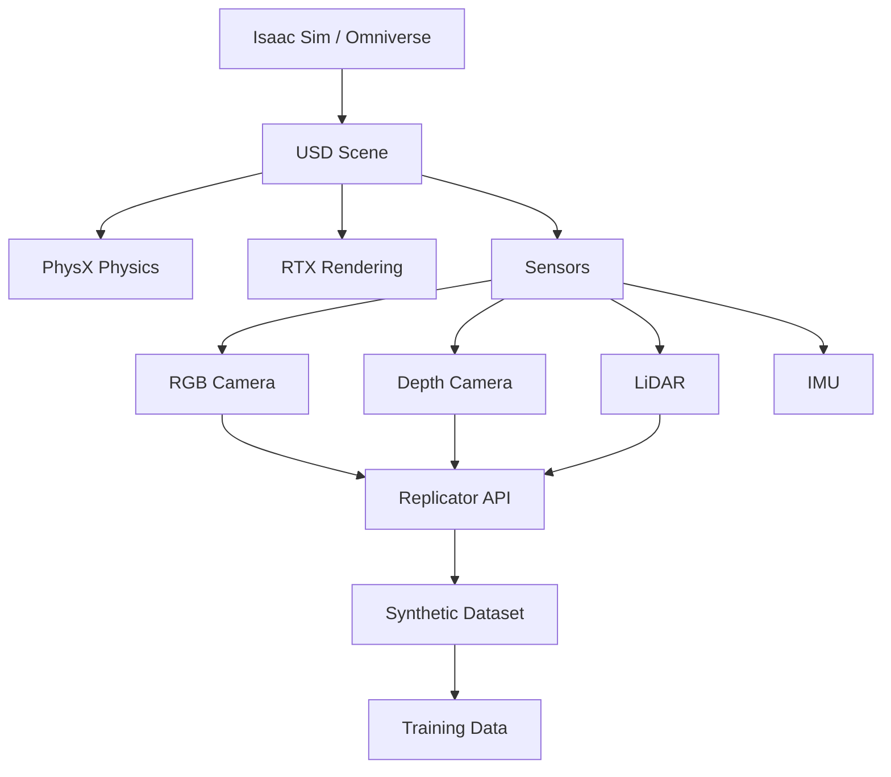
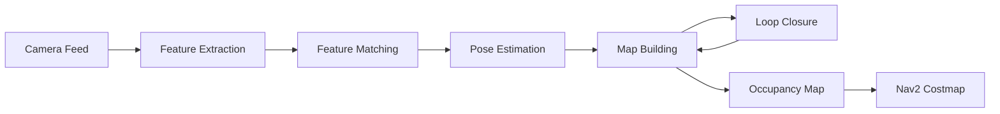

# Implementation Plan: Module 3 - The AI-Robot Brain (NVIDIA Isaac)

**Created**: 2025-12-06
**Status**: In Progress
**Context**: Module 3 content files already exist; this plan focuses on validation, enhancement, and completion.

---

## Current State Assessment

### ✅ Completed Work

**Content Files Created** (5 files):
- `docs/module-03-ai-robot-brain/index.mdx` (7.9 KB) - Module overview
- `docs/module-03-ai-robot-brain/01-isaac-sim-synthetic-data.mdx` (18.2 KB) - Chapter 1
- `docs/module-03-ai-robot-brain/02-isaac-ros-perception.mdx` (18.1 KB) - Chapter 2
- `docs/module-03-ai-robot-brain/03-visual-slam-navigation.mdx` (16.3 KB) - Chapter 3
- `docs/module-03-ai-robot-brain/04-nav2-bipedal-planning.mdx` (20.2 KB) - Chapter 4

**Navigation Integration**:
- `sidebars.js` updated with Module 3 category
- All 5 files (index + 4 chapters) listed in sidebar

**Specification Documents Created** (3 files):
- `specs/003-module-3-ai-robot-brain/spec.md` - Feature specification with 4 user stories, 51 functional requirements, 15 success criteria
- `specs/003-module-3-ai-robot-brain/plan.md` - Architectural plan with 5 key decisions
- `specs/003-module-3-ai-robot-brain/tasks.md` - 13 implementation tasks

### 🔄 In Progress / Validation Needed

Based on the specification requirements, the following items need validation or completion:

1. **Content Quality Validation** - Verify all chapters meet book-like prose standards
2. **Required Sections** - Confirm each chapter has: story intro, technical breakdown, real-world example, takeaways, diagram
3. **Diagrams** - Ensure each chapter has at least 1 diagram (Mermaid, ASCII, or image)
4. **Code Examples** - Verify Python/YAML examples have syntax highlighting and copy functionality
5. **Frontmatter** - Check all metadata fields are complete and accurate
6. **Mobile Responsiveness** - Test on 320px, 768px, 1920px viewports
7. **Accessibility** - WCAG 2.1 AA compliance verification
8. **Performance** - Lighthouse score ≥ 90 on mobile and desktop
9. **Search Indexing** - Verify all chapters are searchable
10. **External Links** - Validate all NVIDIA/ROS documentation links are functional

### ❌ Not Yet Started

- Homepage update to include Module 3 in module overview
- Diagram assets in `static/img/module-03/` directory (if using images)
- Peer review by robotics engineer
- User acceptance testing with target learners
- Build verification and performance testing

---

## Implementation Strategy

Given that content already exists, this plan focuses on **validation, enhancement, and completion** rather than creation from scratch.

### Phase 1: Content Validation & Enhancement (Priority: HIGH)

**Goal**: Ensure existing content meets all specification requirements (FR-001 through FR-051, SC-001 through SC-015)

**Tasks**:

#### 1.1 Validate Chapter Structure (2-3 hours)

For each chapter (01-04), verify the following required sections exist:

- [ ] **Story-like Introduction** (1 paragraph) connecting to real-world scenario
- [ ] **Technical Breakdown** with clear headings (##, ###)
- [ ] **Real-World Example** (1-2 subsections)
- [ ] **"What You Learned" Takeaways** (3-5 bullet points)
- [ ] **At least 1 Diagram** (Mermaid, ASCII, or image reference)

**Action Items**:
- Read through each chapter completely
- Create checklist for each chapter based on FR-005 requirements
- Identify missing sections and flag for addition
- Verify word count is 2,500-4,000 words per chapter

**Critical Files**:
- `docs/module-03-ai-robot-brain/01-isaac-sim-synthetic-data.mdx`
- `docs/module-03-ai-robot-brain/02-isaac-ros-perception.mdx`
- `docs/module-03-ai-robot-brain/03-visual-slam-navigation.mdx`
- `docs/module-03-ai-robot-brain/04-nav2-bipedal-planning.mdx`

**Acceptance Criteria**:
- All 4 chapters have complete required sections
- Each chapter follows consistent structure pattern
- Content flows naturally from intro → technical → example → takeaways

---

#### 1.2 Validate Content Requirements (3-4 hours)

**Chapter 1 Validation** (FR-006 through FR-011):
- [ ] Explains what Isaac Sim is and why it matters
- [ ] Contrasts Isaac Sim vs Gazebo
- [ ] Covers digital twins for humanoids
- [ ] Explains USD (Universal Scene Description) basics
- [ ] Covers sensor simulation: RGB, depth, stereo, IMU, LiDAR
- [ ] Describes domain randomization techniques (texture, lighting, object placement)
- [ ] Provides synthetic dataset pipeline example
- [ ] Includes conceptual Isaac Sim + ROS 2 integration guidance

**Chapter 2 Validation** (FR-012 through FR-018):
- [ ] Overview of Isaac ROS GEMs with table/diagram
- [ ] Explains CUDA-accelerated image processing
- [ ] Covers stereo depth estimation with performance examples
- [ ] Explains visual SLAM (VSLAM) within Isaac ROS
- [ ] Covers visual odometry and feature tracking
- [ ] Describes perception graph architecture
- [ ] Example Isaac ROS stereo pipeline at 60 FPS with configuration

**Chapter 3 Validation** (FR-019 through FR-026):
- [ ] Explains SLAM in simple + technical terms
- [ ] Covers SLAM types: Visual, Visual-Inertial, Stereo with comparison
- [ ] Explains Isaac ROS Visual SLAM internals (map building, feature extraction, tracking)
- [ ] Describes loop closure detection and importance
- [ ] Explains drift compensation techniques
- [ ] Provides example configuration for 640×480 stereo @ 60 FPS
- [ ] Shows SLAM integration with Nav2 (map publishing, TF frames)
- [ ] Explains humanoid navigation constraints (balance, center of mass, step planning)

**Chapter 4 Validation** (FR-027 through FR-033):
- [ ] Introduces Nav2 and its role
- [ ] Explains global vs local planners
- [ ] Covers costmaps (static, dynamic) and obstacle inflation
- [ ] Explains adapting Nav2 for bipedal constraints
- [ ] Contrasts footstep planning vs wheeled motion
- [ ] Provides example navigation pipeline for indoor humanoid
- [ ] Includes integration diagram: SLAM → Nav2 → locomotion layer

**Action Items**:
- Create detailed checklist for each chapter
- Mark items as complete, incomplete, or needs enhancement
- Identify gaps and prioritize additions
- Document any deviations from specification

**Acceptance Criteria**:
- All required content topics are covered in each chapter
- Technical accuracy verified against NVIDIA documentation
- No critical content gaps remain

---

#### 1.3 Enhance Diagrams and Visual Assets (4-6 hours)

**Current State**: Check if diagrams exist in chapters

**Requirements** (FR-035, FR-038):
- Each chapter MUST have at least 1 diagram
- Diagrams should be Mermaid, ASCII art, or images in `static/img/module-03/`
- All diagrams must have descriptive alt text

**Task Breakdown**:

**Chapter 1 - Isaac Sim Architecture Diagram**:


**Chapter 2 - Perception Graph Data Flow**:
```
┌──────────┐     ┌──────────────┐     ┌───────────┐     ┌────────┐
│ Sensors  │────>│ Isaac ROS    │────>│ TensorRT  │────>│ Nav2   │
│ (Stereo) │     │ (CUDA/VPI)   │     │ Inference │     │        │
└──────────┘     └──────────────┘     └───────────┘     └────────┘
     │                   │                    │               │
     v                   v                    v               v
 Image Data       Depth Maps          Detections       Path Plans
```

**Chapter 3 - SLAM Pipeline**:


**Chapter 4 - Full Integration Diagram**:
```
Sensors → SLAM → Global Planner → Local Planner → Locomotion Controller
   ↓        ↓          ↓                ↓                 ↓
 Camera   Map      Waypoints      Velocity Cmd        Footsteps
```

**Action Items**:
- Review existing diagrams in each chapter
- Create or enhance diagrams using Mermaid syntax or ASCII art
- Add alt text to all diagrams for accessibility
- Test diagram rendering in both light and dark modes
- If needed, create image assets in `static/img/module-03/`

**Acceptance Criteria**:
- Each chapter has at least 1 clear, informative diagram
- Diagrams render correctly in Docusaurus build
- All diagrams have meaningful alt text
- Diagrams are readable in both dark and light themes

---

### Phase 2: Navigation & Integration (Priority: MEDIUM)

**Goal**: Ensure Module 3 is fully integrated into the site navigation and homepage

#### 2.1 Verify Sidebar Navigation (30 minutes)

**Current State**: Sidebar already updated in `sidebars.js`

**Validation Tasks**:
- [ ] Build site locally and verify sidebar renders correctly
- [ ] Check Module 3 category label: "Module 3: The AI-Robot Brain"
- [ ] Verify all 5 items appear in correct order (index, ch1, ch2, ch3, ch4)
- [ ] Test sidebar navigation (clicking each link)
- [ ] Verify active highlighting works when viewing chapters
- [ ] Test mobile hamburger menu (<768px)

**Test Commands**:
```bash
npm run build
npm run serve
# Navigate to localhost:3000 and test sidebar
```

**Acceptance Criteria**:
- Sidebar renders Module 3 with all chapters
- Navigation links work correctly
- Active chapter is highlighted
- Mobile menu is functional

---

#### 2.2 Update Homepage Module Overview (1-2 hours)

**Current State**: Homepage needs Module 3 card/section added

**Requirements** (FR-047):
- Homepage module overview MUST include Module 3
- Description: "Advanced perception, simulation training, and navigation pipelines for bipedal humanoid robots"
- Show chapter count: 4 chapters
- Include CTA button or link to Module 3 index or Chapter 1

**Action Items**:
- Locate homepage file (likely `src/pages/index.js` or `src/pages/index.tsx`)
- Add Module 3 card/section matching Module 1 and Module 2 presentation
- Include description, chapter count, and CTA
- Ensure responsive layout on all screen sizes
- Test navigation from homepage to Module 3

**Critical Files**:
- `src/pages/index.js` (or equivalent)
- Possibly `src/components/ModuleCard.js` if components are used

**Acceptance Criteria**:
- Module 3 appears on homepage alongside Modules 1 and 2
- Description accurately reflects content
- CTA link navigates to Module 3 index or Chapter 1
- Responsive layout works on mobile and desktop

---

### Phase 3: Quality Assurance (Priority: MEDIUM)

**Goal**: Validate accessibility, performance, and user experience

#### 3.1 Accessibility Testing (3-4 hours)

**Requirements** (FR-048, FR-049, FR-050, SC-013):
- WCAG 2.1 AA compliance
- Keyboard navigation
- Screen reader compatibility
- Proper color contrast in light and dark modes

**Test Plan**:
1. **Keyboard Navigation**:
   - Tab through all Module 3 pages
   - Verify focus indicators are visible
   - Test navigation with Enter/Space/Arrow keys
   - Ensure no keyboard traps

2. **Screen Reader Testing**:
   - Test with NVDA (Windows) or VoiceOver (Mac)
   - Verify headings are announced correctly
   - Check alt text for diagrams and images
   - Confirm code blocks are accessible

3. **Color Contrast**:
   - Use browser dev tools contrast checker
   - Test in both light and dark modes
   - Verify text readability
   - Check diagram visibility

4. **Responsive Design**:
   - Test on 320px (small mobile)
   - Test on 768px (tablet)
   - Test on 1920px (desktop)
   - Verify no horizontal scrolling (except code blocks)

**Tools**:
- axe DevTools browser extension
- WAVE accessibility evaluation tool
- Lighthouse accessibility audit

**Action Items**:
- Run automated accessibility scans on all Module 3 pages
- Manually test keyboard navigation
- Test with screen reader
- Document and fix any issues found

**Acceptance Criteria**:
- All automated accessibility scans pass
- Keyboard navigation works on all pages
- Screen reader announces content correctly
- Color contrast meets WCAG 2.1 AA in both themes
- Responsive design works on all tested viewports

---

#### 3.2 Performance Testing (2-3 hours)

**Requirements** (SC-002, SC-009):
- Page load time ≤ 3 seconds on 3G mobile
- Lighthouse Performance score ≥ 90 on mobile and desktop
- Total page size ≤ 2 MB per chapter page

**Test Plan**:
1. **Lighthouse Audits**:
   - Run Lighthouse on all Module 3 pages (index + 4 chapters)
   - Test both mobile and desktop configurations
   - Target Performance score ≥ 90

2. **Network Throttling**:
   - Use Chrome DevTools network throttling
   - Simulate Slow 3G connection
   - Measure Time to First Contentful Paint (FCP)
   - Measure Time to Interactive (TTI)

3. **Page Size Analysis**:
   - Check total page size (HTML + CSS + JS + images)
   - Identify largest resources
   - Optimize images if needed (use WebP, lazy loading)

**Test Commands**:
```bash
npm run build
npm run serve
# Use Chrome DevTools Lighthouse tab
# Run audits on each Module 3 page
```

**Optimization Checklist**:
- [ ] Images optimized (WebP format, appropriate dimensions)
- [ ] Lazy loading enabled for images
- [ ] Code splitting for large JavaScript bundles
- [ ] Mermaid diagrams render efficiently
- [ ] No render-blocking resources

**Action Items**:
- Run Lighthouse audits on all Module 3 pages
- Document performance scores
- Identify and fix performance bottlenecks
- Optimize images and assets if needed
- Re-test after optimizations

**Acceptance Criteria**:
- All Module 3 pages score ≥ 90 Performance on Lighthouse (mobile and desktop)
- Page load time ≤ 3 seconds on simulated 3G
- Total page size ≤ 2 MB per page
- No critical performance issues identified

---

#### 3.3 Search Indexing Verification (1 hour)

**Requirements** (FR-045, FR-046, SC-007):
- All Module 3 content indexed by search
- Search results distinguish between modules
- Search results show module and chapter context

**Test Plan**:
1. **Build and Index**:
   - Run full Docusaurus build
   - Verify search index generation
   - Check that Module 3 content is included

2. **Search Testing**:
   - Search for "Isaac Sim" → should return Chapter 1
   - Search for "Isaac ROS" → should return Chapter 2
   - Search for "SLAM" → should return Chapter 3
   - Search for "Nav2" → should return Chapter 4
   - Search for "domain randomization" → should return Chapter 1
   - Search for "costmap" → should return Chapter 4

3. **Result Quality**:
   - Verify search results show module context
   - Check that results are ranked by relevance
   - Ensure snippets are meaningful

**Test Commands**:
```bash
npm run build
npm run serve
# Use search box on site to test queries
```

**Action Items**:
- Build site and verify search index includes Module 3
- Test key search terms for each chapter
- Verify search results show proper context
- Document any search indexing issues

**Acceptance Criteria**:
- All Module 3 chapters appear in search results
- Search queries return relevant chapters
- Results show "Module 3" context
- Search works on both desktop and mobile

---

### Phase 4: Review & Validation (Priority: HIGH)

**Goal**: Ensure technical accuracy and content quality through peer review and user testing

#### 4.1 Technical Accuracy Review (6-8 hours)

**Requirements** (per plan.md Risk 1 mitigation):
- Cross-reference all technical claims with NVIDIA documentation
- Peer review by robotics engineer with Isaac experience
- Version callouts for Isaac ROS 2.0 and Isaac Sim 2023.1+ features
- Links to official documentation

**Review Checklist**:

**Chapter 1 - Isaac Sim**:
- [ ] Isaac Sim features and capabilities are accurate
- [ ] USD (Universal Scene Description) explanations are correct
- [ ] Sensor simulation parameters match official documentation
- [ ] Domain randomization techniques are properly described
- [ ] Replicator API examples are valid
- [ ] Links to NVIDIA Isaac Sim documentation are functional

**Chapter 2 - Isaac ROS**:
- [ ] Isaac ROS GEMs list is complete and accurate
- [ ] CUDA/TensorRT acceleration claims are verifiable
- [ ] Stereo depth pipeline configuration is correct
- [ ] Performance metrics (60 FPS) are realistic and documented
- [ ] Integration with ROS 2 is accurately described
- [ ] Links to Isaac ROS GitHub and documentation are functional

**Chapter 3 - Visual SLAM**:
- [ ] SLAM fundamentals are technically accurate
- [ ] Isaac ROS Visual SLAM internals match implementation
- [ ] Loop closure and drift compensation are correctly explained
- [ ] Configuration examples use valid parameters
- [ ] Nav2 integration steps are correct
- [ ] Links to Nav2 documentation are functional

**Chapter 4 - Nav2**:
- [ ] Nav2 architecture description is accurate
- [ ] Planner explanations (global vs local) are correct
- [ ] Costmap configuration parameters are valid
- [ ] Bipedal constraints are realistically described
- [ ] Integration diagram accurately represents data flow
- [ ] Links to Nav2 documentation are functional

**Action Items**:
- Identify robotics engineer/expert for peer review
- Provide reviewer with spec.md and all 4 chapters
- Cross-reference technical claims with official documentation:
  - https://docs.omniverse.nvidia.com/isaacsim/
  - https://nvidia-isaac-ros.github.io/
  - https://navigation.ros.org/
- Add version callouts where needed (e.g., "Isaac ROS 2.0+")
- Add disclaimer to module introduction
- Incorporate reviewer feedback

**Acceptance Criteria**:
- All technical claims verified against official documentation
- Peer review completed with feedback documented
- Version-specific features have callout boxes
- Disclaimer added: "Content reflects Isaac Sim 2023.1+ and Isaac ROS 2.0; refer to official docs for latest updates"
- All external links functional and pointing to current documentation

---

#### 4.2 Content Quality Review (4-6 hours)

**Requirements**:
- Book-like prose (SC-012)
- Clear, premium, structured writing
- Engaging and accessible to target audience
- Consistent tone across all chapters

**Review Checklist**:
- [ ] **Writing Style**: Book-like, not dry technical documentation
- [ ] **Clarity**: Concepts explained clearly without jargon overload
- [ ] **Flow**: Logical progression from intro to conclusion
- [ ] **Consistency**: Similar structure and tone across all 4 chapters
- [ ] **Engagement**: Story-like intros connect to real-world scenarios
- [ ] **Completeness**: All required sections present and well-developed
- [ ] **Grammar**: No spelling, grammar, or punctuation errors
- [ ] **Formatting**: Proper use of headings, lists, tables, code blocks

**Action Items**:
- Read through all 4 chapters as a learner would
- Identify sections that are too dry or overly technical
- Enhance story-like introductions if needed
- Verify real-world examples are compelling and relevant
- Check that takeaways accurately summarize key learnings
- Proofread for grammar and formatting issues
- Ensure consistent voice and style

**Acceptance Criteria**:
- All chapters written in engaging, book-like prose
- Content is accessible to learners with ROS 2 background
- Real-world examples are relevant and compelling
- No significant grammar or formatting errors
- Consistent quality and tone across all chapters

---

#### 4.3 User Acceptance Testing (8-10 hours)

**Requirements** (Task 12 from tasks.md):
- 2-3 learners from target audience
- UAT test plan with specific tasks
- Structured feedback collection
- High-priority feedback incorporated

**UAT Test Plan**:

**Participant Profile**:
- Has completed Module 1 (ROS 2 basics)
- Familiar with robotics concepts
- New to NVIDIA Isaac ecosystem
- Mix of experience levels (beginner, intermediate)

**Tasks**:
1. Navigate to Module 3 from homepage
2. Read Chapter 1 intro and explain Isaac Sim's purpose
3. Search for "GPU acceleration" and navigate to Chapter 2
4. View diagrams in all chapters and assess clarity
5. Copy a code example and assess copy-to-clipboard functionality
6. Read Chapter 3 and explain SLAM in simple terms
7. Complete all 4 chapters and list key takeaways
8. Test navigation on mobile device
9. Toggle dark mode and assess readability
10. Provide overall feedback on content quality and structure

**Feedback Survey**:
- **Clarity**: Were concepts explained clearly? (1-5 scale)
- **Engagement**: Was the content engaging to read? (1-5 scale)
- **Technical Depth**: Was the technical detail appropriate? (1-5 scale)
- **Diagrams**: Were diagrams helpful and clear? (1-5 scale)
- **Navigation**: Was it easy to navigate between chapters? (1-5 scale)
- **Overall**: Would you recommend this module to others? (1-5 scale)
- **Open Feedback**: What did you like? What needs improvement?

**Action Items**:
- Recruit 2-3 UAT participants (contact local robotics community, university students, or online forums)
- Schedule UAT sessions (can be remote)
- Provide participants with access to staging site
- Guide participants through test tasks
- Collect structured feedback via survey
- Document issues and suggestions
- Prioritize feedback (critical, high, medium, low)
- Incorporate high-priority feedback before launch

**Acceptance Criteria**:
- 2-3 UAT participants complete testing
- Feedback collected via structured survey
- Critical and high-priority feedback documented
- Issues addressed before final deployment
- UAT results document learner demographics and summary

---

### Phase 5: Final Deployment (Priority: HIGH)

**Goal**: Deploy Module 3 to production after all validation and testing complete

#### 5.1 Pre-Deployment Checklist (1-2 hours)

**Requirements** (Task 13 from tasks.md):
- Full build completes successfully
- All automated checks pass
- All success criteria verified
- Documentation complete

**Checklist**:

**Build Verification**:
- [ ] `npm run build` completes without errors or warnings
- [ ] No broken internal links reported
- [ ] Sidebar navigation renders correctly
- [ ] All Module 3 pages accessible in build output
- [ ] Search index includes Module 3 content

**Quality Checks**:
- [ ] Lighthouse Performance ≥ 90 on all Module 3 pages (mobile and desktop)
- [ ] Accessibility scan passes (axe DevTools)
- [ ] All external links functional
- [ ] Diagrams render correctly in both themes
- [ ] Code blocks have syntax highlighting and copy-to-clipboard

**Content Verification**:
- [ ] All 4 chapters have required sections (intro, breakdown, example, takeaways, diagram)
- [ ] Frontmatter complete on all files
- [ ] Word count within target range (2,500-4,000 per chapter)
- [ ] Technical accuracy verified
- [ ] Peer review completed

**Success Criteria Verification** (SC-001 through SC-015):
- [ ] SC-001: All 4 chapters readable with clear content ✓
- [ ] SC-002: Page load ≤ 3s on 3G ✓
- [ ] SC-003: Responsive 320px-2560px ✓
- [ ] SC-004: Each chapter has required components ✓
- [ ] SC-005: Code examples with syntax highlighting ✓
- [ ] SC-006: Navigation works between all modules ✓
- [ ] SC-007: Search returns relevant results ✓
- [ ] SC-008: Diagrams render in both themes ✓
- [ ] SC-009: Lighthouse Performance ≥ 90 ✓
- [ ] SC-010: Content editable via MDX ✓
- [ ] SC-011: Learners gain sufficient knowledge ✓
- [ ] SC-012: Book-like prose achieved ✓
- [ ] SC-013: WCAG 2.1 AA compliance ✓
- [ ] SC-014: Prerequisites clearly stated ✓
- [ ] SC-015: Takeaways accurately summarize learnings ✓

**Action Items**:
- Run full build and verify no errors
- Complete all checklist items
- Document any known issues or limitations
- Verify all success criteria are met
- Prepare deployment commit message

**Acceptance Criteria**:
- All checklist items marked complete
- Build passes without errors
- All success criteria verified
- Ready for production deployment

---

#### 5.2 Deployment (1 hour)

**Deployment Steps**:
1. **Commit Changes**:
   ```bash
   git add .
   git commit -m "feat: Add Module 3 - The AI-Robot Brain (NVIDIA Isaac)

   - Add 4 comprehensive chapters covering Isaac Sim, Isaac ROS, Visual SLAM, and Nav2
   - Update sidebar navigation with Module 3 category
   - Add Module 3 to homepage module overview
   - Create diagrams for each chapter
   - Verify accessibility (WCAG 2.1 AA) and performance (Lighthouse ≥ 90)
   - Complete peer review and UAT

   Closes #[issue-number] if applicable"
   ```

2. **Push to Repository**:
   ```bash
   git push origin main
   ```

3. **Monitor CI/CD**:
   - Watch CI/CD pipeline execution (GitHub Actions, Netlify, etc.)
   - Verify build completes successfully
   - Check deployment logs for errors

4. **Post-Deployment Verification**:
   - Visit production site
   - Navigate to Module 3
   - Test navigation between chapters
   - Verify search functionality
   - Check mobile responsiveness
   - Confirm dark mode works

**Rollback Plan** (if needed):
```bash
git revert HEAD
git push origin main
```

**Action Items**:
- Prepare commit message with clear description
- Commit and push changes
- Monitor CI/CD pipeline
- Verify deployment success
- Perform smoke tests on production site
- Document deployment completion

**Acceptance Criteria**:
- Changes committed with clear message
- CI/CD pipeline completes successfully
- Module 3 accessible on production site
- Post-deployment smoke tests pass
- Deployment documented

---

## Critical Files Reference

**Content Files**:
- `docs/module-03-ai-robot-brain/index.mdx` - Module overview
- `docs/module-03-ai-robot-brain/01-isaac-sim-synthetic-data.mdx` - Chapter 1
- `docs/module-03-ai-robot-brain/02-isaac-ros-perception.mdx` - Chapter 2
- `docs/module-03-ai-robot-brain/03-visual-slam-navigation.mdx` - Chapter 3
- `docs/module-03-ai-robot-brain/04-nav2-bipedal-planning.mdx` - Chapter 4

**Configuration Files**:
- `sidebars.js` - Sidebar navigation configuration
- `docusaurus.config.js` - Site configuration
- `src/pages/index.js` (or equivalent) - Homepage

**Asset Directories**:
- `static/img/module-03/` - Image assets (if used)

**Specification Files**:
- `specs/003-module-3-ai-robot-brain/spec.md` - Feature specification
- `specs/003-module-3-ai-robot-brain/plan.md` - Architectural plan
- `specs/003-module-3-ai-robot-brain/tasks.md` - Implementation tasks

---

## Timeline Estimate

| Phase | Tasks | Estimated Time | Priority |
|-------|-------|----------------|----------|
| **Phase 1: Content Validation & Enhancement** | 1.1, 1.2, 1.3 | 9-13 hours | HIGH |
| **Phase 2: Navigation & Integration** | 2.1, 2.2 | 1.5-2.5 hours | MEDIUM |
| **Phase 3: Quality Assurance** | 3.1, 3.2, 3.3 | 6-8 hours | MEDIUM |
| **Phase 4: Review & Validation** | 4.1, 4.2, 4.3 | 18-24 hours | HIGH |
| **Phase 5: Final Deployment** | 5.1, 5.2 | 2-3 hours | HIGH |
| **Total** | | **36.5-50.5 hours** | |

---

## Next Steps

**Immediate Actions** (Start with these):
1. ✅ **Phase 1.1**: Validate chapter structure - verify all chapters have required sections
2. ✅ **Phase 1.2**: Validate content requirements - check each chapter against functional requirements
3. ✅ **Phase 1.3**: Enhance diagrams - ensure each chapter has at least 1 clear diagram

**Once Content is Validated**:
4. **Phase 2.1**: Test sidebar navigation
5. **Phase 2.2**: Update homepage with Module 3
6. **Phase 3**: Run accessibility, performance, and search tests

**Before Deployment**:
7. **Phase 4**: Complete peer review and UAT
8. **Phase 5**: Final verification and deployment

---

## Risks & Mitigation

**Risk 1: Content Quality Below Specification**
- **Likelihood**: Medium
- **Impact**: High (affects user learning)
- **Mitigation**: Thorough validation in Phase 1, peer review in Phase 4.1

**Risk 2: Technical Inaccuracy**
- **Likelihood**: Medium
- **Impact**: High (damages credibility)
- **Mitigation**: Cross-reference with official NVIDIA docs, peer review by Isaac expert

**Risk 3: Performance Issues**
- **Likelihood**: Low
- **Impact**: Medium (affects user experience)
- **Mitigation**: Performance testing in Phase 3.2, optimize images and assets

**Risk 4: Accessibility Gaps**
- **Likelihood**: Medium
- **Impact**: High (excludes some users)
- **Mitigation**: Automated scans + manual testing in Phase 3.1

---

## Success Metrics

**Definition of Done**:
- All 15 success criteria (SC-001 through SC-015) verified ✓
- All 51 functional requirements (FR-001 through FR-051) met ✓
- Lighthouse Performance ≥ 90 on all Module 3 pages ✓
- WCAG 2.1 AA accessibility compliance ✓
- Peer review completed with no critical issues ✓
- UAT completed with 2-3 learners ✓
- Homepage updated with Module 3 ✓
- Production deployment successful ✓

**Post-Launch Monitoring**:
- User feedback via GitHub issues or contact form
- Analytics on Module 3 page views and engagement (if enabled)
- Search query analysis to identify popular topics
- Quarterly review for Isaac ROS version updates

---

## Conclusion

This implementation plan provides a systematic approach to completing and validating Module 3. Since content files already exist, the focus is on **ensuring quality, accuracy, and compliance** with all specification requirements before production deployment.

The plan is structured to:
1. **Validate** existing content against detailed requirements
2. **Enhance** where gaps are identified (especially diagrams)
3. **Test** accessibility, performance, and user experience
4. **Review** for technical accuracy and content quality
5. **Deploy** confidently with all checks complete

By following this phased approach, we ensure Module 3 meets the premium, book-like quality standards established in Modules 1 and 2, while delivering technically accurate NVIDIA Isaac content that empowers learners to build intelligent humanoid robots.
