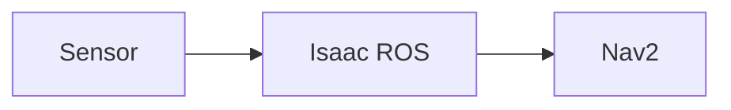

# Architectural Plan: Module 3 - The AI-Robot Brain (NVIDIA Isaac)

**Feature**: Module 3 - NVIDIA Isaac perception, simulation, and navigation for humanoid robots
**Created**: 2025-12-06
**Status**: Draft

---

## 1. Scope and Dependencies

### In Scope

- Creation of 4 premium MDX chapters for Module 3: The AI-Robot Brain (NVIDIA Isaac)
- Chapter 1: NVIDIA Isaac Sim - Synthetic Data & Digital Twins
- Chapter 2: Isaac ROS - GPU-Accelerated Perception Stack
- Chapter 3: Visual SLAM & Navigation for Humanoids
- Chapter 4: Nav2 Path Planning for Bipedal Robots
- Book-like prose with clear structure, story-like intros, technical breakdowns, real-world examples, takeaways, and diagrams
- Integration with existing Docusaurus site structure (sidebar, navigation, search, dark mode)
- Technical accuracy for NVIDIA Isaac Sim, Isaac ROS, Visual SLAM, and Nav2 concepts
- Minimal code examples (conceptual, not comprehensive implementations)
- Diagrams using Mermaid, ASCII art, or high-quality images with alt text
- Responsive design and accessibility (WCAG 2.1 AA)

### Out of Scope

- Interactive 3D simulation widgets or embedded Isaac Sim viewers (learners run locally)
- Comprehensive code implementations (focus is educational content, not production code)
- Backend services, user authentication, or comment systems
- LiDAR SLAM deep-dives (focus is Visual SLAM with cameras)
- Support for non-NVIDIA hardware acceleration (content assumes NVIDIA GPUs)
- Detailed TensorRT optimization guides (high-level explanation only)
- Multi-language translations (English only)
- Video tutorials or embedded demos (static content only)

### External Dependencies

- **Docusaurus**: Static site generator (already in place from Modules 1 and 2)
- **React**: For MDX component rendering (already in place)
- **Mermaid**: For diagram rendering (if used; fallback to ASCII/images)
- **NVIDIA Isaac Documentation**: Reference material for accuracy verification
  - Isaac Sim: https://docs.omniverse.nvidia.com/isaacsim/
  - Isaac ROS: https://nvidia-isaac-ros.github.io/
- **Nav2 Documentation**: Reference material for Nav2 concepts
  - Nav2: https://navigation.ros.org/
- **Existing Modules**: Module 1 (ROS 2) and Module 2 (Gazebo/Unity) for prerequisite knowledge and consistent structure
- **Git**: Version control (already in place)
- **Build Pipeline**: npm/yarn for Docusaurus build (already in place)

**Ownership**: Content creation owned by documentation team; Docusaurus infrastructure owned by web development team.

---

## 2. Key Decisions and Rationale

### Decision 1: Use Book-Like Prose Instead of Technical Documentation Style

**Options Considered**:
1. **Book-like prose** with story intros, narrative flow, and engaging writing (chosen)
2. Technical reference documentation with dry, concise explanations
3. Tutorial-style with step-by-step instructions

**Trade-offs**:
- Book-like prose is more engaging and accessible but requires more writing effort and editorial polish
- Technical reference is concise but less engaging for learners
- Tutorial-style is practical but assumes specific hardware/software setups

**Rationale**:
- Aligns with existing Modules 1 and 2 structure and user expectations
- Makes advanced NVIDIA Isaac concepts more accessible to learners
- Encourages continuous reading (book experience) rather than lookup (reference experience)
- Differentiates content from official NVIDIA documentation (which is reference-style)

**Principle**: Measurable (success criteria SC-012 requires book-like prose), reversible (can convert to reference style later if needed), smallest viable change (reuses existing module structure).

### Decision 2: Focus on Visual SLAM (Camera-Based) Rather Than LiDAR SLAM

**Options Considered**:
1. **Visual SLAM only** with stereo and depth cameras (chosen)
2. LiDAR SLAM only with 2D/3D LiDAR sensors
3. Both Visual SLAM and LiDAR SLAM with equal depth

**Trade-offs**:
- Visual SLAM is more accessible (cameras cheaper than LiDAR) but less robust in featureless environments
- LiDAR SLAM is more robust but hardware is expensive and less common in humanoid research platforms
- Covering both requires double the content length and risks surface-level treatment

**Rationale**:
- Humanoid robots typically use cameras for perception (eyes analogy)
- Visual SLAM aligns with Isaac ROS strengths (GPU-accelerated image processing)
- Chapter 2 already covers camera-based perception, so SLAM is a natural extension
- Module 2 introduced LiDAR sensor simulation, so learners have context but don't need deep SLAM coverage
- Keeps chapter length manageable (2,500-4,000 words per chapter)

**Principle**: Measurable (FR-026 specifies Visual SLAM focus), not easily reversible (would require significant rewrite), smallest viable change (focuses on one SLAM approach deeply).

### Decision 3: Provide Conceptual Isaac Sim Integration, Not Step-by-Step Installation

**Options Considered**:
1. **Conceptual integration guidance** showing ROS 2 connection patterns (chosen)
2. Full step-by-step installation and setup tutorial for Isaac Sim
3. Docker-based pre-configured environment with launch scripts

**Trade-offs**:
- Conceptual guidance is environment-agnostic but less immediately actionable
- Step-by-step tutorial is actionable but quickly becomes outdated as Isaac Sim versions change
- Docker environment is reproducible but adds complexity and large downloads

**Rationale**:
- Isaac Sim installation varies by platform (Windows, Linux, cloud) and version
- Official NVIDIA documentation already provides detailed installation guides
- Focus of this module is understanding concepts (what, why, how) not deployment mechanics
- Keeps content maintainable (doesn't require updates every Isaac Sim release)
- Aligns with book-like educational approach rather than hands-on workshop

**Principle**: Measurable (FR-011 requires "conceptual hands-on guidance"), reversible (can add detailed setup guide in separate appendix), smallest viable change (teaches concepts without deployment complexity).

### Decision 4: Use Mermaid or ASCII Diagrams for Architecture, Images for Screenshots

**Options Considered**:
1. **Mermaid + ASCII + Images** with preference for text-based diagrams (chosen)
2. All custom SVG diagrams created from scratch
3. Screenshots only from Isaac Sim and RViz
4. Interactive diagram widgets with React components

**Trade-offs**:
- Mermaid/ASCII are version-controllable, theme-adaptive, and editable but have limited visual complexity
- Custom SVG is pixel-perfect but requires design tools and is harder to maintain
- Screenshots are realistic but quickly become outdated and don't adapt to dark mode well
- Interactive widgets are engaging but increase page load time and complexity

**Rationale**:
- Mermaid diagrams are already supported in Docusaurus and render in both dark/light modes
- ASCII art is universally accessible and easy to edit in plain text
- Images should be used sparingly for complex visualizations (Isaac Sim UI, perception outputs)
- Text-based diagrams can be version-controlled and reviewed in pull requests
- Aligns with FR-035 requirement for ASCII/Mermaid diagrams

**Principle**: Measurable (FR-035 specifies ASCII/Mermaid), reversible (can upgrade diagrams to SVG later), smallest viable change (uses existing Docusaurus capabilities).

### Decision 5: Target Isaac ROS 2.0 (ROS 2 Humble) with Version Callouts

**Options Considered**:
1. **Isaac ROS 2.0 (Humble)** with notes on version-specific features (chosen)
2. Isaac ROS 1.0 (Foxy/Galactic) for broader compatibility
3. Version-agnostic content avoiding specific API references

**Trade-offs**:
- Isaac ROS 2.0 is latest and actively developed but may not be installed by all learners
- Isaac ROS 1.0 is older and may be deprecated soon
- Version-agnostic content is future-proof but loses technical specificity

**Rationale**:
- Isaac ROS 2.0 represents current best practices and will remain relevant longer
- ROS 2 Humble is LTS (Long Term Support) through 2027
- Module 1 already targets ROS 2 Humble, so learners have compatible environment
- Callout boxes can highlight version-specific features for transparency
- Aligns with industry adoption trajectory (most new projects use Humble or later)

**Principle**: Measurable (assumption states Isaac ROS 2.0 and ROS 2 Humble), reversible (can create alternate content for older versions), smallest viable change (targets current LTS).

---

## 3. Interfaces and API Contracts

### Chapter MDX Frontmatter Contract

All Module 3 chapters MUST include frontmatter with the following structure:

```yaml
---
id: <chapter-slug>              # e.g., "isaac-sim-synthetic-data"
title: "Chapter N: <Title>"     # e.g., "Chapter 1: NVIDIA Isaac Sim"
sidebar_label: "<Short Title>"  # e.g., "Isaac Sim & Synthetic Data"
description: "<1-2 sentence summary>"
keywords: [<array of keywords>] # e.g., ["isaac sim", "synthetic data", "domain randomization"]
---
```

**Inputs**: Frontmatter YAML parsed by Docusaurus
**Outputs**: Sidebar navigation, SEO metadata, breadcrumbs
**Errors**: Missing required fields will cause build failure or incorrect navigation
**Versioning**: Frontmatter schema is stable across Docusaurus 2.x

### Chapter Content Structure Contract

Each chapter MUST follow this section order:

1. **Story-like Introduction (1 paragraph)**: Narrative hook connecting to real-world robotics scenario
2. **Technical Breakdown (main content)**: Core concepts, architecture, algorithms explained with headings (##, ###)
3. **Real-World Example (1-2 subsections)**: Practical application or case study
4. **What You Learned (Takeaways section)**: 3-5 bullet points summarizing key concepts
5. **Next Steps (optional footer)**: Link to next chapter or additional resources

**Inputs**: MDX file with structured content
**Outputs**: Rendered HTML page with consistent styling
**Errors**: Missing required sections will fail acceptance criteria (SC-004)

### Diagram Rendering Contract

Diagrams MUST be provided in one of three formats:

1. **Mermaid Code Blocks**:


2. **ASCII Art in Code Blocks** (language: `text` or `ascii`):
```text
Sensor → Image Processing → Feature Extraction → SLAM → Map
```

3. **Image Files** in `static/img/module-03/`:
```markdown

```

**Inputs**: Mermaid syntax, ASCII text, or image file paths
**Outputs**: Rendered diagrams in HTML (Mermaid via plugin, ASCII as code blocks, images as  tags)
**Errors**: Invalid Mermaid syntax will cause rendering failure; missing image files will show broken image icon
**Versioning**: Mermaid 9.x+ supported by Docusaurus

### Sidebar Navigation Contract

Module 3 chapters MUST be organized in `sidebars.js` with the following structure:

```javascript
{
  type: 'category',
  label: 'Module 3: AI-Robot Brain',
  items: [
    'module-03-ai-robot-brain/index',
    'module-03-ai-robot-brain/isaac-sim-synthetic-data',
    'module-03-ai-robot-brain/isaac-ros-perception',
    'module-03-ai-robot-brain/visual-slam-navigation',
    'module-03-ai-robot-brain/nav2-bipedal-planning',
  ],
}
```

**Inputs**: Sidebar configuration in `sidebars.js`
**Outputs**: Left sidebar with expandable Module 3 section, chapter links, active highlighting
**Errors**: Incorrect file paths will cause broken links; missing index will break module overview
**Idempotency**: Sidebar regenerates on each build; order is deterministic based on config
**Timeouts**: N/A (synchronous build-time operation)

---

## 4. Non-Functional Requirements (NFRs) and Budgets

### Performance

- **p95 Latency**: Page load time ≤ 3 seconds on 3G mobile connection (consistent with SC-002)
- **Throughput**: Site must handle 1000+ concurrent readers without degradation (static hosting via CDN)
- **Resource Caps**: Total page size (HTML + CSS + JS + images) ≤ 2 MB per chapter page
- **Build Time**: Full Docusaurus build for Module 3 additions ≤ 5 minutes on standard CI/CD runner

### Reliability

- **SLO**: 99.9% uptime for static hosting (delegated to hosting provider: GitHub Pages, Netlify, or Vercel)
- **Error Budget**: <0.1% of page loads can result in 404 or rendering errors
- **Degradation Strategy**: If Mermaid plugin fails, fallback to pre-rendered PNG diagrams; if search fails, manual navigation still functional

### Security

- **AuthN/AuthZ**: Not applicable (public static site, no authentication)
- **Data Handling**: No user data collected or stored (except Contact form in localStorage, handled in Module 1)
- **Secrets**: No API keys or secrets in MDX content (all content is public)
- **Auditing**: Git commit history provides audit trail for all content changes

### Cost

- **Unit Economics**: Static hosting cost ~$0 (GitHub Pages free tier) to $19/month (Netlify Pro)
- **Content Creation**: Estimated 8-12 hours per chapter (4 chapters × 10 hours = 40 hours content writing)
- **Maintenance**: Estimated 2 hours/month for updates as Isaac ROS versions evolve

---

## 5. Data Management and Migration

### Source of Truth

- **Content Source of Truth**: MDX files in `docs/module-03-ai-robot-brain/` directory
- **Configuration Source of Truth**: `sidebars.js` for navigation, `docusaurus.config.js` for site settings
- **Version Control**: Git repository as single source of truth for all changes

### Schema Evolution

- **Frontmatter Schema**: If new fields are added to frontmatter (e.g., `author`, `lastUpdated`), existing chapters must be backward-compatible (optional fields only)
- **Content Structure**: If section structure changes (e.g., adding "Prerequisites" before introduction), all Module 3 chapters must be updated consistently

### Migration and Rollback

- **Migration**: Module 3 is additive (no migration required); existing Modules 1 and 2 remain unchanged
- **Rollback**: If Module 3 causes build failures, revert commits to last stable build; sidebar entries for Module 3 can be commented out temporarily
- **Data Retention**: Git history retains all previous versions indefinitely; no data is deleted

---

## 6. Operational Readiness

### Observability

- **Logs**: Docusaurus build logs capture warnings and errors (e.g., broken links, invalid frontmatter)
- **Metrics**:
  - Build success rate (target: 100% of commits build successfully)
  - Page load time (monitored via Lighthouse CI)
  - Search indexing completeness (all 4 chapters indexed)
- **Traces**: Not applicable (static site, no runtime tracing)

### Alerting

- **Build Failure Alert**: CI/CD pipeline (GitHub Actions) sends notification if build fails
  - Threshold: Any build failure
  - On-call Owner: Documentation team lead
- **Broken Link Alert**: Docusaurus link checker plugin detects broken internal links
  - Threshold: >0 broken links
  - On-call Owner: Content editor
- **Performance Regression Alert**: Lighthouse CI fails if performance score drops below 90
  - Threshold: Performance score <90 on mobile or desktop
  - On-call Owner: Web development team

### Runbooks

**Runbook 1: Adding a New Chapter to Module 3**
1. Create new MDX file in `docs/module-03-ai-robot-brain/NN-chapter-slug.mdx`
2. Add frontmatter with required fields (id, title, sidebar_label, description, keywords)
3. Write content following chapter structure contract (intro, breakdown, example, takeaways)
4. Add chapter to `sidebars.js` in Module 3 category items array
5. Run `npm run build` locally to verify no errors
6. Commit and push; CI/CD will deploy automatically

**Runbook 2: Updating Isaac ROS Version References**
1. Search codebase for version-specific references (e.g., "Isaac ROS 2.0")
2. Update version numbers in affected chapters
3. Add version callout boxes where API changes affect learners
4. Update assumptions section in spec.md
5. Test build and review changes in preview deployment
6. Commit with clear message indicating version update

**Runbook 3: Fixing Broken Diagrams**
1. Identify broken diagram (Mermaid syntax error or missing image)
2. For Mermaid: Validate syntax at https://mermaid.live/
3. For Images: Verify file exists in `static/img/module-03/` and path is correct
4. Fix syntax or add missing file
5. Run `npm run build` to verify rendering
6. Commit fix

### Deployment and Rollback Strategies

- **Deployment**: Continuous deployment via GitHub Actions (on push to `main` branch)
  - Build Docusaurus static site
  - Run link checker and Lighthouse CI
  - Deploy to hosting provider (GitHub Pages, Netlify, or Vercel)
  - Deployment time: ~3-5 minutes per commit
- **Rollback**: Git revert to previous commit, push to `main`, automatic redeploy
  - Rollback time: ~5 minutes (same as deployment)
- **Feature Flags**: Not applicable (static content deployment, all-or-nothing)
- **Compatibility**: New chapters are additive; existing Modules 1 and 2 remain backward-compatible

---

## 7. Risk Analysis and Mitigation

### Risk 1: Technical Inaccuracy in NVIDIA Isaac Content

**Blast Radius**: High (affects learner trust and educational value)
**Likelihood**: Medium (Isaac Sim/ROS APIs are complex and evolving)

**Mitigation**:
- Cross-reference all technical claims with official NVIDIA documentation
- Include version callouts to clarify when features apply
- Add disclaimer: "Content reflects Isaac Sim 2023.1+ and Isaac ROS 2.0; refer to official docs for latest updates"
- Peer review by robotics engineer with Isaac experience before publishing

**Guardrails**:
- Link to official NVIDIA docs for deep-dive technical details
- Use conceptual explanations rather than detailed API references (which change frequently)

### Risk 2: Code Examples Become Outdated as Isaac ROS Evolves

**Blast Radius**: Medium (affects hands-on learners who copy code)
**Likelihood**: High (Isaac ROS is actively developed with API changes)

**Mitigation**:
- Keep code examples minimal and conceptual (avoid extensive implementations)
- Focus on YAML configuration and ROS 2 patterns (more stable than Python APIs)
- Add "last verified" dates to code examples
- Quarterly review of Module 3 for breaking changes

**Guardrails**:
- Include links to official Isaac ROS examples repository for up-to-date reference implementations
- Use comments in code to explain intent, making it easier to adapt when APIs change

### Risk 3: Learners Lack Required Hardware (NVIDIA GPU)

**Blast Radius**: High (blocks hands-on learning for affected learners)
**Likelihood**: Medium (not all learners have RTX GPUs or Jetson devices)

**Mitigation**:
- Clearly state hardware requirements at module introduction (FR-051)
- Provide cloud alternatives (NVIDIA Omniverse Cloud, AWS EC2 g4dn/g5 instances)
- Emphasize conceptual understanding over hands-on execution (learners can still understand concepts without running code)
- Consider adding "Cloud Setup Guide" appendix for learners without local hardware

**Guardrails**:
- Module introduction includes "Hardware Requirements" section with minimum and recommended specs
- Each chapter notes which sections require GPU vs which can be understood conceptually

---

## 8. Evaluation and Validation

### Definition of Done

- [ ] All 4 chapters created with MDX files in `docs/module-03-ai-robot-brain/`
- [ ] Each chapter includes required sections: intro, technical breakdown, example, takeaways, diagram
- [ ] Frontmatter complete and validated for all chapters
- [ ] Sidebar navigation configured in `sidebars.js` with Module 3 category
- [ ] All internal links functional (no 404 errors)
- [ ] Code examples have syntax highlighting and copy-to-clipboard buttons
- [ ] Diagrams render correctly in both dark and light modes
- [ ] Content is mobile-responsive (tested at 320px, 768px, 1920px)
- [ ] Search indexing includes all Module 3 content
- [ ] Lighthouse Performance score ≥ 90 on mobile and desktop
- [ ] Accessibility: WCAG 2.1 AA compliance verified
- [ ] Build completes in <5 minutes
- [ ] Peer review completed by robotics engineer and technical editor
- [ ] User acceptance testing with 2-3 learners from target audience
- [ ] All success criteria (SC-001 through SC-015) verified

### Output Validation

**Format Validation**:
- MDX files must parse without errors (validated by Docusaurus build)
- Frontmatter must conform to YAML schema (validated by frontmatter linter)
- Mermaid diagrams must render without syntax errors (validated in browser)

**Requirements Validation**:
- Each chapter checklist verified against functional requirements (FR-001 through FR-051)
- Content length within target range (2,500-4,000 words per chapter)
- Code examples include required languages (Python, YAML, XML, Bash as needed)

**Safety Validation**:
- No executable code that could harm learner systems (all examples are conceptual/educational)
- No external links to malicious sites (link checker validates domains)
- No personally identifiable information in content (manual review)