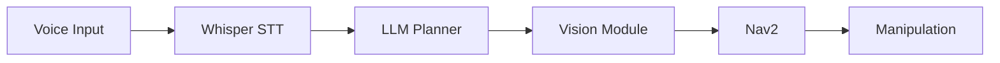

# Architectural Plan: Module 4 - Vision-Language-Action (VLA)

**Feature**: Module 4 - Vision-Language-Action: Convergence of LLMs and Robotics
**Created**: 2025-12-06
**Status**: Draft

---

## 1. Scope and Dependencies

### In Scope

- Creation of 4 premium MDX chapters for Module 4: Vision-Language-Action (VLA)
- Chapter 1: Voice-to-Action with OpenAI Whisper
- Chapter 2: Cognitive Planning with LLMs
- Chapter 3: Computer Vision for Object Recognition
- Chapter 4: Capstone Project: The Autonomous Humanoid
- Book-like prose with clear structure, story-like intros, technical breakdowns, real-world examples, takeaways, and diagrams
- Integration with existing Docusaurus site structure (sidebar, navigation, search, dark mode)
- Technical accuracy for VLA concepts, Whisper, LLMs (GPT-4, Llama-3), vision models (CLIP, SAM, Grounding DINO)
- Practical code examples for Whisper + ROS 2, LLM planning, vision pipelines, and capstone integration
- Diagrams using Mermaid, ASCII art, or high-quality images with alt text
- Open-source alternatives for all paid/proprietary components
- Responsive design and accessibility (WCAG 2.1 AA)
- End-to-end capstone project integrating Modules 1-4 concepts

### Out of Scope

- Real-time voice interaction widgets embedded in browser (learners run locally)
- Production-ready LLM orchestration systems (focus is educational patterns)
- Comprehensive computer vision training pipelines (focus is inference and integration)
- Backend LLM API services or hosted inference infrastructure
- Multi-language voice recognition beyond English (Whisper supports it but examples in English)
- Advanced reinforcement learning for robotics (RLHF mentioned as extension only)
- Real-world hardware deployment guides (focus is simulation with Isaac Sim)
- Video tutorials or interactive voice demos (static content only)
- Fine-tuning LLMs or vision models (focus is using pre-trained models)

### External Dependencies

- **Docusaurus**: Static site generator (already in place from Modules 1-3)
- **React**: For MDX component rendering (already in place)
- **Mermaid**: For diagram rendering (already in place)
- **OpenAI Whisper**: Reference documentation and model architecture
  - https://github.com/openai/whisper
  - https://openai.com/research/whisper
- **OpenAI GPT-4 API**: Reference for LLM planning examples
  - https://platform.openai.com/docs/
  - Open-source alternatives: Llama-3, Mistral, Qwen-2
- **Vision Foundation Models**: Reference documentation
  - CLIP: https://github.com/openai/CLIP
  - SAM (Segment Anything): https://github.com/facebookresearch/segment-anything
  - Grounding DINO: https://github.com/IDEA-Research/GroundingDINO
- **ROS 2 Humble**: Audio message types, action interfaces (from Module 1)
- **NVIDIA Isaac Sim**: Simulation environment for capstone (from Module 3)
- **Isaac ROS & Nav2**: Perception and navigation integration (from Module 3)
- **Existing Modules**: Modules 1-3 for prerequisite knowledge and consistent structure
- **Git**: Version control (already in place)
- **Build Pipeline**: npm/yarn for Docusaurus build (already in place)

**Ownership**: Content creation owned by documentation team; Docusaurus infrastructure owned by web development team; technical accuracy review by robotics/AI subject matter experts.

---

## 2. Key Decisions and Rationale

### Decision 1: Feature OpenAI Whisper as Primary Speech-to-Text, Provide Open-Source Alternatives

**Options Considered**:
1. **OpenAI Whisper** with local inference options (Whisper.cpp, faster-whisper) (chosen)
2. Google Cloud Speech-to-Text or AWS Transcribe (cloud-only APIs)
3. Open-source only models (Vosk, Coqui STT)
4. Multiple STT engines with equal depth coverage

**Trade-offs**:
- Whisper has state-of-the-art accuracy and multilingual support but requires OpenAI API or local GPU
- Google/AWS STT is accurate but vendor lock-in and requires cloud connectivity
- Open-source models are fully local but lower accuracy and limited language support
- Covering multiple engines equally dilutes focus and increases content length

**Rationale**:
- Whisper represents current state-of-the-art in speech recognition (as of 2024-2025)
- Whisper.cpp and faster-whisper enable local inference without API costs
- Aligns with educational goal of teaching cutting-edge techniques
- Learners can start with Whisper API for testing, then migrate to local inference for deployment
- Edge case FR addresses API access concerns with clear alternatives

**Principle**: Measurable (FR-008 specifies Whisper architecture), reversible (can add other STT engines as alternatives), smallest viable change (focuses on one well-documented approach).

### Decision 2: Use GPT-4 for High-Quality LLM Planning Examples, Provide Open-Source Fallbacks

**Options Considered**:
1. **GPT-4 for examples** with open-source alternatives documented (Llama-3, Mistral) (chosen)
2. Open-source LLMs only (Llama-3-70B, Qwen-2)
3. Generic LLM API patterns without specific model references
4. Multiple LLMs with equal depth (GPT-4, Claude, Gemini, Llama)

**Trade-offs**:
- GPT-4 produces highest quality task decomposition but requires paid API access
- Open-source LLMs are free but may require significant GPU memory (70B models)
- Generic patterns are model-agnostic but lack concrete implementation details
- Covering multiple LLMs equally increases complexity and maintenance burden

**Rationale**:
- GPT-4 is widely recognized as leading LLM for reasoning and task planning (as of 2024-2025)
- Most learners can access GPT-4 API for educational experimentation with low cost
- Open-source alternatives (Llama-3-70B, Mistral-8x7B) provide viable fallbacks for learners without API access
- Prompt engineering patterns are transferable across models with minor adjustments
- Edge case FR addresses API access with clear open-source alternatives

**Principle**: Measurable (FR-019 specifies GPT-4 or open-source alternatives), reversible (can update to newer models), smallest viable change (demonstrates best-in-class capabilities while providing accessible options).

### Decision 3: Cover CLIP, SAM, and Grounding DINO as Primary Vision Foundation Models

**Options Considered**:
1. **CLIP + SAM + Grounding DINO** as primary foundation models (chosen)
2. Traditional computer vision (YOLO, Faster R-CNN, ORB features)
3. End-to-end VLA models (RT-1, RT-2, OpenVLA)
4. Single vision model (CLIP only or SAM only)

**Trade-offs**:
- Foundation models represent cutting-edge vision-language integration but require GPU inference
- Traditional CV is faster and lighter but lacks semantic understanding and open-vocabulary detection
- End-to-end VLA models are state-of-the-art but black-box, hard to debug, and require massive datasets
- Single model is simpler but doesn't showcase complementary capabilities (detection + segmentation + grounding)

**Rationale**:
- CLIP enables vision-language understanding (text-image similarity for object identification)
- SAM provides universal segmentation (identify object boundaries for grasping)
- Grounding DINO enables open-vocabulary detection (find objects by text description without retraining)
- Three models complement each other in VLA pipeline: CLIP (semantic), SAM (segmentation), Grounding DINO (detection)
- Aligns with research community adoption (Meta SAM, OpenAI CLIP, IDEA Research Grounding DINO all widely used)
- Lighter alternatives (MobileNet, YOLO) provided for CPU-only environments

**Principle**: Measurable (FR-021 specifies CLIP, SAM, Grounding DINO), reversible (can add other models as extensions), smallest viable change (covers three distinct but complementary capabilities).

### Decision 4: Build Capstone Around Isaac Sim (Module 3 Integration), Provide Gazebo Fallback

**Options Considered**:
1. **NVIDIA Isaac Sim** as primary simulation environment with Gazebo fallback (chosen)
2. Gazebo Classic or Gazebo Fortress only
3. PyBullet for lightweight simulation
4. Real-world robot deployment guide

**Trade-offs**:
- Isaac Sim provides photorealistic rendering and NVIDIA Isaac ROS integration but requires NVIDIA GPU and large download
- Gazebo is lighter and open-source but less realistic rendering and slower perception pipelines
- PyBullet is lightest but lacks ROS 2 integration and realistic sensor simulation
- Real-world deployment is most impactful but inaccessible to most learners (no hardware)

**Rationale**:
- Capstone builds on Module 3 (NVIDIA Isaac coverage), creating continuity and reinforcing prior learning
- Isaac Sim provides realistic camera rendering crucial for vision model testing
- Isaac ROS perception stack from Module 3 integrates naturally with vision models
- Gazebo fallback ensures learners without NVIDIA GPUs can still complete capstone
- Simulation-first approach is accessible (no robot hardware required) and safe (no physical risks)
- Assumption explicitly states Isaac Sim primary, Gazebo fallback

**Principle**: Measurable (assumption specifies Isaac Sim primary), reversible (can create Gazebo-specific guide), smallest viable change (leverages existing Module 3 infrastructure).

### Decision 5: Structure Capstone as End-to-End Integration, Not Separate Standalone Components

**Options Considered**:
1. **End-to-end integrated capstone** showing full VLA pipeline (chosen)
2. Three separate mini-projects (voice demo, LLM planning demo, vision demo)
3. Modular capstone with optional components (voice OR planning OR vision)
4. Open-ended capstone with learner-defined scenario

**Trade-offs**:
- Integrated capstone demonstrates real-world complexity but is harder to debug and requires all dependencies
- Separate demos are easier to test in isolation but don't show system integration challenges
- Modular capstone is flexible but lacks cohesive narrative and may not demonstrate full VLA loop
- Open-ended capstone is creative but lacks structured guidance and testable success criteria

**Rationale**:
- VLA systems are valuable because they integrate voice, language, and vision (integration is the point)
- Learners completing Modules 1-4 deserve portfolio-worthy capstone showing multi-system orchestration
- Troubleshooting section addresses integration debugging challenges explicitly
- Modular architecture in implementation guide allows testing components independently before integration
- Scenario walkthrough provides concrete success criteria ("pick up blue bottle, place in recycling bin")
- Aligns with FR-028 to FR-035 requirements for comprehensive integration

**Principle**: Measurable (SC-016, SC-017 require successful end-to-end integration), reversible (can simplify later), smallest viable change (demonstrates minimum viable VLA system).

### Decision 6: Provide Prompt Engineering Patterns for Robotics, Not Generic LLM Tutorials

**Options Considered**:
1. **Robotics-specific prompt engineering** with safety constraints and action schemas (chosen)
2. Generic LLM prompting techniques (few-shot, chain-of-thought)
3. No prompt examples (assume learners know LLM usage)
4. Comprehensive prompt engineering course (covering all LLM techniques)

**Trade-offs**:
- Robotics-specific prompts are immediately applicable but narrower in scope
- Generic techniques are broadly useful but don't address robot safety, action schemas, or physical constraints
- No examples assume too much prior knowledge and reduce practical value
- Comprehensive course is valuable but out of scope for VLA module (becomes LLM course, not robotics course)

**Rationale**:
- Robotics LLM prompting has unique requirements: safety constraints, action schemas, physical workspace bounds, failure handling
- Generic "write me a poem" prompts don't transfer to "plan a manipulation task with collision avoidance"
- FR-015 explicitly requires robotics prompt engineering (system prompts with capabilities, few-shot examples, JSON schemas)
- Learners benefit most from patterns they can immediately apply to robot task planning
- Keeps focus on VLA integration rather than general LLM education

**Principle**: Measurable (FR-015 specifies robotics prompt engineering), reversible (can expand to general LLM education), smallest viable change (addresses robot-specific needs).

---

## 3. Interfaces and API Contracts

### Chapter MDX Frontmatter Contract

All Module 4 chapters MUST include frontmatter with the following structure:

```yaml
---
id: <chapter-slug>              # e.g., "voice-to-action-whisper"
title: "Chapter N: <Title>"     # e.g., "Chapter 1: Voice-to-Action with OpenAI Whisper"
sidebar_label: "<Short Title>"  # e.g., "Voice-to-Action"
description: "<1-2 sentence summary>"
keywords: [<array of keywords>] # e.g., ["vla", "whisper", "speech recognition", "ros2"]
---
```

**Inputs**: Frontmatter YAML parsed by Docusaurus
**Outputs**: Sidebar navigation, SEO metadata, breadcrumbs
**Errors**: Missing required fields will cause build failure or incorrect navigation
**Versioning**: Frontmatter schema is stable across Docusaurus 2.x

### Chapter Content Structure Contract

Each chapter MUST follow this section order:

1. **Story-like Introduction (1 paragraph)**: Narrative hook connecting to real-world VLA scenario
2. **Technical Breakdown (main content)**: Core concepts, architecture, algorithms explained with headings (##, ###)
3. **Real-World Example (1-2 subsections)**: Practical application or case study
4. **What You Learned (Takeaways section)**: 3-5 bullet points summarizing key concepts
5. **Next Steps (optional footer)**: Link to next chapter or additional resources

**Inputs**: MDX file with structured content
**Outputs**: Rendered HTML page with consistent styling
**Errors**: Missing required sections will fail acceptance criteria (SC-004)

### Voice Command Interface (Chapter 1)

Voice commands MUST be parsed into structured command objects:

```python
{
  "raw_audio": bytes,           # Raw audio data from microphone
  "transcription": str,         # Whisper output text
  "intent": str,                # Parsed intent (navigate, grasp, query, etc.)
  "parameters": {               # Extracted parameters
    "object": str,              # e.g., "blue cup"
    "location": str,            # e.g., "kitchen"
    "action": str               # e.g., "pick up"
  },
  "confidence": float,          # 0.0-1.0 transcription confidence
  "validation_status": str      # "valid", "ambiguous", "unsafe", "out_of_scope"
}
```

**Inputs**: Audio stream (audio_msgs/Audio), Whisper API/model
**Outputs**: Structured command object, ROS 2 topic publication (std_msgs/String or custom msg)
**Errors**: Low confidence (<0.7), unrecognized intent, unsafe command → fallback to clarification request
**Idempotency**: Same audio input produces same transcription (Whisper deterministic with fixed seed)
**Timeouts**: Transcription timeout 5 seconds for medium model on RTX 3060

### LLM Task Plan Interface (Chapter 2)

LLM-generated plans MUST be structured as JSON action sequences:

```json
{
  "task": "Pick up the blue bottle and place it in the recycling bin",
  "plan": [
    {
      "action": "navigate",
      "parameters": {"goal": "object_search_position"},
      "preconditions": ["robot_localized", "map_available"],
      "success_criteria": ["position_reached", "tolerance_0.1m"]
    },
    {
      "action": "detect_object",
      "parameters": {"query": "blue bottle", "confidence_threshold": 0.8},
      "preconditions": ["camera_online", "vision_model_loaded"],
      "success_criteria": ["object_detected", "pose_estimated"]
    },
    {
      "action": "grasp",
      "parameters": {"object_id": "blue_bottle", "grasp_type": "top_down"},
      "preconditions": ["object_pose_known", "arm_homed"],
      "success_criteria": ["grasp_successful", "force_sensor_triggered"]
    },
    {
      "action": "navigate",
      "parameters": {"goal": "recycling_bin_position"},
      "preconditions": ["object_grasped"],
      "success_criteria": ["position_reached"]
    },
    {
      "action": "place",
      "parameters": {"location": "recycling_bin", "release_height": 0.2},
      "preconditions": ["at_target_position"],
      "success_criteria": ["object_released", "grasp_opened"]
    }
  ],
  "estimated_duration": 120,
  "risk_assessment": "low",
  "safety_constraints": ["workspace_bounds_checked", "collision_free_path"]
}
```

**Inputs**: Natural language task (str), robot capabilities schema (JSON), LLM API (GPT-4, Llama-3)
**Outputs**: Structured JSON plan, validation status (bool), safety warnings (list)
**Errors**: Hallucinated actions, invalid parameters, unsafe sequences → validation layer rejects plan
**Versioning**: Action schema v1.0 (extensible for new action types)
**Retries**: LLM replanning triggered on action failure (max 3 retries)

### Vision Detection Interface (Chapter 3)

Vision pipelines MUST output detection results in ROS 2 message format:

```python
# vision_msgs/Detection2DArray
detections = [
  {
    "bbox": {"center": (x, y), "size_x": w, "size_y": h},  # Pixel coordinates
    "class_name": "bottle",
    "confidence": 0.92,
    "segmentation_mask": np.array(...),  # Binary mask from SAM
    "pose_6d": {
      "position": (x, y, z),             # Meters in robot base frame
      "orientation": (qx, qy, qz, qw)    # Quaternion
    }
  }
]
```

**Inputs**: Camera image (sensor_msgs/Image), text query (str), vision models (CLIP, SAM, Grounding DINO)
**Outputs**: Detection2DArray message, PoseStamped for grasping, TF frames for object tracking
**Errors**: No detections, low confidence (<0.7), pose estimation failure → retry or fallback to alternative sensor
**Idempotency**: Same image + query produces consistent detections (models deterministic)
**Timeouts**: Inference timeout 200ms per frame (target ≥10 FPS)
**Performance**: TensorRT optimization achieves 30 FPS on RTX 3060 for 640×480 images

### Capstone System Integration Interface (Chapter 4)

The capstone MUST integrate all components via ROS 2 topics and actions:

```text
Voice Command Node → /voice/command (std_msgs/String)
                  ↓
LLM Planner Node  → /task/plan (custom_msgs/TaskPlan)
                  ↓
Vision Node       → /vision/detections (vision_msgs/Detection2DArray)
                  ↓
Nav2 (Module 3)   → /navigate_to_pose (nav2_msgs/NavigateToPose action)
                  ↓
Manipulation Node → /grasp_object (custom_msgs/GraspObject action)
                  ↓
Execution Monitor → /task/status (std_msgs/String)
```

**Inputs**: Voice audio stream, Isaac Sim camera feeds, SLAM map, robot state
**Outputs**: Robot motion commands, grasp actions, task completion status
**Errors**: Component failures handled via watchdog timers and graceful degradation (FR-033 troubleshooting)
**Idempotency**: Task plan execution is idempotent (can restart from last successful action)
**Timeouts**: Overall task timeout 5 minutes; per-action timeout 30 seconds

### Diagram Rendering Contract

Diagrams MUST be provided in one of three formats:

1. **Mermaid Code Blocks**:


2. **ASCII Art in Code Blocks** (language: `text` or `ascii`):
```text
Voice → Whisper → LLM → Vision → SLAM → Nav2 → Manipulation → Robot
```

3. **Image Files** in `static/img/module-04/`:
```markdown

```

**Inputs**: Mermaid syntax, ASCII text, or image file paths
**Outputs**: Rendered diagrams in HTML (Mermaid via plugin, ASCII as code blocks, images as  tags)
**Errors**: Invalid Mermaid syntax will cause rendering failure; missing image files will show broken image icon
**Versioning**: Mermaid 9.x+ supported by Docusaurus

### Sidebar Navigation Contract

Module 4 chapters MUST be organized in `sidebars.js` with the following structure:

```javascript
{
  type: 'category',
  label: 'Module 4: Vision-Language-Action',
  items: [
    'module-04-vision-language-action/index',
    'module-04-vision-language-action/voice-to-action-whisper',
    'module-04-vision-language-action/cognitive-planning-llms',
    'module-04-vision-language-action/computer-vision-object-recognition',
    'module-04-vision-language-action/capstone-autonomous-humanoid',
  ],
}
```

**Inputs**: Sidebar configuration in `sidebars.js`
**Outputs**: Left sidebar with expandable Module 4 section, chapter links, active highlighting
**Errors**: Incorrect file paths will cause broken links; missing index will break module overview
**Idempotency**: Sidebar regenerates on each build; order is deterministic based on config
**Timeouts**: N/A (synchronous build-time operation)

---

## 4. Non-Functional Requirements (NFRs) and Budgets

### Performance

- **Page Load Time**: All Module 4 pages MUST load in under 3 seconds on 3G mobile connection (consistent with SC-002)
- **Lighthouse Performance Score**: ≥ 90 on mobile and desktop (SC-009)
- **Time to Interactive (TTI)**: < 5 seconds on average mobile device
- **First Contentful Paint (FCP)**: < 1.5 seconds
- **Largest Contentful Paint (LCP)**: < 2.5 seconds
- **Code Example Rendering**: Syntax highlighting MUST render within 500ms of page load
- **Diagram Rendering**: Mermaid diagrams MUST render within 1 second of page load
- **Search Indexing**: All Module 4 content MUST be indexed within 10 seconds of build completion

**Budgets**:
- JavaScript bundle size: < 300 KB per page (code splitting)
- Image assets: < 500 KB total per chapter (optimized PNGs/WebP)
- Total page size: < 2 MB including all assets
- Mermaid diagrams: < 50 KB SVG output per diagram

### Reliability

- **Uptime SLO**: 99.9% uptime for Docusaurus site (infrastructure dependency, not module-specific)
- **Build Success Rate**: 100% successful builds (no broken links, valid MDX syntax)
- **Cross-Browser Compatibility**: Chrome 90+, Firefox 88+, Safari 14+, Edge 90+
- **Graceful Degradation**: Content MUST remain readable with JavaScript disabled (Docusaurus SSG ensures this)
- **Error Handling**: Broken images MUST show meaningful alt text; missing diagrams MUST not break page layout

**Error Budget**: 0 critical errors per chapter (broken navigation, missing required sections, invalid frontmatter)

### Security

- **Content Security Policy (CSP)**: Docusaurus default CSP (no inline scripts, whitelisted sources)
- **API Key Handling**: Code examples MUST use environment variables for API keys (never hardcoded)
- **Privacy**: No user tracking beyond aggregated analytics (Google Analytics or privacy-first alternative)
- **XSS Prevention**: All MDX content sanitized by Docusaurus (React escaping)
- **Safe External Links**: All external links MUST use `rel="noopener noreferrer"` (Docusaurus default)

**Security Constraints**:
- No embedded third-party widgets that execute arbitrary JavaScript
- No external API calls from client-side code (examples show server-side patterns only)
- API credentials in examples MUST be placeholder values ("YOUR_API_KEY_HERE")

### Cost

- **Infrastructure Cost**: $0 (static site hosted on GitHub Pages or similar free tier)
- **LLM API Cost (Example Code)**: Estimated $0.10-$0.50 per learner for testing GPT-4 examples (learner responsibility)
- **Compute Cost**: Builds run on GitHub Actions free tier (< 2000 minutes/month)
- **Content Creation Cost**: Internal team time (not measured here)

**Cost Budgets**:
- Build time: < 5 minutes per build (enables rapid iteration)
- Storage: < 100 MB for Module 4 content (images, diagrams, MDX files)

---

## 5. Data Management and Migration

### Source of Truth

- **Content Source**: MDX files in `docs/module-04-vision-language-action/`
- **Diagrams**: Mermaid syntax in MDX files (text-based) or images in `static/img/module-04/`
- **Configuration**: `sidebars.js` for navigation, `docusaurus.config.js` for site-wide settings
- **Version Control**: Git repository with commit history as audit trail

### Schema Evolution

- **MDX Frontmatter**: Adding new optional frontmatter fields is non-breaking (Docusaurus ignores unknown fields)
- **Mermaid Syntax**: Mermaid version updates may require diagram updates (test on upgrade)
- **Sidebar Structure**: Reordering chapters requires updating `sidebars.js` only (no MDX changes)

**Migration Strategy**:
- New frontmatter fields: Add to new chapters, backfill existing chapters in batch update
- Mermaid upgrades: Test all diagrams in development environment before production deployment
- Sidebar restructuring: Update `sidebars.js`, verify navigation in local build, commit atomically

### Data Retention

- **Git History**: Indefinite retention of all content versions (Git commit history)
- **Build Artifacts**: 30-day retention for historical builds (CI/CD pipeline)
- **Analytics Data**: 26 months retention (Google Analytics default, if used)

### Backup and Disaster Recovery

- **Primary Backup**: Git remote repository (GitHub, GitLab, Bitbucket)
- **Secondary Backup**: Weekly automated backups to cloud storage (optional)
- **Recovery Time Objective (RTO)**: < 1 hour to restore from Git backup
- **Recovery Point Objective (RPO)**: < 1 day (last commit)

---

## 6. Operational Readiness

### Observability

**Logs**:
- Build logs from Docusaurus (warnings, errors, broken links)
- Deployment logs from hosting platform (GitHub Pages, Netlify, Vercel)

**Metrics**:
- Page views per chapter (via Google Analytics or Plausible)
- Search queries and click-through rates (via Docusaurus search analytics)
- Lighthouse Performance scores (tracked per release)
- Build duration (tracked in CI/CD pipeline)

**Traces**:
- N/A (static site, no server-side tracing)

### Alerting

**Thresholds**:
- Build failure: Alert immediately (email, Slack)
- Lighthouse Performance < 80: Warning (investigate before next release)
- Broken links detected: Alert immediately (block deployment)
- Page load time > 5 seconds: Warning (investigate optimization)

**On-Call Owners**:
- Web development team: Infrastructure and build pipeline
- Content team: Content accuracy and MDX syntax errors
- Subject matter experts: Technical accuracy review (robotics, AI, VLA)

### Runbooks

**Common Tasks**:

1. **Add New Chapter to Module 4**:
   - Create MDX file in `docs/module-04-vision-language-action/`
   - Add frontmatter (id, title, sidebar_label, description, keywords)
   - Write content following structure contract (intro, breakdown, example, takeaways)
   - Add chapter to `sidebars.js` in correct order
   - Build locally: `npm run build`
   - Verify navigation, search, and mobile responsiveness
   - Commit and push

2. **Update Existing Chapter**:
   - Edit MDX file
   - Verify no broken links or invalid Mermaid syntax
   - Build locally: `npm run build`
   - Review diff for unintended changes
   - Commit with descriptive message

3. **Fix Broken Build**:
   - Check build logs for specific error (broken link, invalid frontmatter, Mermaid syntax)
   - Fix error in MDX file
   - Run `npm run build` locally to verify fix
   - Commit and push

4. **Add Diagram to Chapter**:
   - Choose format: Mermaid (for architecture, data flow) or image (for screenshots, complex visuals)
   - If Mermaid: Add code block to MDX file, test rendering locally
   - If image: Add to `static/img/module-04/`, reference in MDX with alt text
   - Verify dark mode compatibility (Mermaid auto-adapts, images may need separate versions)

### Deployment and Rollback

**Deployment Strategy**:
- **Continuous Deployment**: Every commit to main branch triggers build and deployment
- **Preview Deployments**: Pull requests generate preview URLs for review
- **Staging Environment**: Optional staging site for testing before production

**Rollback Strategy**:
- **Git Revert**: Revert commit if content error detected post-deployment
- **Re-deploy Previous Commit**: Manually trigger deployment of last known good commit
- **Rollback Time**: < 10 minutes from detection to rollback completion

### Feature Flags and Compatibility

**Feature Flags**:
- N/A (static site content, no runtime feature flags)
- Content can be hidden by commenting out sidebar entry (manual flag)

**Backwards Compatibility**:
- New chapters are additive (don't break existing content)
- Sidebar reorganization preserves existing URLs (redirects if needed)
- Mermaid syntax updates may require diagram refactoring (test before production)

---

## 7. Risk Analysis and Mitigation

### Risk 1: LLM Hallucinations in Code Examples

**Impact**: High (learners copy incorrect code, waste time debugging)
**Likelihood**: Medium (LLMs can generate plausible but incorrect code)
**Blast Radius**: Chapter 2 (LLM planning) code examples

**Mitigation**:
- All code examples MUST be manually tested by subject matter experts
- Include validation layer examples showing how to detect invalid LLM outputs
- Provide unit test examples for LLM plan validation
- Include troubleshooting section addressing common hallucination patterns

**Kill Switch**: Remove code examples and link to external validated repository if widespread errors detected

### Risk 2: Vision Model API Changes or Deprecation

**Impact**: Medium (examples become outdated, learners confused)
**Likelihood**: Medium (CLIP, SAM, Grounding DINO are research models, APIs may change)
**Blast Radius**: Chapter 3 (computer vision) code examples

**Mitigation**:
- Pin model versions in code examples (e.g., "CLIP ViT-B/32", "SAM-H")
- Provide links to official model repositories (GitHub) for version history
- Include fallback to alternative models (MobileNet, YOLO) if foundation models unavailable
- Quarterly review of vision model APIs to detect breaking changes

**Guardrails**: Version callouts in content clearly state model versions used in examples

### Risk 3: Isaac Sim GPU Requirements Exclude Many Learners

**Impact**: High (learners can't complete capstone without NVIDIA GPU)
**Likelihood**: Medium (not all learners have RTX-series GPUs)
**Blast Radius**: Chapter 4 (capstone project)

**Mitigation**:
- Clearly state hardware requirements at beginning of module (FR-053 prerequisites)
- Provide Gazebo fallback instructions for CPU-only environments
- Link to cloud GPU options (Google Colab, AWS EC2, Paperspace)
- Offer simplified capstone variant using Gazebo and lighter vision models

**Guardrails**: Edge case addresses GPU access, cloud alternatives documented

### Top 3 Risks Summary

| Risk | Impact | Likelihood | Mitigation |
|------|--------|------------|------------|
| LLM hallucinations in code examples | High | Medium | Manual testing, validation examples, troubleshooting guide |
| Vision model API changes | Medium | Medium | Pin versions, quarterly reviews, alternative models |
| Isaac Sim GPU requirements | High | Medium | Clear prerequisites, Gazebo fallback, cloud options |

---

## 8. Evaluation and Validation

### Definition of Done

A Module 4 chapter is considered complete when:

- [ ] All functional requirements (FR-001 to FR-053) are satisfied
- [ ] Frontmatter is complete and valid (id, title, description, keywords)
- [ ] Content follows structure contract (intro, breakdown, example, takeaways)
- [ ] All code examples are tested and syntax-highlighted correctly
- [ ] All diagrams render properly in dark and light modes
- [ ] No broken links or missing images
- [ ] Sidebar navigation includes chapter in correct order
- [ ] Search indexing includes chapter content
- [ ] Mobile responsiveness verified (320px to 2560px)
- [ ] Lighthouse Performance score ≥ 90
- [ ] Accessibility verified (keyboard navigation, screen reader compatible)
- [ ] Peer review completed by subject matter expert
- [ ] Copy editing completed (grammar, clarity, tone)

### Output Validation

**Format Validation**:
- MDX syntax: Linted with `eslint-plugin-mdx`
- Frontmatter: Validated against schema (automated check in CI/CD)
- Links: Checked with `linkinator` or Docusaurus build warnings
- Images: Optimized with `imagemin` (< 500 KB per chapter)

**Requirements Validation**:
- FR coverage: Checklist verified against specification
- SC coverage: Success criteria tested in staging environment
- Edge cases: Documented and addressed in content

**Safety Validation**:
- API keys: No hardcoded credentials (grep check in CI/CD)
- External links: All use HTTPS and `rel="noopener noreferrer"`
- Code examples: No unsafe robot behaviors (workspace bound violations, collision risks)

---

## 9. Architectural Decision Records (ADRs)

The following architectural decisions are significant and should be documented:

### ADR Candidates

1. **Choice of Whisper over alternative STT engines** (Decision 1)
   - Impact: Long-term (sets standard for voice interface examples)
   - Alternatives: Multiple (Google STT, AWS Transcribe, Vosk, Coqui)
   - Scope: Cross-cutting (affects all voice-to-action examples)
   - **Recommendation**: Document as ADR

2. **Choice of GPT-4 with open-source fallbacks** (Decision 2)
   - Impact: Long-term (LLM planning patterns may influence future modules)
   - Alternatives: Multiple (Claude, Gemini, Llama-only)
   - Scope: Cross-cutting (affects LLM integration patterns throughout capstone)
   - **Recommendation**: Document as ADR

3. **Choice of CLIP + SAM + Grounding DINO as vision stack** (Decision 3)
   - Impact: Long-term (sets foundation for future vision-language integration)
   - Alternatives: Multiple (traditional CV, end-to-end VLA models, single foundation model)
   - Scope: Cross-cutting (affects all vision-based manipulation examples)
   - **Recommendation**: Document as ADR

4. **Isaac Sim as primary simulation with Gazebo fallback** (Decision 4)
   - Impact: Long-term (consistent with Module 3 choices)
   - Alternatives: Multiple (Gazebo-only, PyBullet, real-world)
   - Scope: Cross-cutting (affects capstone implementation and all simulation examples)
   - **Recommendation**: Already documented in Module 3 ADR; reference and extend for VLA-specific needs

5. **End-to-end integrated capstone vs modular demos** (Decision 5)
   - Impact: Long-term (sets expectation for learner portfolio projects)
   - Alternatives: Few (separate demos, modular options)
   - Scope: Cross-cutting (affects capstone architecture and testing strategy)
   - **Recommendation**: Document as ADR

### Suggested ADR Documentation

For each ADR above:
- **Title**: Concise decision statement (e.g., "Use OpenAI Whisper as Primary STT with Open-Source Fallbacks")
- **Context**: Why this decision is needed (VLA requires speech input, multiple options available)
- **Decision**: What was chosen and why (Whisper for SOTA accuracy, Whisper.cpp for local inference)
- **Consequences**: Positive (high accuracy, multilingual), Negative (requires GPU or API), Neutral (learners need to install Whisper)
- **Alternatives Considered**: List with brief pros/cons (Google STT: cloud-only, Vosk: lower accuracy)
- **Status**: Accepted, Proposed, Deprecated
- **Date**: 2025-12-06

---

## 10. Implementation Roadmap

### Phase 1: Content Foundation (Weeks 1-2)

**Deliverables**:
- Module 4 index/overview page (landing page)
- Chapter 1: Voice-to-Action with OpenAI Whisper (complete draft)
- VLA architecture diagram (Mermaid)
- Whisper + ROS 2 integration code example

**Dependencies**: Module 3 completion, Docusaurus site operational
**Acceptance**: Chapter 1 passes Definition of Done checklist

### Phase 2: LLM Planning and Vision (Weeks 3-4)

**Deliverables**:
- Chapter 2: Cognitive Planning with LLMs (complete draft)
- Chapter 3: Computer Vision for Object Recognition (complete draft)
- LLM prompt engineering examples (JSON schemas, system prompts)
- Vision pipeline code examples (CLIP, SAM, Grounding DINO integration)

**Dependencies**: Chapter 1 completion, LLM API access for testing
**Acceptance**: Chapters 2 and 3 pass Definition of Done checklist

### Phase 3: Capstone Integration (Weeks 5-6)

**Deliverables**:
- Chapter 4: Capstone Project (complete draft)
- End-to-end system architecture diagram
- Scenario walkthrough ("pick up blue bottle")
- Troubleshooting guide with common failure modes
- Testing and validation strategy

**Dependencies**: Chapters 1-3 completion, Isaac Sim environment setup
**Acceptance**: Chapter 4 passes Definition of Done checklist, capstone executable in Isaac Sim

### Phase 4: Review and Polish (Week 7)

**Deliverables**:
- Subject matter expert review feedback incorporated
- Copy editing completed (grammar, clarity, tone)
- All diagrams optimized for dark/light modes
- Alternative options documented (open-source LLMs, Gazebo fallback)
- Prerequisites and edge cases clearly stated

**Dependencies**: All chapters drafted
**Acceptance**: All success criteria (SC-001 to SC-020) validated

### Phase 5: Deployment and Validation (Week 8)

**Deliverables**:
- Module 4 integrated into production Docusaurus site
- Sidebar navigation updated
- Search indexing verified
- Mobile responsiveness tested
- Lighthouse Performance scores measured (≥90)
- User acceptance testing with 3-5 beta learners

**Dependencies**: Content review complete, staging environment ready
**Acceptance**: Module 4 live in production, no critical errors, beta learner feedback positive

---

## 11. Governance and Amendment Process

### Plan Ownership

- **Plan Author**: Documentation team lead
- **Reviewers**: Robotics subject matter expert, AI/ML subject matter expert, web development lead
- **Approvers**: Product owner, technical architect

### Amendment Process

1. Identify need for plan change (new requirements, technical constraints, user feedback)
2. Propose amendment in pull request with rationale and impact analysis
3. Review by stakeholders (documentation team, SMEs, product owner)
4. Approve or reject amendment (requires 2/3 stakeholder approval)
5. Update plan document and increment version (e.g., v1.0.0 → v1.1.0)
6. Communicate changes to implementation team

### Version History

- **v1.0.0** (2025-12-06): Initial architectural plan for Module 4: Vision-Language-Action (VLA)

---

## 12. Appendices

### Appendix A: Technology Stack

- **Static Site Generator**: Docusaurus 2.x
- **Markup Language**: MDX (Markdown + JSX)
- **Diagram Rendering**: Mermaid.js 9.x
- **Syntax Highlighting**: Prism.js (Docusaurus default)
- **Version Control**: Git
- **Hosting**: GitHub Pages, Netlify, or Vercel
- **Build Tool**: npm/yarn
- **Linting**: ESLint, markdownlint
- **Image Optimization**: imagemin
- **Link Checking**: linkinator

### Appendix B: Key Metrics

| Metric | Target | Measurement |
|--------|--------|-------------|
| Page Load Time (3G) | < 3 seconds | Lighthouse audit |
| Lighthouse Performance | ≥ 90 | Lighthouse audit |
| Content Accuracy | 100% | SME review |
| Build Success Rate | 100% | CI/CD logs |
| Mobile Responsiveness | 320px - 2560px | Manual testing |
| Accessibility (WCAG 2.1 AA) | Pass | axe DevTools |
| Search Indexing Coverage | 100% | Docusaurus search console |

### Appendix C: Glossary

- **VLA (Vision-Language-Action)**: Paradigm integrating computer vision, natural language understanding, and robot action execution
- **Whisper**: OpenAI's speech-to-text model (multilingual, high accuracy)
- **LLM (Large Language Model)**: AI model trained on text (e.g., GPT-4, Llama-3) for language understanding and generation
- **CLIP**: Contrastive Language-Image Pre-training (OpenAI) for vision-language understanding
- **SAM**: Segment Anything Model (Meta) for universal image segmentation
- **Grounding DINO**: Open-vocabulary object detection model (IDEA Research)
- **Isaac Sim**: NVIDIA's photorealistic robot simulation platform
- **Capstone**: Final integrative project synthesizing all module concepts

### Appendix D: External References

- OpenAI Whisper: https://github.com/openai/whisper
- OpenAI GPT-4: https://platform.openai.com/docs/
- Meta SAM: https://github.com/facebookresearch/segment-anything
- CLIP: https://github.com/openai/CLIP
- Grounding DINO: https://github.com/IDEA-Research/GroundingDINO
- NVIDIA Isaac Sim: https://docs.omniverse.nvidia.com/isaacsim/
- Nav2 Documentation: https://navigation.ros.org/
- ROS 2 Humble: https://docs.ros.org/en/humble/

---

**Plan Status**: Draft (pending review and approval)
**Next Steps**: Stakeholder review → Approval → Implementation (Phase 1)
